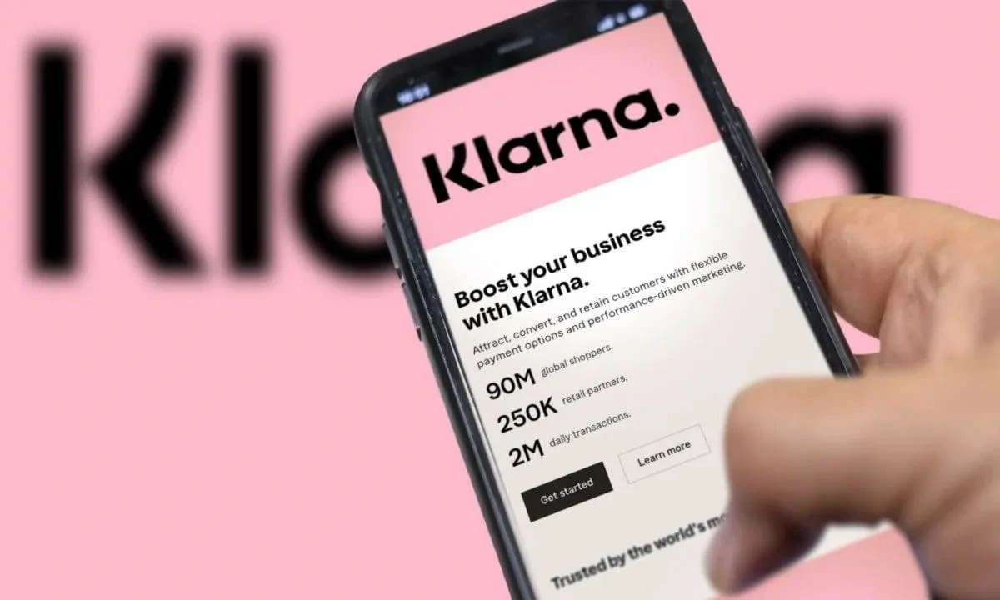

Klarna became one of the most watched cases in the market when it replaced a relevant part of customer service with artificial intelligence.

The movement brought clear gains in productivity, reduced operating costs and greater capacity for scale.

But it also revealed an important limit: not every interaction can be automated without impacting the customer experience.

The case has become a practical reference for companies studying support automation and implementing AI in service operations.

## Klarna accelerated automation and reduced its dependence on human teams

In the first few months of the change, the company transferred much of its support interactions to artificial intelligence systems.

The proposal was simple: automate the high volume of repetitive demands, reduce response time and reduce operational costs.

In practice, AI began to take on tasks such as:

### Answers to frequently asked questions

Simple issues such as payment status, deadlines and charges are now resolved automatically.

### Initial screening of tickets

Before reaching a human, the AI began to identify the problem and direct the customer.

### Large-scale service

The ability to respond to thousands of customers simultaneously increased without proportional expansion of the team.

## Where automation started to fail

The operation showed efficiency at first, but began to face limitations in less predictable situations.

More complex demands required contextual interpretation, emotional analysis and decision flexibility.

### More complex cases were compromised

Specific billing problems, disputes and operational exceptions began to generate friction.

In some cases, the customer had to repeat information several times before receiving human assistance.

### Customer experience has been impacted

Although the average response time has dropped, some satisfaction has been affected by the difficulty in resolving non-standard cases.

This is a common problem in overly automated operations.

## What Sebastian Siemiatkowski said about the strategy

Sebastian Siemiatkowski explained that the intention was never just to cut costs.

According to him, the priority was to make the operation more efficient and scalable.

But he recognized that the advancement of automation was too fast in some points.

### Strategic learning

The main adjustment was understanding that operational efficiency does not just depend on speed.

Quality of service and effective resolution continue to be critical metrics.

## The operational impact of AI within Klarna

Automation reduced an important part of the operational support burden.

This had relevant effects:

### Lower cost per service

With less need for human intervention in repetitive tasks.

### Greater response speed

Initial service became faster and available on a larger scale.

### Better distribution of the human team

The attendants started to focus on more critical and strategic cases.

This hybrid model tends to be more sustainable in the long term.

## What companies can learn from this case

The Klarna case reinforces an important market reality.

Automation does not mean total replacement.

It means intelligent redistribution of tasks.

Companies that automate correctly can:

### Scale without inflating costs

Increasing productivity without expanding operations at the same speed.

### Improve operational efficiency

Reducing bottlenecks in repetitive processes.

### Free up teams for strategic tasks

Allowing greater focus on retention, relationships and complex resolution.

## How to apply this model in small and medium-sized companies

Smaller businesses can also use the same logic.

Even without the infrastructure of a global fintech, some steps can be automated immediately.

### First automated service

Bots can resolve basic queries quickly.

### Qualification of demands

Filter and organize requests before human service.

### After-sales automation

Tracking, notifications and initial support can be automated.

The Klarna case leaves a clear message for the market: AI speeds up operations, reduces costs and increases scale, but the real advantage appears when technology and people work together.