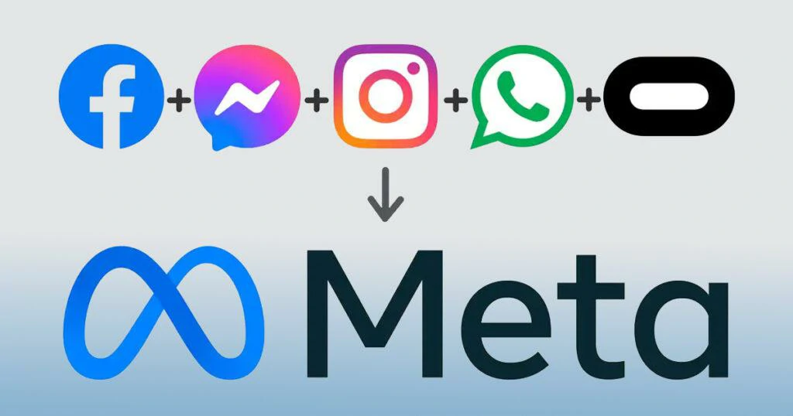
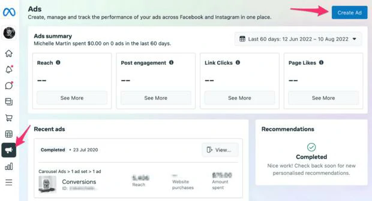

Meta is expanding the use of artificial intelligence to automate advertising campaigns on its platforms.

The movement changes one of the foundations of digital marketing: manual segmentation.

As a result, companies start to depend less on technical configurations and more on the strategic ability to create efficient campaigns.

## Meta's artificial intelligence is taking over decisions that were previously manual

The platform's new logic significantly reduces the need for detailed audience configuration.

Today, in many cases, the advertiser only defines the campaign objective and budget.

AI does the rest.

### What the platform started to decide on its own

The technology analyzes behavior, purchase intent, browsing patterns and conversion signals.

This automatically adjusts different campaign variables.

### Ideal audience

Identifies users most likely to convert.

### Best delivery time

Distribute ads at times with the greatest potential for results.

### Continuous optimization

Adjust campaigns in real time to improve performance.

## What changes for those who advertise

The traditional model required technical knowledge in segmenting by interests, age, location and behavior.

This scenario is changing.

### Less technical operation

Artificial intelligence automatically tests and adjusts.

This reduces barriers for small advertisers.

### More operational efficiency

Campaigns can find qualified audiences with less human intervention.

This accelerates learning and improves results.

### Less dependence on technical experts

Smaller companies can compete without complex paid traffic structures.

## The strategic objective of the Goal

Meta's strategy is to simplify the entry of new advertisers into its ecosystem.

The lower the complexity, the greater the adherence.

### Expansion of the advertiser base

By making the tool simpler, more companies join the platform.

This increases the flow of advertising investment.

### Strengthening the ecosystem

The more automation, the greater the dependence on the platform's internal decisions.

This increases Meta's control over campaign performance.

## The impact on the digital marketing market

Automation is changing the role of the traffic manager.

Technical execution loses weight.

The strategy gains relevance.

### Segmentation is no longer a differentiator

If AI finds the audience automatically, competitive value shifts.

### Creativity becomes a competitive advantage

Strong creative captures attention and increases conversion.

### Offer and message gain more weight

The quality of the commercial proposal directly influences performance.

## What does this mean for companies

The logic of digital marketing has changed.

Technology now handles much of the distribution.

But conversion continues to depend on the company's ability to communicate value.

### The new competitive differentiator

Companies that stand out today tend to dominate three factors.

### Creative

Images and videos need to capture attention quickly.

### Message

Communication needs to be clear, objective and persuasive.

### Offer

The commercial proposal needs to be strong enough to convert.

Artificial intelligence delivers ads more efficiently, but what determines the final result remains the quality of the campaign.