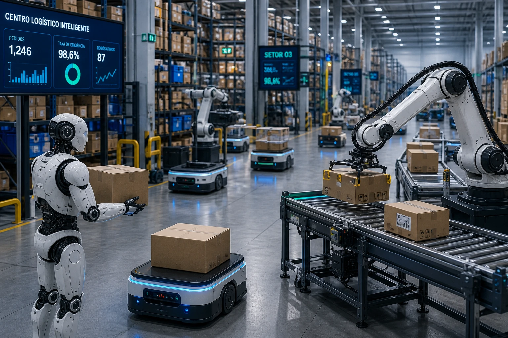
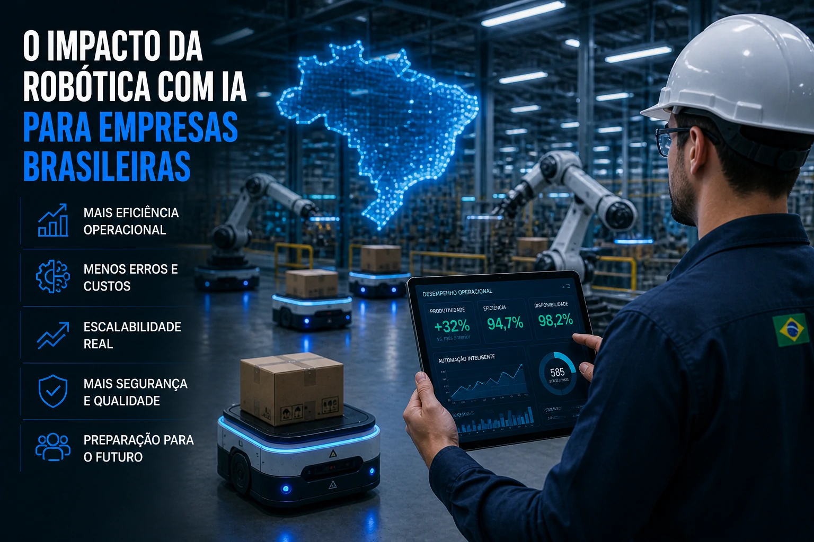

*Artificial intelligence begins to leave the software and gain a physical presence within operations. Meta's new movement reinforces a movement that can accelerate automation in logistics, industry and retail.*

**__Meta__**'s more aggressive entry into the robotics sector shows that the next phase of artificial intelligence can be less digital and more operational.

The company acquired the startup Assured Robot Intelligence (ARI), specialized in AI models for humanoid robots.

The movement expands the company's operations in a strategic area that goes beyond social networks, advertising and language models.

The focus now is physical automation.

And that changes the game.

Large companies such as **__Amazon__**, **__Tesla__** and **__Nvidia__** have also accelerated investments in advanced robotics in recent months.

The objective is clear:

transform physical operations into smarter, faster and more efficient systems.

For companies, this means a new layer of productivity.

## Robotics is entering a new phase

For years, industrial robots have been limited to repetitive tasks and predictable environments.

Now this scenario is starting to change.

With more advanced AI models, systems gain operational autonomy.

This means:

- adaptation to changes in the environment
- contextual decision making
- real-time crash correction
- continuous learning

In practice, this makes automation more flexible.

And operational flexibility is an important advantage in high-demand sectors.

## Where this technology can impact first

The most immediate application is in areas with high operational repetition.

The most impacted sectors tend to be:

- logistics
- industry
- retail
- distribution centers
- health

In the logistics sector, for example, intelligent robots can optimize order picking and stock movement.

In industry, production flexibility can increase without the need for constant reprogramming.

In retail, organization and operational replacement can gain more speed.

The gain is simple:

less error.

More efficiency.

More predictability.

## The practical impact for Brazilian companies

In Brazil, operational costs and low efficiency are still central problems for many companies.

The combination of robotics and AI can attack exactly these bottlenecks.

Companies that operate with high physical volume tend to win first.

This goes for:

- e-commerce
- industry
- logistics operators
- retail chains
- hospitals

The main advantage is operational.

Less dependence on manual processes.

More scalability.

More margin.

## The next dispute in artificial intelligence will be physics

The AI race begins to shift gears.

If before the focus was on chatbots, digital automation and data analysis, now the market is beginning to migrate to real-world execution.

The movement of **__Meta__** reinforces this trend.

For Brazilian companies, keeping up with this movement is not just a matter of innovation.

It's strategy.

Those who understand this convergence between physical automation and artificial intelligence early can build a real competitive advantage in the coming years.