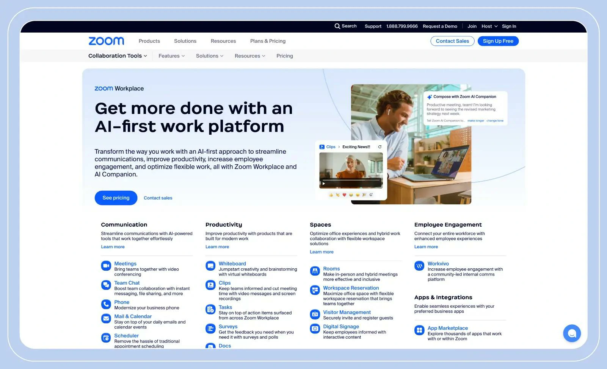

Zoom is accelerating its transformation beyond video conferencing.

The company announced the expansion of its enterprise artificial intelligence platform with a focus on autonomous agents and workflow automation.

The movement shows how traditional communication platforms are repositioning themselves to compete in an increasingly AI-driven market.

The new strategy seeks to transform meetings, calls and interactions with customers into automatic triggers for executing business tasks.

## What Zoom announced for companies

The company has expanded its agentic AI platform to operate in different areas of the corporate ecosystem.

Among the new features are:

- custom agents without code  
- automation of flows between systems  
- integration with external tools  
- AI Companion expansion  
- automation in service and collaboration

The proposal is to transform conversations into operational actions.

This reduces manual tasks and speeds up internal processes.

## How Zoom agents work in practice

Agents can act in multiple operational stages.

This includes:

### Automatic follow-up

After meetings, AI can automatically generate tasks and emails.

### Integration between tools

The platform connects internal systems and external tools.

### Commercial automation

Sales teams can speed up processes with automatic flows.

### Customer service

Demands can be classified and directed automatically.

## Why Zoom is betting big on AI now

The enterprise AI market is becoming one of the key growth drivers for software companies.

Zoom realized that the traditional meeting model is no longer sufficient to support expansion.

Now, the company seeks to position its platform as operational infrastructure.

This changes your role within companies.

From communication tool to execution tool.

## The impact for companies

Zoom's expansion shows an important movement in the market.

Business platforms are no longer just connecting people.

Now start executing tasks and automating operations.

For businesses, this means:

### More productivity

Less time spent on repetitive tasks.

### More speed

Operational processes happen with less delay.

### More integration

Different areas begin to operate in a connected way.

### Less operational dependence

Part of the execution passes to intelligent agents.

Zoom's advance reinforces a clear trend.

Artificial intelligence is no longer a support.

And it is becoming an active part of the business operation.