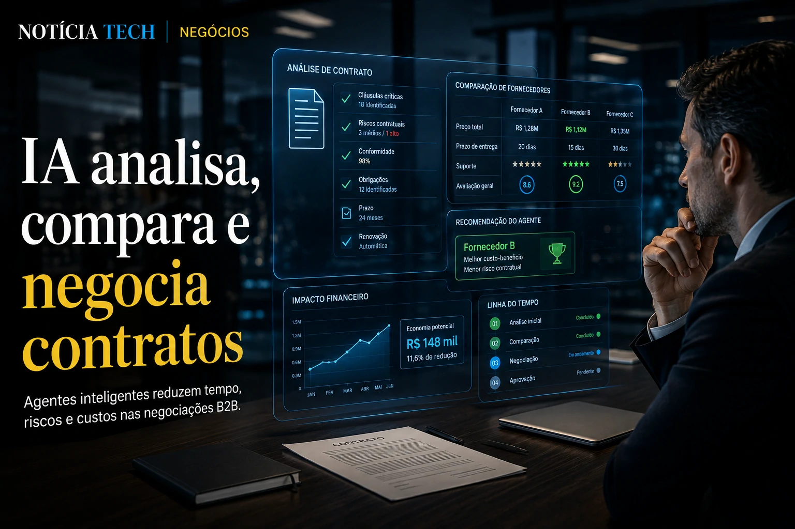
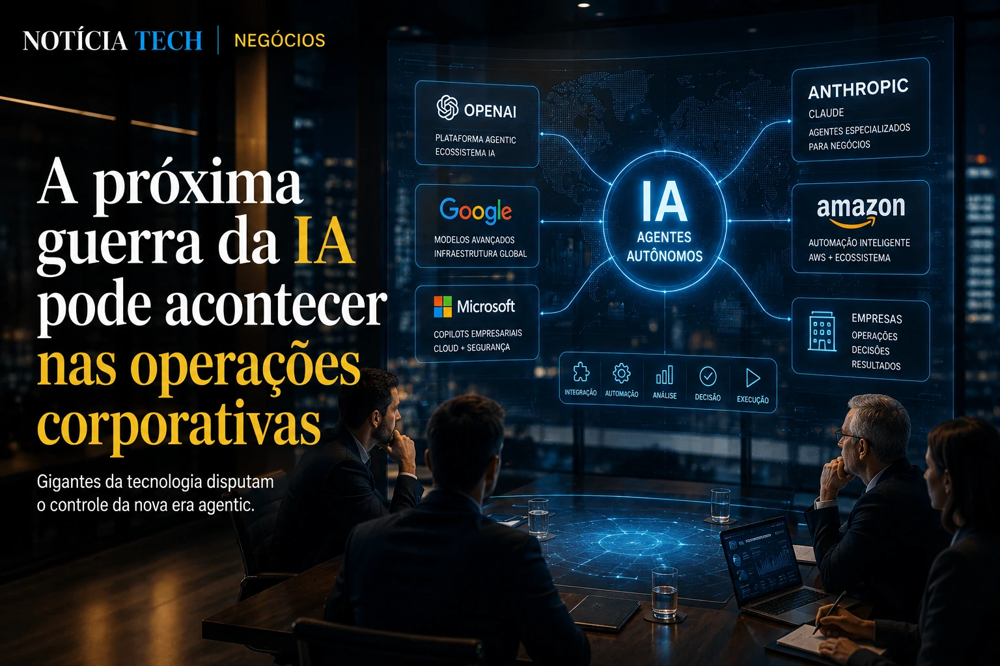

*The advancement of corporate artificial intelligence is entering a new silent phase, but potentially much more disruptive than simple task automation. After accelerating service, marketing, productivity and software development, large companies are now beginning to explore autonomous agents capable of analyzing suppliers, comparing proposals, negotiating prices and even recommending strategic decisions in B2B contracts. The movement could profoundly change the functioning of the corporate market in the coming years.*

## Companies start using AI agents to shorten the corporate negotiation cycle

The corporate software market is experiencing an accelerated transformation driven by generative artificial intelligence platforms. After the explosion of corporate copilots, companies are starting to test AI agents specialized in commercial negotiations.

In practice, these systems can:

- analyze contracts;
- compare suppliers;
- cross historical prices;
- identify legal risks;
- calculate operational impact;
- suggest better commercial conditions.

The change is starting to attract attention because it drastically reduces the time it takes to close business contracts. Processes that previously took weeks can now be analyzed in a few hours.

This movement appears in parallel with the growth of the so-called agentic economy, a concept that is already beginning to redefine digital commerce and the relationship between companies and intelligent platforms. The theme connects directly to the advance described in [Agentic Commerce: how ChatGPT, Google and Shopify are transforming the internet into an online shopping interface IA](https://noticiatech.com.br/inteligencia-artificial/com%C3%A9rcio-agentic-como-chatgpt-google-e-shopify-est%C3%A3o-transformando-a-internet-em-uma-interface-de-compras-por-ia/).

### The new role of AI within commercial areas

Until recently, most **enterprise AI** implementations were focused on operational productivity. Now, technology is beginning to advance into historically strategic areas within companies.

This includes:

- procurement;
- corporate purchases;
- B2B negotiation;
- supplier management;
- compliance;
- contractual analysis.

Instead of just responding to commands, the new agents are able to execute complete decision-making flows.

This scenario also reinforces the race for platforms capable of centralizing operational intelligence within companies, something that has already been impacting the software development market itself, as shown in [OpenAI wants to transform VS Code into the central platform of the new AI economy](https://noticiatech.com.br/inteligencia-artificial/openai-quer-transformar-o-vs-code-na-plataforma-central-da-nova-economia-da-ia/).

## The next AI war could happen within corporate operations

The advancement of autonomous agents is creating a new dispute between technology giants. Companies like **OpenAI**, **Google**, **Microsoft**, **Anthropic** and **Amazon** are accelerating investments to master the infrastructure of the next generation of enterprise software.

The objective is no longer just to offer language models.

Now, the dispute involves:

- agentic platforms;
- corporate ecosystems;
- integration with ERPs;
- workflow automation;
- operational intelligence;
- control of critical processes.

The change is strategic because companies are beginning to realize that AI agents can function as a new operational layer on top of traditional software.

This movement is close to the trend shown in [Companies begin to replace traditional software with AI agents](https://noticiatech.com.br/automacao/empresas-come%C3%A7am-a-substituir-softwares-tradicionais-por-agentes-de-ia/).

### AI stops being a tool and becomes a decision infrastructure

The corporate market is beginning to enter a new phase of artificial intelligence.

In the first wave, technology helped employees.

In the second, I automated tasks.

Now, agents are beginning to participate directly in the companies’ operational logic.

This completely changes the way organizations:

- buy software;
- hire services;
- analyze risk;
- define suppliers;
- manage productivity;
- make strategic decisions.

At the same time, concerns about governance, traceability and technological dependence are growing.

The topic gains relevance because companies have already realized that automated decisions can create important operational risks when there is no adequate supervision. This debate also appears in [AI Governance becomes a priority in companies](https://noticiatech.com.br/inteligencia-artificial/governanca-ia-prioridade-empresas/).

## The corporate job market could change with the rise of freelance agents

The rise of autonomous agents is also beginning to pressure changes within corporate structures.

Purchasing, operations and technology teams now work together to oversee intelligent systems capable of negotiating, performing analysis and automatically generating strategic recommendations.

Instead of eliminating professionals, the market tends to accelerate the creation of hybrid functions aimed at:

- supervision of agents;
- AI audit;
- AI Operations;
- intelligent workflow engineering;
- algorithmic governance.

This change is already beginning to appear in companies that structure new departments focused on coordinating autonomous agents, a trend discussed in [Companies begin to create AI Operations positions to control autonomous agents](https://noticiatech.com.br/negocios/empresas-come%C3%A7am-a-criar-cargos-de-ai-operations-para-controlar-agentes-aut%C3%B4nomos/).

### Enterprise software could enter its biggest transformation in decades

The advancement of AI agents also threatens to profoundly alter the traditional enterprise software model.

Historically, companies needed to operate multiple separate systems:

- CRM;
- ERP;
- service;
- analytics;
- automation;
- document management.

With intelligent agents capable of navigating between platforms and performing tasks contextually, some of this fragmentation begins to lose relevance.

In practice, the agent becomes the main interface.

This scenario reinforces a structural change in the technology market: companies stop buying just software and start hiring operational intelligence.

The movement is still in its infancy, but it is beginning to indicate that the next major corporate transformation may not just happen within AI models — but rather in the way entire companies begin to operate, negotiate and make decisions using autonomous agents as the central layer of strategic execution.