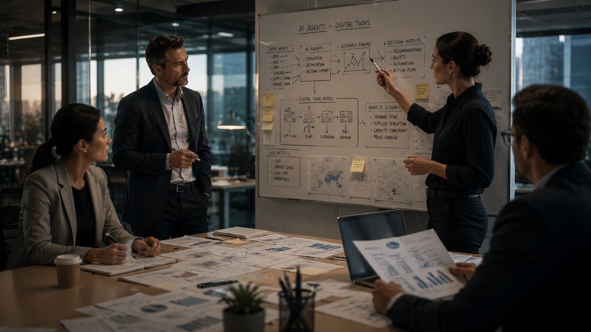

*For years, companies have made strategic decisions based on historical reports, spreadsheets and limited projections. Now, the combination of enterprise data, cloud computing and artificial intelligence is creating a new operational layer: digital environments capable of simulating entire businesses before any changes happen in the real world. The so-called AI Digital Twins are starting to become one of the most strategic assets in corporate digital transformation.*

## AI Digital Twins are digital replicas that allow you to test decisions before actual execution

**AI Digital Twins** are digital representations of operations, processes, production chains or even entire companies.

The difference in relation to traditional analytical models is the ability to incorporate real-time data and use **Artificial Intelligence** to predict future behavior.

While dashboards show what happened, digital twins help you understand what is likely to happen.

### How does a corporate digital twin work?

The system brings together data from ERPs, CRMs, sensors, sales platforms, financial systems and operational tools.

This information feeds a virtual environment that replicates the behavior of the real operation.

From there, the company can test hypotheses before making critical decisions.

### Why is this gaining traction now?

The growth of **AI agents**, cloud computing, and generative models has made it economically viable to create increasingly complex simulations.

Additionally, companies are accumulating sufficient historical volumes of data to train more accurate models.

The result is a new generation of platforms capable of predicting operational impacts with a level of detail that did not exist just a few years ago.

## Companies use AI Digital Twins to reduce risks and increase operational efficiency

Companies are using **AI Digital Twins** to validate decisions before committing financial resources, teams or infrastructure.

The objective is not to replace managers.

The goal is to enable more informed decisions.

### What can be tested inside a Digital Twin?

Among the main simulated scenarios are:

- expansion of units;
- logistical changes;
- increase in production;
- hiring;
- commercial campaigns;
- pricing policies;
- operational reorganization.

Each scenario can generate thousands of possible combinations.

**Artificial Intelligence** evaluates these alternatives and identifies which paths are most likely to be successful.

### How does this impact corporate costs?

Small operational errors can generate millions of dollars in losses.

By simulating decisions in advance, companies can identify bottlenecks before they become real problems.

This model reduces waste, accelerates planning cycles and improves resource allocation.

It is a natural evolution of the movement observed in analytics platforms and corporate copilots.

In fact, the adoption of intelligent environments is directly connected to the transformation analyzed in [Companies begin to replace dashboards with analytical copilots powered by generative AI](https://noticiatech.com.br/negocios/empresas-come%C3%A7am-a-substituir-dashboards-por-copilotos-anal%C3%ADticos-movidos-por-ia-generativa/).

## AI agents can transform Digital Twins into autonomous decision systems

The next stage of **AI Digital Twins** involves integration with autonomous agents.

In this model, the AI ​​does not just observe the simulated scenarios.

She actively participates in the construction and evaluation of decisions.

### What changes when agents enter the simulation?

Agents can run thousands of tests simultaneously.

They can change parameters, create hypotheses and identify opportunities that would be difficult for human teams to perceive.

This creates a continuous cycle of operational learning.

The more data enters the system, the more accurate the digital environment becomes.

### Can Digital Twins become the operational brains of companies?

More and more experts believe so.

As companies build robust internal knowledge bases, digital twins begin to function as layers of operational intelligence.

This trend is strongly related to the growth of so-called AI-based corporate memory.

The topic was previously explored in [Corporate memory with AI: why companies are transforming internal knowledge into competitive advantage](https://noticiatech.com.br/negocios/mem%C3%B3ria-corporativa-com-ia-por-que-empresas-est%C3%A3o-transformando-conhecimento-interno-em-vantagem-competitiva/).

## AI Digital Twins Could Redefine Strategic Planning in the Next Decade

**AI Digital Twins** represent a structural change in the way companies make decisions.

Historically, organizations analyzed the past to plan for the future.

Now the possibility arises of experiencing multiple futures before choosing which path to follow.

### Why does this matter to managers?

Because it reduces uncertainty.

Increasingly volatile markets require quick and well-informed decisions.

Companies that can predict operational impacts before execution gain a significant competitive advantage.

### Which sectors should lead this transformation?

Industry, logistics, energy, health, retail and financial services appear among the most advanced segments.

But the trend should not be restricted to large corporations.

Reducing infrastructure costs and advancing AI platforms could democratize this technology in the coming years.

Just as happened with analytics, automation and cloud computing, digital twins are moving from being an experimental innovation to becoming a permanent layer of corporate management.

In the long term, the main difference between companies will not just be who has more data. It will be whoever can create the best environments to transform this data into predictions, decisions and competitive advantages before the market notices the change.

---