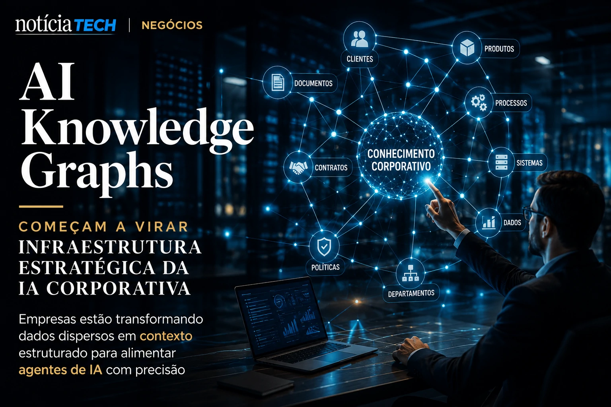

*For years, companies accumulated documents, CRMs, spreadsheets, dashboards, support tickets and disconnected internal bases. Now, with the advancement of autonomous AI agents, the market is beginning to realize that artificial intelligence without reliable organizational context creates a new silent operational bottleneck.*

## AI Knowledge Graphs begin to become strategic infrastructure for corporate AI

Companies are discovering that generative AI models work best when they can access structured relationships between data, people, systems and internal processes.



The so-called **AI Knowledge Graphs** emerge precisely to solve this problem. The technology organizes business information into contextual networks that connect strategic entities such as customers, contracts, departments, products, internal policies and operational flows.

In practice, this transforms isolated data into working memory reusable by intelligent systems.

The change happens because many companies have realized that just installing a corporate chatbot does not solve structural productivity problems.

Without organizational context:
- agents make mistakes;
- answers are inconsistent;
- processes lose reliability;
- teams become suspicious of AI.

This movement expands a trend already observed in corporate automation platforms and autonomous agents.

Companies that began to structure AI-driven operations also began to face new governance and internal context organization challenges, as already appears in movements related to [AI Readiness](https://noticiatech.com.br/negocios/ai-readiness-por-que-empresas-come%C3%A7am-a-medir-maturidade-operacional-para-sobreviver-%C3%A0-nova-economia-da-intelig%C3%AAncia-artificial/) and [corporate memory with IA](https://noticiatech.com.br/negocios/mem%C3%B3ria-corporativa-com-ia-por-que-empresas-est%C3%A3o-transformando-conhecimento-interno-em-vantagem-competitiva/).

### What changes in practice for companies?

The main change is that data is no longer just passive storage and starts to function as an operational layer of artificial intelligence.

This completely changes the logic of digital transformation.

Before:
- companies focused on storing data;
- departments operated in isolation;
- knowledge depended on specific people.

Now:
- AI requires continuous context;
- agents need to interpret relationships;
- systems need to understand operational intent.

Companies are beginning to realize that the true competitive advantage lies not only in the AI ​​model used, but in the quality of the contextual organization of internal data.

## AI agents increasingly rely on structured context

The new generation of autonomous agents requires more than well-written prompts. It relies on persistent memory, traceability, and deep contextual understanding.


This movement explains why giants like **Microsoft**, **Google**, **OpenAI**, **Anthropic** and enterprise platforms are accelerating investments in context-driven architectures.

The market realized that:
- AI without contextual memory generates rework;
- agents without governance increase risks;
- disconnected systems reduce operational efficiency.

In many cases, companies already live with a phenomenon similar to the so-called [Shadow AI](https://noticiatech.com.br/negocios/shadow-ai-empresas-descobrem-que-uso-invis%C3%ADvel-de-intelig%C3%AAncia-artificial-j%C3%A1-virou-risco-operacional-em-2026/), where teams use artificial intelligence without real integration with corporate structures.

### Why does this matter for the future of business?

Because the market begins to migrate from an economy based solely on software to an economy based on operational context.

This means that:
- companies with organized data will have an advantage;
- fragmented operations will lose efficiency;
- internal knowledge will gain strategic value.

**AI Knowledge Graphs** function as a kind of corporate cognitive layer.

They enable agents to understand:
- customer history;
- internal policies;
- organizational hierarchies;
- context of contracts;
- relationship between departments;
- operational dependencies.

This capability can reduce errors, speed up automations, and improve corporate decisions.

## The next competitive differentiator could be contextual intelligence

The corporate AI race is beginning to leave the experimental phase and enter a competition for semantic infrastructure.


Over the past few years, companies have fought for access to the best AI models. Now, the next dispute seems to be moving into another territory: who has the best structured organizational context.

This change could create a new billion-dollar market involving:
- corporate context platforms;
- organizational memory;
- semantic governance;
- integration between agents;
- operational intelligence based on graphs.

Companies that are able to connect internal knowledge in a structured way will be able to create more efficient, safe and adaptable agents.

### What can small and medium-sized companies learn from this?

Even smaller organizations can begin to build competitive advantage by better organizing their internal data.

Some possible moves include:
- centralize documentation;
- integrate CRM and customer service;
- create reusable knowledge bases;
- standardize operational flows;
- structure internal processes.

Affordable automation and AI tools now enable small businesses to create smarter operating systems without relying on large technical teams.

This movement also connects to the trend of [AI Operating Systems](https://noticiatech.com.br/negocios/ai-operating-systems-por-que-empresas-come%C3%A7am-a-substituir-softwares-isolados-por-ecossistemas-aut%C3%B4nomos-de-ia/) and the transformation of traditional software into agent-driven ecosystems.

In the long term, companies may discover that the most valuable asset in the new AI economy will not just be the model used, but the ability to transform internal knowledge into reusable operational intelligence.
```