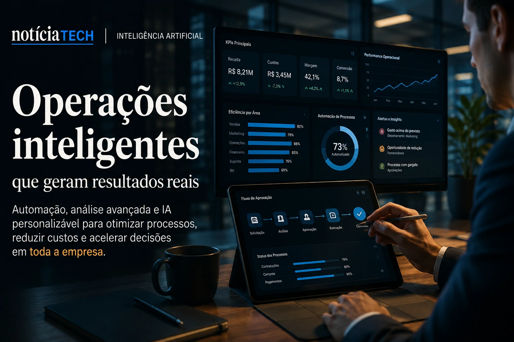

*For years, companies purchased separate software for CRM, customer service, analytics, productivity, marketing and operations. Now, a new enterprise architecture is quietly beginning to emerge: AI operating systems capable of integrating context, memory, automation and decision-making within a single intelligent layer. The movement already mobilizes giants such as **Microsoft**, **OpenAI**, **Google**, **Salesforce** and **Oracle**, while the B2B market accelerates a race to transform artificial intelligence into the operational core of companies.*

## The race to transform AI into enterprise infrastructure

The corporate technology market is beginning to enter a new structural phase. After the initial explosion of copilots, chatbots and isolated automation, companies began to realize a critical problem: disconnected tools generate operational fragmentation.

The consequence is that entire departments end up using multiple systems with no shared memory, no persistent context and no real capacity for strategic coordination.

It is precisely at this point that the so-called **AI Operating Systems** emerge.

In practice, these platforms function as a central layer of intelligence capable of:

- integrate corporate data;
- connect autonomous agents;
- understand operational context;
- store organizational memory;
- execute complex automations;
- make decisions based on business objectives.

The change goes far beyond a corporate chatbot.

What is beginning to emerge is a new operational architecture where AI stops being an auxiliary tool and becomes strategic infrastructure.

Companies that are already exploring this model are beginning to replace traditional dashboards with intelligent conversational interfaces, a trend that has already appeared in recent movements in the B2B market.

In this context, the advancement of analytical copilots connects directly to the phenomenon already explored by **Notícia Tech** in:

[Companies begin to replace dashboards with analytical copilots powered by generative AI](https://noticiatech.com.br/negocios/empresas-come%C3%A7am-a-substituir-dashboards-por-copilotos-anal%C3%ADticos-movidos-por-ia-generativa/)

The difference now is the scale.

Copilots stop operating in specific tasks and start coordinating entire business flows.

### AI begins to become the “middleware” of companies

Historically, enterprise systems have been built in layers:

- database;
- ERP;
- CRM;
- analytics;
- automation;
- productivity applications.

The new scenario adds a layer on top of them all.

This layer is contextual intelligence.

It can interpret natural language, access different software simultaneously, memorize organizational patterns and act semi-autonomously.

This is exactly why companies like **Microsoft** and **OpenAI** have been accelerating initiatives aimed at business agents connected to multiple tools.

The movement also speaks directly to the rise of autonomous corporate agents previously discussed by the portal:

[The era of AI agents has begun: How Microsoft, OpenAI, and Google are turning companies into systems autonomous](https://noticiatech.com.br/inteligencia-artificial/a-era-dos-agentes-de-ia-j%C3%A1-come%C3%A7ou-como-microsoft-openai-e-google-est%C3%A3o-transformando-empresas-em-sistemas-aut%C3%B4nomos/)

## The end of the traditional logic of isolated software

Traditional enterprise software was built around the idea of independent applications.

Each department hired its own tools:

- marketing used automation;
- sales used CRM;
- finance used ERP;
- support used help desk.

Now, AI is beginning to dissolve these boundaries.

Instead of manually navigating between dozens of systems, users now interact with a single intelligent interface capable of accessing all platforms simultaneously.

This completely changes the operating experience.

Instead of:

> “Open the right software”

employees begin to:

> “Talk to the AI layer”.

This model reduces operational friction, accelerates productivity, and creates a new paradigm for enterprise software.

### Software stops being an interface and becomes invisible infrastructure

This may be one of the most important movements in the technology industry in 2026.

The applications continue to exist.

But they are no longer the center of the experience.

The main interface becomes AI.

In practice:

- CRM becomes a source of context;
- the ERP becomes a data source;
- analytics becomes an analytical engine;
- systems no longer compete for interface;
- AI becomes the dominant layer.

This helps explain why B2B software companies are rushing to add agents, persistent memory, and intelligent automations to their products.

The dispute is no longer just about features.

Now, the competition is to become the main AI operational layer for companies.

This transformation also connects to the growth of so-called **Shadow AI**, where employees begin to use artificial intelligence without corporate approval.

The topic was previously discussed in depth in:

[Shadow AI: companies discover that the invisible use of artificial intelligence has already become an operational risk in 2026](https://noticiatech.com.br/negocios/shadow-ai-empresas-descobrem-que-uso-invis%C3%ADvel-de-intelig%C3%AAncia-artificial-j%C3%A1-virou-risco-operacional-em-2026/)

## Corporate memory could become the most valuable asset of the next decade

One of the central pillars of new AI Operating Systems is organizational memory.

While traditional software only stores structured data, new systems begin to build corporate contextual memory.

This includes:

- decision patterns;
- operational history;
- customer behavior;
- internal processes;
- company language;
- strategic objectives;
- corporate policies;
- trading history.

The consequence is profound.

AI stops answering simple questions and starts understanding the internal workings of the organization.

### The birth of “context-aware” companies

This new model creates companies capable of operating with persistent context.

The AI starts to remember:

- how the company negotiates;
- which decisions worked;
- which customers are at greatest risk;
- which flows generate bottlenecks;
- which strategies perform best.

This level of working memory creates a competitive advantage that is difficult to replicate.

The more an organization uses integrated AI, the smarter its operation tends to become.

The result is a kind of compound context effect.

Companies lagging behind in this race may face a problem similar to what happened in the digital transformation of the cloud:

It will not just be a question of efficiency.

It will be a question of competitive survival.

### Impact could redefine the B2B software market

The emergence of AI Operating Systems also threatens the traditional SaaS model.

If AI starts to mediate all interactions between users and software:

- the interface loses value;
- the context gains value;
- organizational memory gains value;
- data becomes central assets;
- autonomous agents become a competitive advantage.

This could create a new billion-dollar cycle in the technology industry.

Companies that manage to build:

- reliable persistent memory;
- coordinated business agents;
- contextual automation;
- deep integration between systems;
- operational security;

can dominate the next generation of enterprise software.

At the same time, change increases challenges related to:

- privacy;
- governance;
- data security;
- algorithmic dependence;
- decisional transparency.

The trend indicates that the corporate market is beginning to enter a new stage of digital transformation.

After cloud, mobility and automation, the next structural layer appears to be persistent operational intelligence.

And this time, the dispute will not just be about who has the best software.

It will be about who can build the AI ​​that best understands how a company really works.

---