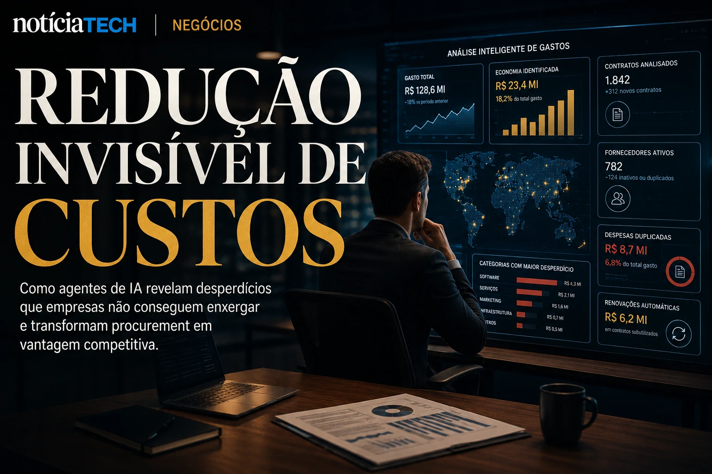

*For decades, corporate purchasing departments were treated as slow, bureaucratic operational structures highly dependent on human processes. But the arrival of AI agents is starting to quietly change this logic. Large companies are now testing systems capable of negotiating contracts, comparing suppliers, analyzing risks and even conducting entire procurement processes without direct human intervention. The movement could inaugurate a new billion-dollar dispute in the global corporate software market.*

## Companies begin to transform procurement into an AI-driven operation

Companies are using **generative AI**, **autonomous agents** and analytical systems to automate corporate purchasing processes, reduce operational waste and accelerate strategic negotiations.

In practice, the so-called **AI Procurement** represents the transformation of traditional procurement into a structure driven by data, automation and contextual intelligence.

The global procurement market already generates trillions of dollars annually. The problem is that most companies still operate with:
- excess spreadsheets;
- multiple decentralized suppliers;
- low operational integration;
- slow renegotiations;
- invisible waste;
- little predictive intelligence.

With the arrival of **AI agents**, companies are beginning to see procurement not just as an administrative area, but as a strategic center for financial efficiency.

### What can AI agents do in procurement?

The new corporate systems can:
- compare thousands of suppliers in seconds;
- identify waste patterns;
- predict price increases;
- suggest renegotiations;
- analyze contractual risks;
- automate quotes;
- accelerate compliance;
- detect redundant purchases.

The difference is that agents don't just operate as passive dashboards.

They start to act as active operators within the company.

This movement has a strong connection with the rise of the so-called:
- **AI Operating Systems**;
- corporate copilots;
- autonomous business agents;
- cognitive automation.

In fact, the advancement of these ecosystems has already been discussed by NOTÍCIA TECH itself in content such as:

[AI Operating Systems: why companies are starting to replace isolated software with autonomous AI ecosystems](https://noticiatech.com.br/negocios/ai-operating-systems-por-que-empresas-come%C3%A7am-a-substituir-softwares-isolados-por-ecossistemas-aut%C3%B4nomos-de-ia/)

and also:

[AI agents begin negotiating corporate contracts and could transform the B2B software market](https://noticiatech.com.br/negocios/agentes-de-ia-come%C3%A7am-a-negociar-contratos-corporativos-e-podem-transformar-o-mercado-de-software-b2b/)

## The true impact of AI in procurement is in invisible cost reduction

The biggest impact of **AI Procurement** is not just in automation.

It lies in the ability to reveal invisible waste that companies cannot normally detect manually.

In many organizations, different departments:
- hire repeated tools;
- use similar suppliers;
- negotiate contracts separately;
- pay inconsistent prices;
- renew services without strategic audit.

AI agents can consolidate this data in real time.

This creates a new operational management model based on:
- predictive intelligence;
- analytical centralization;
- continuous monitoring;
- dynamic cost optimization.

### Why did this become a priority in 2026?

The global economic scenario has increased pressure for operational efficiency.

At the same time:
- software costs have grown;
- companies started to operate more SaaS tools;
- structures became more complex;
- hybrid operations increased invisible expenses.

According to corporate market estimates, medium and large companies often waste between 10% and 30% of investments in software and suppliers due to operational fragmentation.

It is exactly at this point that AI agents begin to gain relevance.

They function as a permanent layer of operational financial intelligence.

This advance is directly related to the growth of the so-called **AI Readiness**, a topic that NOTÍCIA TECH has previously analyzed:

[AI Readiness: why companies are starting to measure operational maturity to survive the new artificial intelligence economy](https://noticiatech.com.br/negocios/ai-readiness-por-que-empresas-come%C3%A7am-a-medir-maturidade-operacional-para-sobreviver-%C3%A0-nova-economia-da-intelig%C3%AAncia-artificial/)

## The corporate software market could enter a new billion-dollar dispute

The advancement of **AI Procurement** could trigger a new strategic race between giants such as:
- **Microsoft**;
- **Oracle**;
- **SAP**;
- **Salesforce**;
- **ServiceNow**;
- **OpenAI**;
- **Google Cloud**;
- **Amazon AWS**.

The reason is simple:
Whoever controls the companies' operational agents will be able to control much of the corporate decision-making.

This completely changes the logic of enterprise software.

### Procurement is no longer just operational

Historically, corporate platforms were used to:
- record information;
- organize processes;
- store contracts;
- centralize documents.

Now systems begin to:
- interpret context;
- suggest decisions;
- predict scenarios;
- perform actions;
- trade automatically.

This is the beginning of a structural transition:
from passive software to agent software.

### What changes for small and medium-sized companies?

Small and medium-sized companies could be some of the biggest beneficiaries.

This is because AI agents reduce historical barriers to operation.

Smaller businesses can:
- negotiate better with suppliers;
- automate purchases;
- reduce waste;
- operate with lean teams;
- increase financial efficiency.

At the same time, companies that take time to structure internal data may face difficulties integrating these new intelligent ecosystems.

This movement is directly connected to the growth of invisible automation in Brazilian companies:

[Silent AI: how small companies are automating operations without attracting market attention](https://noticiatech.com.br/automacao/ia-silenciosa-como-pequenas-empresas-est%C3%A3o-automatizando-opera%C3%A7%C3%B5es-sem-chamar-aten%C3%A7%C3%A3o-do-mercado/)

and also to strengthen AI operational governance:

[AI governance becomes a priority for companies amid the expansion of autonomous agents](https://noticiatech.com.br/inteligencia-artificial/governanca-ia-prioridade-empresas/)

What is beginning to emerge now is a new layer of the digital economy:
companies operating not just with software, but with entire ecosystems of intelligent agents negotiating, analyzing risks, reducing costs and making decisions in real time.

And the more AI advances within corporate operations, the more procurement stops being an administrative sector and becomes a strategic infrastructure of the new business economy based on artificial intelligence.

---