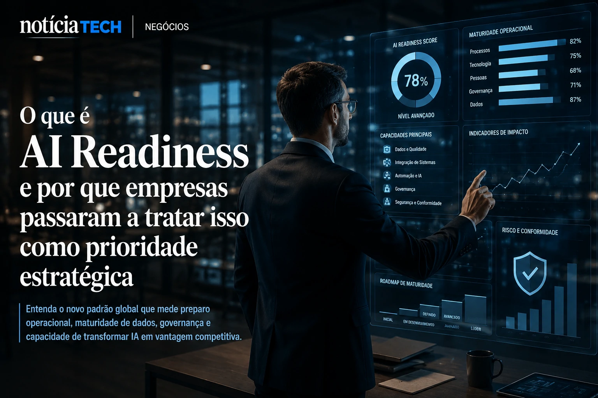
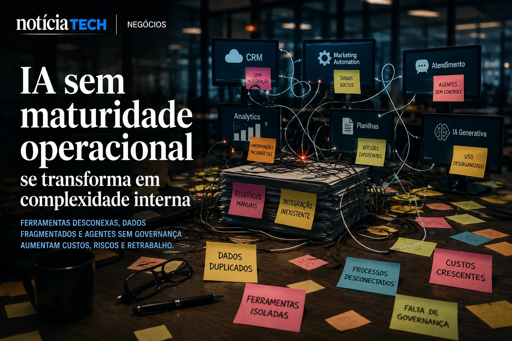

*During the last two years, the corporate market has experienced an accelerated race to adopt artificial intelligence. But in 2026, the logic begins to change. Companies have realized that simply hiring AI tools does not guarantee productivity, competitive advantage or real transformation. The new priority now is to measure the so-called AI Readiness — the level of operational, structural and strategic preparation necessary to transform AI into a sustainable result.*

## What is AI Readiness and why companies have started to treat it as a strategic priority

**AI Readiness** represents a company's level of preparation to operate artificial intelligence in a scalable, secure and integrated manner into business processes.

In practice, this means evaluating factors such as:

- data organization;
- operational quality;
- integration between systems;
- digital maturity;
- AI governance;
- corporate culture;
- automation capacity;
- information security;
- team training.

The market began to realize that many companies implemented AI in a fragmented way.

Tools were added without real integration.

Departments began to operate isolated systems.

Teams began using autonomous agents without centralized governance.

This scenario has already been discussed in recent movements in the corporate market, especially after the growth of the so-called **Shadow AI**, where employees use artificial intelligence without official company supervision.

This movement has already appeared in recent trends analyzed by NOTÍCIA TECH itself:

- [Shadow AI: companies discover that the invisible use of artificial intelligence has already become an operational risk in 2026](https://noticiatech.com.br/negocios/shadow-ai-empresas-descobrem-que-uso-invis%C3%ADvel-de-intelig%C3%AAncia-artificial-j%C3%A1-virou-risco-operacional-em-2026/)
- [Companies discover that AI without internal organization increases costs and reduces productivity](https://noticiatech.com.br/negocios/empresas-descobrem-que-ia-sem-organiza%C3%A7%C3%A3o-interna-aumenta-custos-e-reduz-produtividade/)

Now, the market is beginning to understand that the true competitive differentiator will not just be having AI, but being able to operate AI in a coordinated way.

## Companies begin to discover that AI without operational maturity increases internal complexity

The first phase of AI adoption was marked by enthusiasm.

The second begins to be marked by complexity.

Companies began to realize that:

- multiple copilots generate redundancy;
- disconnected tools create rework;
- isolated automations increase operational noise;
- too many platforms fragment internal data;
- agents without governance create corporate risk.

In many cases, AI has increased operational speed, but it has also amplified structural disorganization.

This is exactly the reason why large companies started investing in new internal areas linked to:

- **AI Operations**;
- AI governance;
- automation architecture;
- integration of agents;
- operational security;
- AI observability.

The market begins to migrate from the experimental phase to a phase of operational industrialization of artificial intelligence.

This movement also directly connects with the growth of so-called **AI Operating Systems**, where companies try to replace dozens of isolated tools with unified AI ecosystems.

The topic has already been discussed by NOTÍCIA TECH in recent analyses:

- [AI Operating Systems: why companies are starting to replace isolated software with autonomous AI ecosystems](https://noticiatech.com.br/negocios/ai-operating-systems-por-que-empresas-come%C3%A7am-a-substituir-softwares-isolados-por-ecossistemas-aut%C3%B4nomos-de-ia/)
- [Companies begin to create AI Operations positions to control autonomous agents](https://noticiatech.com.br/negocios/empresas-come%C3%A7am-a-criar-cargos-de-ai-operations-para-controlar-agentes-aut%C3%B4nomos/)

### What companies start to measure within AI Readiness

The new generation of corporate metrics begins to include factors that were not previously treated as a priority.

Among the main indicators observed by companies are:

- quality of the database;
- integration between platforms;
- operational response time;
- autonomy of agents;
- automation costs;
- regulatory risk;
- dependence on suppliers;
- prompt security;
- traceability of AI decisions.

The change is important because the market realized that AI is no longer just software.

Now, artificial intelligence is beginning to function as critical operational infrastructure.

## The AI market enters a new phase: less experimentation and more real efficiency

The next market fight will not be about who has the most AI tools.

It will be about who can transform AI into sustainable operational efficiency.

Companies are beginning to realize that real productivity depends on:

- systems integration;
- organizational quality;
- clear internal processes;
- structured data;
- strong governance;
- adaptable operational culture.

This explains why many organizations have accelerated investments in:

- unified platforms;
- corporate copilots;
- data infrastructure;
- operational observability;
- automation architecture;
- integrated agents.

The trend also helps explain why giants such as **Microsoft**, **Google**, **OpenAI**, **Anthropic** and **Salesforce** began to compete not only for AI models, but for control of companies' operational infrastructure.

The race now takes place within the corporate flow.

### What changes for small and medium-sized companies

Small companies are perhaps the biggest beneficiaries of this new phase.

This is because many smaller organizations are able to:

- implement automations faster;
- reduce internal bureaucracy;
- integrate operations more quickly;
- adapt processes without complex structures;
- accelerate digital transformation at a lower cost.

Modern tools already allow small businesses to operate:

- automated service;
- marketing with AI;
- Smart CRM;
- commercial automation;
- support agents;
- operational analysis in real time.

This scenario already appears in other recent transformations analyzed by NOTÍCIA TECH:

- [AI tools for small businesses: how to automate service, content and sales without a technical team](https://noticiatech.com.br/negocios/ferramentas-de-ia-para-pequenas-empresas-como-automatizar-atendimento-conte%C3%BAdo-e-vendas-sem-equipe-t%C3%A9cnica/)
- [WhatsApp Business gains automation with AI and becomes a central tool for small businesses in Brazil](https://noticiatech.com.br/negocios/whatsapp-business-ganha-automa%C3%A7%C3%B5es-com-ia-e-vira-ferramenta-central-para-pequenas-empresas-no-brasil/)
- [Silent AI: how small companies are automating operations without attracting market attention](https://noticiatech.com.br/automacao/ia-silenciosa-como-pequenas-empresas-est%C3%A3o-automatizando-opera%C3%A7%C3%B5es-sem-chamar-aten%C3%A7%C3%A3o-do-mercado/)

### The new AI economy begins to separate prepared companies from merely digitalized companies

For many years, digital transformation meant owning software.

Now, that is no longer enough.

The new phase of the market requires operational capacity to coordinate artificial intelligence at scale.

Companies that can integrate:

- data;
- automation;
- autonomous agents;
- operations;
- governance;
- decision making;

tend to build competitive advantages that are difficult to replicate.

The market is beginning to realize that the true value of AI is not just in the generative model.

It lies in the company's ability to transform artificial intelligence into a continuous operational structure.

And this may be the biggest silent change in the digital economy in 2026.

---