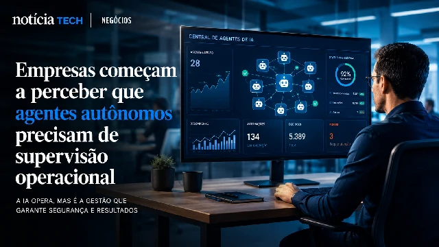
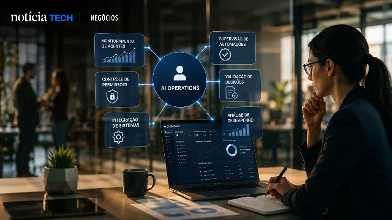
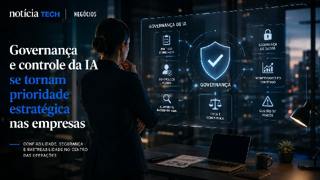

*The accelerated growth of autonomous agents is creating a new silent transformation within companies. After the initial rush to adopt artificial intelligence, organizations are beginning to realize that the real challenge now is not just implementing AI — but coordinating, supervising and controlling entire operations carried out by intelligent agents. This movement begins to drive the emergence of a new professional layer: AI Operations specialists.*

## Companies are beginning to realize that autonomous agents need operational oversight

The first wave of corporate artificial intelligence was marked by:
- experimentation;
- punctual automation;
- productivity gain;
- initial integration of copilots.

Now, the second phase begins to emerge.

Companies begin to operate:
- multiple agents;
- connected automations;
- smart flows;
- autonomous systems;
- AI-driven platforms.

And this creates a new operational problem.

### The more AI companies use, the greater the need for coordination

Many organizations are beginning to discover that intelligent agents:
- make decisions;
- perform tasks;
- interact with systems;
- access critical information;
- automate complete flows.

But without adequate supervision, risks arise related to:
- governance;
- compliance;
- security;
- operational inconsistency;
- redundancy of automations.

In this scenario, there is a need for professionals responsible for:
- supervise agents;
- validate operations;
- organize permissions;
- monitor automated decisions;
- integrate corporate flows.

### AI Operations begins to function as an operational hub for corporate AI

The concept of **AI Operations** emerges as a natural evolution of the industrialization of artificial intelligence.

The focus is no longer just:
- create prompts;
- test tools;
- automate isolated tasks.

And it involves:
- systemic coordination;
- operational monitoring;
- integration between agents;
- process control;
- continuous management of AI.

This movement is already beginning to appear in companies that accelerate investments in intelligent agents and business automation:

- [Companies begin to replace traditional software with AI agents](https://noticiatech.com.br/automacao/empresas-come%C3%A7am-a-substituir-softwares-tradicionais-por-agentes-de-ia/)
- [Companies double investments in corporate AI and Brazil accelerates adoption of intelligent agents](https://noticiatech.com.br/inteligencia-artificial/empresas-dobram-investimentos-em-ia-corporativa-e-brasil-acelera-ado%C3%A7%C3%A3o-de-agentes-inteligentes/)

## The new generation of professionals will need to understand processes, AI and operations at the same time

The advancement of corporate AI is also beginning to transform the job market.

Companies realize that it is not enough to just hire:
- developers;
- data scientists;
- automation experts.

A hybrid need arises between:
- technology;
- operations;
- governance;
- strategy;
- process management.

### The AI Operations professional can become a central part of companies

New enterprise AI operators begin to take on roles such as:
- monitor agents;
- organize smart flows;
- supervise integrations;
- validate automated responses;
- control access to data;
- optimize human+AI hybrid operations.

In practice, this professional works as:
- AI operational coordinator;
- automation manager;
- agent supervisor;
- corporate integrator.

This creates an important change in the organizational structure of companies.

### The focus stops being just automation and becomes orchestration

The market is beginning to realize that the true value of AI is not just in automating individual tasks.

The competitive differentiator becomes:
- connect agents;
- integrate systems;
- coordinate flows;
- reduce operational friction;
- create scalable operations.

This movement directly connects to the evolution of agentic AI and the corporate industrialization of artificial intelligence:

- [Agentic AI could redesign business automation in the coming years](https://noticiatech.com.br/automacao/ia-ag%C3%AAntica-pode-redesenhar-a-automa%C3%A7%C3%A3o-empresarial-nos-pr%C3%B3ximos-anos/)
- [2026 became the year of AI industrialization in Brazil](https://noticiatech.com.br/inteligencia-artificial/2026-virou-o-ano-da-industrializa%C3%A7%C3%A3o-da-ia-no-brasil/)

## AI governance could become one of the most strategic areas of the next decade

As companies increase operational dependence on artificial intelligence, concerns about:
- reliability;
- traceability;
- security;
- decision control;
- operational predictability.

This means that AI governance stops being just a regulatory discussion and becomes an operational priority.

### Companies begin to structure hybrid operations between humans and agents

The tendency is for many organizations to start operating in hybrid models made up of:
- human employees;
- specialized agents;
- autonomous systems;
- operational copilots;
- smart platforms.

In this scenario, the challenge is no longer just “using AI”.

The focus becomes:
- coordinate intelligence;
- control automated operations;
- supervise decisions;
- avoid systemic failures;
- maintain operational efficiency.

### The next competitive advantage could be in the ability to coordinate intelligent agents

Companies that can structure:
- operational governance;
- continuous supervision;
- intelligent integration;
- scalable flows;
- hybrid coordination;

can gain enormous competitive advantage in the coming years.

This is because the market is beginning to enter a phase where productivity will no longer depend solely on how many AI tools a company has.

But mainly from:
- how these intelligences work together;
- how they are supervised;
- how flows are coordinated;
- how automated decisions are organized.

Artificial intelligence is no longer just an experimental layer within companies.

Now, it begins to transform into a continuous operation that will require new professionals, new organizational structures and a new corporate management logic.