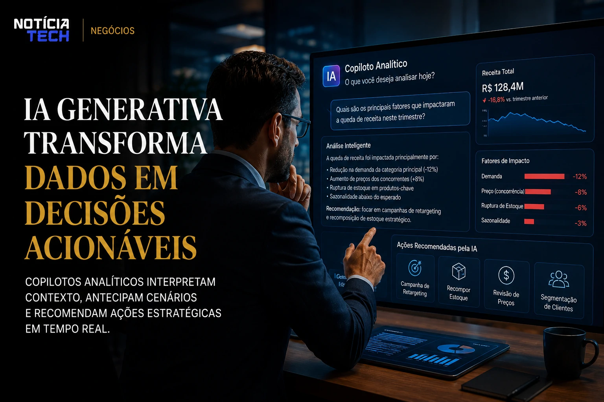
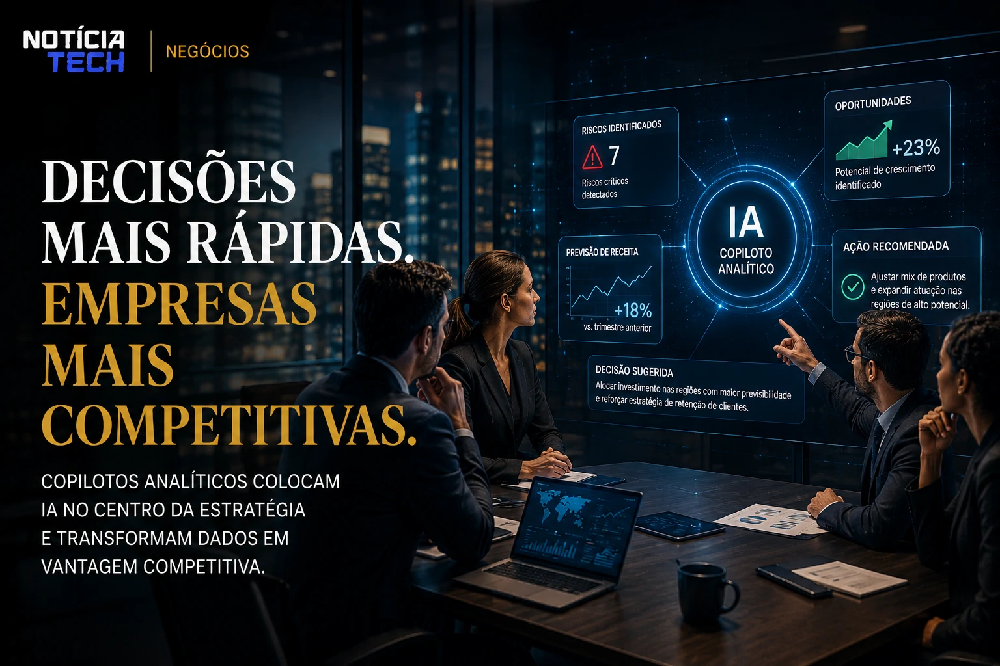

*For years, dashboards dominated the corporate universe as the main data analysis tool. Now, a new transformation driven by **generative AI** is beginning to profoundly change this scenario. Instead of manually navigating through complex charts, filters and reports, companies are switching to analytical co-pilots capable of interpreting information, answering strategic questions and even suggesting decisions in real time.*

## The end of the era of static dashboards

Traditional **Business Intelligence (BI)** systems were built for operational logic based on human reading. Executives needed to interpret metrics, cross-reference indicators and transform data into strategic decisions manually.

With the advancement of **generative AI**, this model begins to seem slow in the face of new corporate demands.

Companies like **Microsoft**, **Google**, **Salesforce** and **Oracle** started to integrate language models directly into analytical platforms, creating conversational experiences capable of replacing much of the traditional navigation through dashboards.

Now, managers can simply ask:

- “Which region showed the biggest drop in margin?”
- “Why did sales slow down this week?”
- “Which products have the highest risk of churn?”

And receive contextualized responses, interpreted and accompanied by strategic recommendations.

This movement accelerates a structural change in the corporate data market.

### The new operational layer of business analytics

The focus stops being just visualization of metrics and moves to automated interpretation.

Analytical copilots begin to act as:

- data interpreters;
- executive assistants;
- predictive systems;
- operational recommendation mechanisms;
- contextual decision-making platforms.

This drastically reduces dependence on highly technical teams for basic analytical tasks.

Furthermore, it democratizes access to business intelligence within companies.

Instead of relying exclusively on specialized analysts, areas such as marketing, sales, HR and operations now communicate directly with intelligent systems.

This scenario directly connects to the advancement of corporate automation already discussed in:
[Companies accelerate adoption of autonomous AI agents to reduce operational costs](https://noticiatech.com.br/automacao/empresas-come%C3%A7am-a-substituir-softwares-tradicionais-por-agentes-de-ia/)

## Generative AI turns data into actionable decisions

The difference of analytical copilots is not just in answering questions.

The real impact appears in the ability to interpret corporate context.

The new systems begin to connect:

- operational histories;
- market trends;
- consumer behavior;
- seasonality;
- financial goals;
- competitive moves.

This allows AI to deliver not just information, but strategic direction.

### The rise of conversational predictive analytics

One of the most relevant trends is the popularization of so-called conversational predictive analysis.

In this model, AI does not just wait for human commands.

It automatically starts suggesting:

- operational risks;
- possible drops in revenue;
- logistical bottlenecks;
- changes in customer behavior;
- commercial opportunities.

In some cases, the systems are already able to recommend specific actions for internal teams.

This advancement creates a new paradigm within the corporate software market.

Tools are no longer passive.

They begin to act as proactive entities within the business operation.

This movement follows the growing integration between AI and corporate productivity observed in:
[Microsoft expands AI integration in the workplace and redefines corporate productivity](https://noticiatech.com.br/negocios/microsoft-e-openai-mudam-parceria-e-deixam-alerta-para-empresas-sobre-o-risco-de-depender-de-uma-%C3%BAnica-ia/)

## The strategic impact for companies and professionals

The rise of analytical co-pilots should profoundly change the professional profile within organizations.

The trend points to a gradual reduction in operational tasks linked to manual data extraction.

In parallel, the appreciation of professionals capable of:

- interpret strategic context;
- validate AI recommendations;
- build data-driven narratives;
- supervise analytical automations;
- integrate artificial intelligence into business processes.

### The new competitive advantage will be speed of interpretation

Companies have always had increasing access to data.

The problem was never a lack of information.

The real challenge has always been in the speed of interpretation.

Analytics copilots reduce this bottleneck.

Organizations that can integrate AI directly into decision-making will be able to respond more quickly to:

- market changes;
- fluctuations in consumption;
- competitive movements;
- operational crises;
- emerging trends.

At the same time, the dispute between technology giants for dominance in this new operational layer is growing.

The traditional BI market is beginning to enter a phase of forced reinvention.

Platforms that do not incorporate generative AI tend to quickly lose relevance in the face of much more accessible and efficient conversational solutions.

This scenario also reinforces the growing consolidation of AI as the central infrastructure of modern companies, a trend observed in:
[Google accelerates corporate AI competition with advanced integration of Gemini into Workspace](https://noticiatech.com.br/inteligencia-artificial/gemini-spark-a-ia-aut%C3%B4noma-do-google-que-pode-transformar-o-futuro-do-trabalho-digital/)

As analytical copilots evolve, the tendency is for traditional dashboards to stop being the center of the corporate experience and start to function only as secondary visual support. The next generation of business intelligence will be less based on manual navigation and increasingly driven by intelligent conversations, operational context and automated real-time decisions.

---