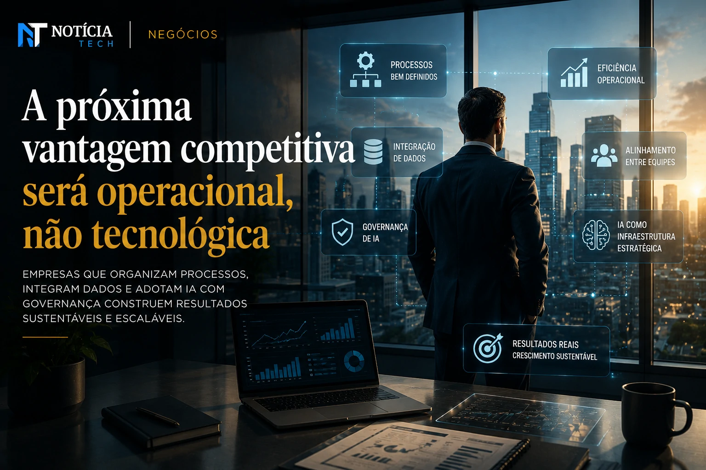

*During the last two years, the corporate race to adopt **Artificial Intelligence** has created a perception of almost absolute urgency within companies. The problem is that many organizations started to implement AI tools even before organizing internal processes, operational flows and governance structures. The result is now beginning to appear behind the scenes: increased costs, rework, data fragmentation and a silent drop in productivity.*

## The new invisible crisis of corporate AI

The first wave of **generative AI** adoption was driven largely by the fear of being left behind. Companies began to integrate automation tools, intelligent copilots and productivity platforms without reviewing their own operational maturity.

In practice, many teams started to operate with multiple disconnected platforms, creating a fragmented corporate environment.

According to industry analysts, the problem is not the technology itself, but the lack of an operational strategy to absorb the impact of AI within companies.

This scenario is starting to generate a silent phenomenon: professionals spending more time managing tools than executing strategic tasks.

Instead of simplifying processes, some implementations end up creating new layers of complexity.

This movement also increases concerns linked to data governance, compliance and integration between departments.

Companies that accelerated adoption without planning are now beginning to realize that real productivity depends less on the tool and more on the internal structural organization.

The movement accompanies a broader transformation of the corporate market, especially after digital platforms began to compete for attention and automated distribution of corporate content, as shown in the analysis of [LinkedIn stops being a resume network and becomes a B2B distribution platform driven by IA](https://noticiatech.com.br/negocios/linkedin-deixa-de-ser-rede-de-curr%C3%ADculos-e-vira-plataforma-de-distribui%C3%A7%C3%A3o-b2b-impulsionada-por-ia/).

### Excessive tools have become a new corporate problem

The accelerated growth of the AI market has created an explosion of platforms promising immediate productivity increases.

Today, many companies operate simultaneously with:
- text copilots;
- automation platforms;
- AI agents;
- predictive analysis systems;
- automated service tools;
- intelligent management solutions.

The problem is that few of these tools talk to each other properly.

This generates:
- duplication of processes;
- operational inconsistency;
- decentralized data;
- increase in hidden operational costs;
- excessive dependence on third-party platforms.

In some cases, entire departments began to develop parallel flows using different tools to perform similar functions.

## The market begins to value governance over speed

After the initial phase of euphoria, the market begins to enter a new stage of digital transformation.

Now, investors and executives are starting to prioritize:
- operational integration;
- data security;
- standardization of flows;
- reduction of redundancies;
- cost control;
- real efficiency.

Companies that previously announced dozens of AI initiatives simultaneously are starting to reduce projects and focus investments on solutions truly integrated into the business.

This change represents an important maturity of the market.

The current perception is that AI alone does not generate sustainable competitive advantage.

The difference begins to emerge in companies that are able to transform AI into integrated operational infrastructure.

This includes:
- internal training;
- review of processes;
- data integration;
- creation of usage policies;
- automation control;
- productivity management based on real metrics.

The trend also strengthens a growing movement towards sustainable operational efficiency, similar to the advance observed in corporate automation platforms discussed in [Companies abandon giant teams and adopt lean structures driven by AI](https://noticiatech.com.br/automacao/empresas-come%C3%A7am-a-substituir-softwares-tradicionais-por-agentes-de-ia/).

### AI without organized processes increases internal bottlenecks

Many companies have discovered that AI accelerates the exact level of organization they already have.

If the internal structure is efficient:
- AI enhances productivity.

If the structure is chaotic:
- AI accelerates chaos.

This effect was evident in areas such as:
- service;
- marketing;
- content production;
- corporate support;
- data analysis;
- operational management.

In several cases, professionals started to produce more volume, but with less strategic consistency.

The direct consequence appears in the growth of corporate rework.

## The next competitive advantage will be operational

The next phase of digital transformation should favor companies that are less obsessed with speed and more focused on intelligent operational efficiency.

This means that:
- well-defined processes;
- data integration;
- operational standardization;
- AI governance;
- alignment between teams;

can become more valuable assets than simply having access to the most advanced tools on the market.

The scenario also creates an important change in the profile of professionals valued by companies.

The tendency is for organizations to start looking for people capable of:
- integrate systems;
- coordinate automated flows;
- validate operational quality;
- supervise AI agents;
- organize hybrid processes between humans and automation.

This movement begins to redefine the very concept of corporate productivity.

Instead of just producing faster, companies are beginning to realize that sustainable growth depends on an intelligent operational structure, efficient integration and the ability to continuously adapt in the face of the accelerated advancement of AI in the corporate environment.

---