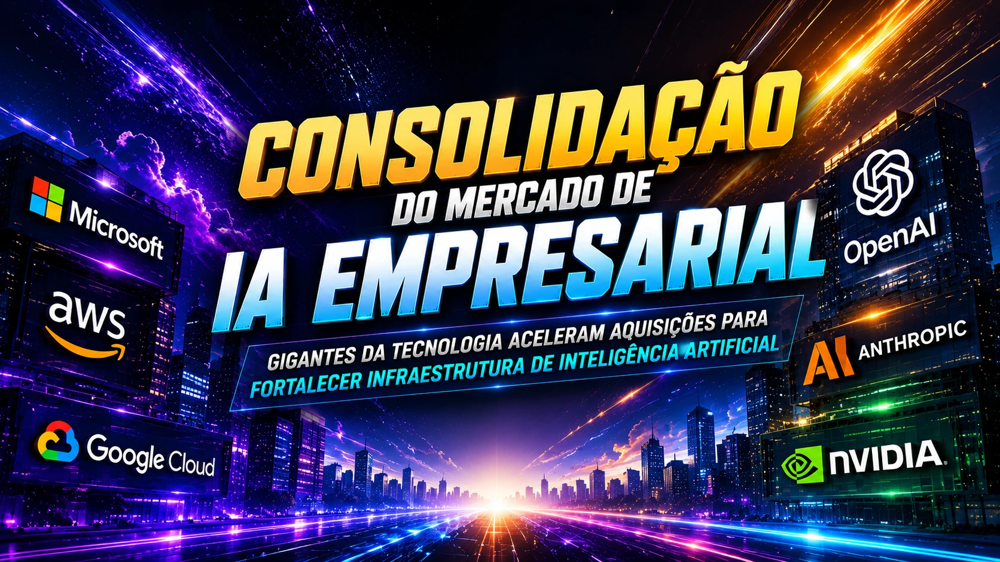

*The enterprise artificial intelligence market is entering a new phase of consolidation. **Cognizant**'s acquisition of **Astreya**, in a deal valued at approximately **$600 million**, shows that the race for enterprise AI is no longer just about models — it's now about infrastructure, scale, and actual operations.*

*Cognizant's move reinforces accelerated consolidation of the AI infrastructure sector.*

## Enterprise AI Consolidation Has Begun

*Tech giants accelerate acquisitions to strengthen artificial intelligence infrastructure.*

The artificial intelligence market is changing rapidly.

In the early years of the generative AI explosion, the focus was almost entirely on models.

Whoever had the most advanced model dominated headlines, attracted investments and captured the market.

But this cycle began to change.

Now, companies have realized that the real challenge is not creating intelligence.

It's about **operationalizing intelligence**.

And that is exactly why **Cognizant** decided to buy **Astreya**, a company specialized in technological infrastructure, data center operations and corporate AI environments.

The acquisition strengthens the company's position at a time when demand for scalable AI deployment is growing globally. :contentReference[oaicite:2]{index=2}

This movement follows a trend that we have already seen in the market with the dispute between **OpenAI** and **Anthropic** for control of the implementation of AI in companies.

Now the logic is clear:

**whoever controls the infrastructure, controls the scalability.**

## Why infrastructure has become a priority in the AI market

*Robust infrastructure is the new competitive differentiator in the enterprise AI race.*

Many people look at artificial intelligence and only think about software.

But the corporate reality is different.

AI at scale requires:

- robust servers  
- data architecture  
- high performance networks  
- safe environments  
- integration between systems  
- distributed processing

Without this, there is no operation.

**Astreya** built its reputation precisely in this field.

The company has been managing complex infrastructure operations for some of the largest technology companies in the world for years.

And this has strategic value.

Because the new AI race is not just about intelligence.

It's about operational sustainment.

This point directly connects with the growth in the use of AI to reduce operational costs, where infrastructure is a critical part of efficiency.

## What does Cognizant gain from this acquisition

The acquisition delivers three clear advantages for **Cognizant**.

### Operational scalability

With Astreya's infrastructure, Cognizant can accelerate AI implementation for enterprise customers.

This reduces deployment time.

And time is a competitive advantage.

### Portfolio expansion

The company expands its offer.

Now you can work not only in consultancy and digital transformation, but also in the operational layer.

This increases average ticket.

### Strategic positioning

The AI services market is getting more competitive.

Companies such as **Accenture**, **IBM** and **Capgemini** are expanding their presence.

Strengthening infrastructure is an important competitive defense.

## The impact of this movement for Brazilian companies

*Brazilian market can benefit from the new consolidation phase of corporate AI.*

In Brazil, this type of movement usually anticipates trends.

What happens in big markets usually arrives here with force.

Especially in sectors such as:

- retail  
- banks  
- fintechs  
- logistics  
- health  
- customer service

Brazilian companies are increasing investment in AI.

But they face classic difficulties:

- systems integration  
- limited infrastructure  
- low operational maturity

If the global market accelerates complete solutions, this could reduce barriers in Brazil.

This scenario connects with companies that are already using AI for billing and revenue recovery and seeking greater operational efficiency.

The right infrastructure can accelerate all of this.

## B2B AI's new game is scale and operation

The market is maturing.

And that changes priorities.

Before:

model.

Now:

infrastructure.

After:

execution.

This cycle is natural.

All technology goes through this.

Innovation first.

Then standardization.

Then consolidation.

Cognizant's purchase of Astreya is a clear sign that we are entering this third phase.

And that's important.

Because consolidation generally means:

more competition  
more efficiency  
more offer  
more pressure for results

And in the B2B market, results are the center of everything.

## The next big dispute will be invisible to the public

If before the dispute was public and visible — models, benchmarks and launches — now it moves behind the scenes.

Infrastructure.

Operation.

Implementation.

Integration.

It's less glamorous.

But much more profitable.

And perhaps this is the most important point:

The next generation of enterprise AI leaders may not be the ones creating the best model.

It could be whoever delivers the best system working within companies.

And this difference completely changes the market.