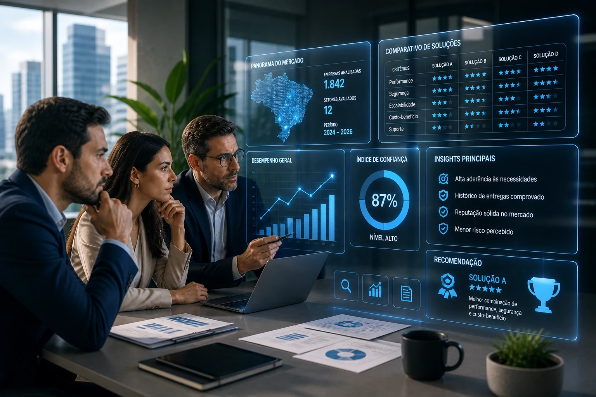

*Brazil has access to more marketing tools than ever before. More platforms, more automation, more artificial intelligence. And even so, most companies fail to reach their own goals. The problem is not a lack of resources. It's a lack of method.*

This is the direct diagnosis of one of the largest Brazilian studies on the subject.

And it changes the conversation about what really matters in digital marketing in 2026.

## The number no one wants to see

The **RD Station** Marketing and Sales Panoramas 2025 — the largest Brazilian survey on the topic, with data from thousands of companies — revealed a scenario that demands attention:

**71% of Brazilian companies did not reach their marketing goals in 2024.**

This number is high. But what makes it even more relevant is the context:

at the same time, **58% of these companies were already using artificial intelligence** in their marketing operations.

In other words: having technology was not enough.

The gap is not in the tools.

It is in the absence of an integrated strategy, consistent method and real connection between marketing, sales and data.

And 2026 arrived to pick up the bill.

## Why generic marketing stopped working

The Brazilian digital market is saturated.

More than **180 million active users** on social networks, with an average of more than 9 hours of digital content consumption per person per day.

At this volume of attention, the average content simply disappears.

The algorithm does not favor those who publish out of obligation.

Consumers don’t engage with brands that don’t say anything relevant.

And investment in paid media is more expensive and less efficient than it was two years ago.

The diagnosis is straightforward: repeated campaigns, rigid funnels and content produced just to meet the calendar deliver lower returns each quarter.

Those who insist on this model are paying more to achieve less.

## What is really changing in 2026

Three movements are redefining digital marketing in Brazil this year — and they are connected to each other.

**1. AI as infrastructure, not an experiment**

Artificial intelligence is no longer a novelty and has become an everyday tool.

But the difference between those who grow and those who stagnate is not in using AI — it is in **how** it is integrated into the operation.

According to HubSpot's **AI Trends for Marketers** report, **66% of marketing leaders** already use AI at work.

But most still use it in isolation: to generate text here, an image there.

The leap in results happens when AI is integrated into the complete flow: market research, segmentation, content production, campaign analysis and consumer behavior prediction — all connected.

According to **Deloitte**, **83% of marketing leaders** believe that AI will be the main driver of digital transformation in 2026. And this prediction is already confirmed in practice.

**2. Own data as a strategic asset**

With the progressive end of third-party cookies and the advancement of **LGPD** in Brazil, the segmentation game has changed.

Companies that relied on data from external platforms to personalize campaigns are losing accuracy.

Those that invested in building their own database — email, CRM, website behavior, purchase history — reach 2026 with a real advantage.

In 2026, mastering your own data stopped being a competitive advantage and became a **prerequisite** to operate efficiently.

**3. Marketing and sales operating as one team**

This is perhaps the most ignored point — and the one that most impacts the result.

Digital marketing disconnected from sales becomes content production without a destination.

In 2026, the companies that grow the most are those that operate with **unified goals**, synchronized processes and indicators shared between the two teams — what the market calls **RevOps** (revenue operations).

Integration with CRM is no longer optional.

It is result infrastructure.

## The new content logic

Brazilian consumer behavior has created a dynamic that few marketing teams have yet realized.

Videos lasting just a few seconds work as a **gateway**.

Long, dense and comparative content supports **purchase decisions**.

The middle ground has disappeared.

Those who produce average content — neither too short nor too deep — will not find an audience at either extreme.

The strategy that's working is what experts call **barbell content**: intentionally combining content that's too short for discovery with content that's too deep for conversion.

This applies both to companies that sell to end consumers and to B2B businesses.

The logic is the same: capture quick attention, nourish it deeply.

## GEO: the new frontier of SEO

There is a silent change happening in search — and it will directly impact those who invest in content marketing.

**Kantar** identified in its **Marketing Trends 2026** report that around **24% of AI users** already use shopping assistants powered by artificial intelligence.

This means that a growing share of searches no longer goes through traditional Google.

It goes through AI systems that recommend brands, products and services based on what they have learned.

This movement created a new field of optimization: **GEO — Generative Engine Optimization**.

The logic is simple:

If the AI model doesn't know your brand, it won't recommend it.

And to appear in the responses of systems like ChatGPT, Gemini or Perplexity, it's not enough to have a website optimized for Google.

It is necessary to be present in the content where these models learn — reference articles, studies, analyses, comparisons.

For Brazilian marketing teams, this represents a real change in priority: content produced in 2026 needs to be designed not only to rank in traditional search engines, but to **be cited and learned by AI systems**.

## What to do now

The diagnosis is clear.

And the good news is that most fixes don't require large investments — they require a change in mindset and reorganization of the process.

Some concrete points to start with:

- **Connect marketing and sales around common goals** — without this, any technology loses efficiency
- **Invest in first-party data now** — email, CRM, customer behavior — before dependence on external data becomes a bigger problem
- **Integrate AI into the complete flow**, not just in the production of isolated content
- **Produce content at both extremes**: too short for discovery, too deep for decision
- **Think about GEO**: the content you publish today will feed the AI systems that will recommend (or not) your brand tomorrow
- **Measure what matters**: campaigns that are not connected to the sales funnel and CRM cannot prove results

Digital marketing in 2026 is no longer about volume of publications, followers or investment in media.

It's about **method, data and integration**.

Companies that understand this now will come out ahead.

Those who continue producing out of obligation will continue to miss their targets — even with all the tools in the world at their disposal.

---