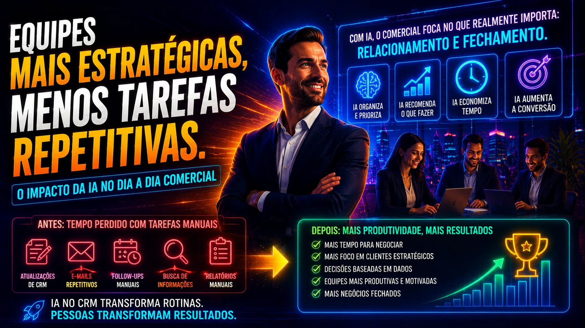

*For years, **CRM (Customer Relationship Management)** was treated solely as a commercial organization tool. Save contacts, record negotiations and monitor funnels. But that has changed. With the entry of **artificial intelligence**, platforms such as **HubSpot**, **Salesforce** and **Pipedrive** began to operate as true commercial decision engines. And this is profoundly changing the way companies sell.*

## CRM is no longer a passive system

*Modern CRM doesn't just store data. It interprets behavior and generates action.*

Previously, CRM depended entirely on the team.

The seller fed.

The manager analyzed.

The commercial ran.

It was a reactive system.

Not now.

With **integrated AI**, CRM identifies patterns, alerts risks, recommends actions and prioritizes opportunities.

In practice, it stops being a “commercial file” and becomes an active system.

This changes speed.

Changes predictability.

Change conversion.

This movement follows the larger transformation of the market:

Also read:
[How companies are using AI to generate qualified leads without relying on SDR](https://noticiatech.com.br/negocios/ia-prospeccao-b2b-geracao-leads-qualificados/)

## How AI is changing CRM in practice

*AI transforms business data into faster, smarter decisions.*

The big change is not just in automation.

It's in applied intelligence.

Today the main systems work with four layers:

### Closing forecast

AI analyzes trading history.

She crosses:

- average closing time  
- customer profile  
- lead behavior  
- response rate  
- commercial engagement

With this, the system calculates the real probability of conversion.

This improves predictability.

And it helps managers make better decisions.

### Automatic prioritization of opportunities

Not every opportunity has the same weight.

AI understands this.

It reorganizes the pipeline automatically.

Showing first:

- hottest leads  
- accounts with higher intent  
- customers with a greater chance of purchasing

This improves productivity.

And reduces energy waste.

### Follow-up automation

One of the biggest business bottlenecks is consistency.

Many businesses die due to lack of follow-up.

AI solves this.

She shoots:

- automatic emails  
- reminders  
- notifications  
- follow-up cadences

Without depending on the seller's memory.

### Loss risk identification

Some modern CRMs detect signs of loss.

Example:

- excessive delay  
- drop in engagement  
- behavior change  
- low interaction

This allows for quick reaction.

And recovery of opportunities.

## The real impact on commercial teams

*With automated repetitive tasks, salespeople focus on what generates revenue.*

The modern salesperson is changing.

Before, I spent energy on:

- update CRM  
- organize pipeline  
- create reminders  
- review contacts  
- analyze history

Now this can be automated.

The impact is direct:

more time in negotiation.

More focus on relationships.

More closure.

This pattern follows the same logic of operational transformation that other areas are experiencing.

Also read:
[How companies use AI to automate processes](https://noticiatech.com.br/automacao/como-empresas-usam-ia-para-automatizar-processos/) 
## CRM with AI improves decision quality

Selling is not just executing.

It's deciding.

Whoever attacks.

When to attack.

How to attack.

AI helps with this.

It transforms data into intelligence.

And this reduces human error.

Companies that use **intelligent CRM** can answer questions such as:

- which lead has the highest chance of closing?  
- which seller converts best?  
- where is the funnel getting stuck?  
- which accounts need immediate attention?

This kind of clarity accelerates growth.

## CRM with AI and WhatsApp are becoming inseparable

The modern commercial no longer operates in isolation.

Today **WhatsApp Business** has become a central part of the funnel.

When integrated with CRM with AI, the system can:

- automatically record conversations  
- identify intent  
- nurture relationship  
- automate service  
- schedule meetings

This movement is accelerating in Brazil.

Also read:
[WhatsApp Business gains automation with AI and becomes a central tool for small businesses](https://noticiatech.com.br/negocios/whatsapp-business-ganha-automa%C3%A7%C3%B5es-com-ia-e-vira-ferramenta-central-para-pequenas-empresas-no-brasil/)

## What changes from now on

Traditional CRM will survive.

But CRM without AI will lose value.

The market is getting too fast.

Too much volume.

Too much complexity.

Companies need systems that don't just store information.

They need systems that think.

Let them prioritize.

Recommended.

Let them be alert.

In the new commercial scenario, selling better does not just depend on talent.

It depends on operational intelligence.

And increasingly, this intelligence will be artificial.