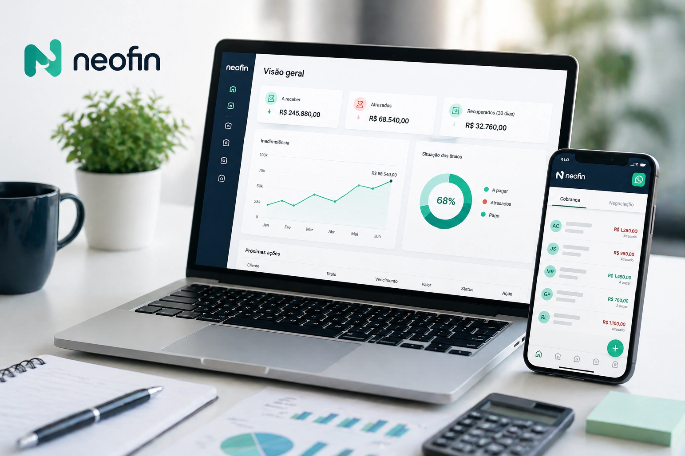
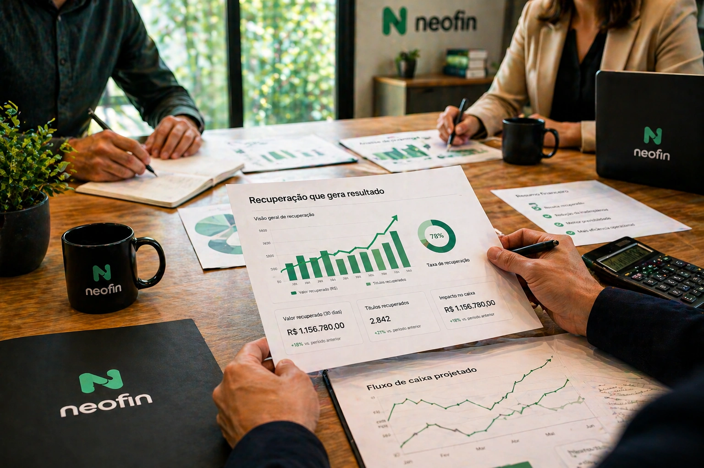

Idle money is a problem that many companies only notice when cash gets tight.

The sale takes place, the service is delivered, the invoice is issued… but payment is delayed.

And when delays accumulate, the impact goes beyond financial: it affects planning, operations and growth.

That's why companies are starting to use **artificial intelligence** to transform an old, exhausting process into something more efficient.

Platforms like Neofin are helping businesses automate billing, speed up negotiations and recover revenue without having to expand their team.

## Manual billing has become a financial bottleneck

In many companies, billing still works on an improvised basis.

Spreadsheets, manual messages, isolated reminders and standard-free follow-up.

The problem is that this model generates flaws.

Customers forget.

The team forgets.

Deadlines pass.

And defaults grow.

Furthermore, billing manually requires time from people who could be focused on more strategic areas.

This same movement of replacing operational tasks with automation has already been happening in other sectors, as we showed in the article about [how companies are using AI to reduce operational costs without increasing teams](https://noticiatech.com.br/automacao/como-empresas-usam-ia-para-redutor-custos-operacionais/).

## How AI is changing billing logic

The difference is not just in automating.

It’s about automating with intelligence.

**AI applied to billing** can analyze payment behavior and define better strategies for financial recovery.

It identifies patterns such as:

### Delay history

Customers with a greater tendency to be late.

### Channel with the highest response

WhatsApp, email or SMS.

### Best time to contact

Times with more chances of return.

### Best approach

Friendly collection, reinforcement or renegotiation.

This increases efficiency and reduces friction.

## How Neofin works in practice

Neofin is a platform specialized in billing automation and revenue recovery.

In practice, the flow works like this:

### Registration of receivables

The company organizes outstanding payments.

### Creation of billing rule

Defines when and how contacts will be made.

### AI tracks behavior

The system learns from responses and payments.

### Automatic communication

Messages are sent without manual action.

### Digital trading

The customer can negotiate without depending on an attendant.

This reduces operational time and speeds up recovery.

It is a model similar to the evolution of automated service via [WhatsApp Business with AI for small businesses](https://noticiatech.com.br/negocios/whatsapp-business-ganha-automa%C3%A7%C3%B5es-com-ia-e-vira-ferramenta-central-para-pequenas-empresas-no-brasil/), but applied to finance.

## Why companies are adopting this now

The pressure for financial efficiency has increased.

Operating costs rose.

Margins got smaller.

And cash became even more important.

In this scenario, automated billing solves three problems at the same time.

### Reduces operational costs

Less team time on repetitive billing.

### Accelerates cash inflow

Less late payments.

### Organizes financial predictability

More clarity on future revenue.

Companies are understanding something important:

**collection is not just about recovering money.**

It's protecting growth.

## Practical example of use

Imagine a company with:

- 250 active customers  
- 60 late payments  
- dozens of monthly charges

In the manual model:

an employee needs to remember, collect, negotiate and record.

In the automated model with Neofin:

- automatic reminder  
- smart follow-up  
- structured negotiation  
- full history

The result tends to be simple:

less default.

more efficiency.

more cash available.

## Automated billing even improves customer relationships

Many companies avoid charging because they associate it with wear and tear.

But automation changes that.

Communication is:

- standardized  
- professional  
- predictable  
- organized

This reduces embarrassment and improves the process.

It is part of the same movement that is already redesigning business processes, as we showed in the article about [why companies are redesigning internal processes with AI instead of just automating tasks](https://noticiatech.com.br/negocios/por-que-empresas-est%C3%A3o-redesenhando-processos-internos-com-ia-e-n%C3%A3o-just-automatizando-trabalhos/).

## The next big automation for companies could be in finance

For years, companies have automated marketing, sales and service.

Now, finance is entering this cycle.

And billing is one of the areas with the fastest return.

Because it directly impacts:

- cash flow  
- stability  
- growth  
- predictability

Tools like Neofin show that **artificial intelligence** is not just for productivity.

It also serves to recover revenue that should already be in the cash register.

And for many companies, this can be a divider between growing with stability or living by putting out fires.