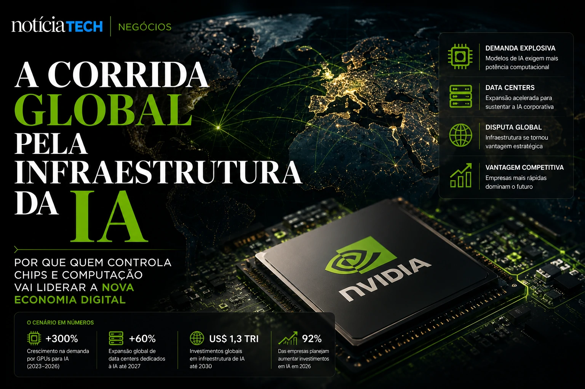

*The race for corporate artificial intelligence is creating a new silent dispute in the global market: who controls the computing infrastructure that supports AI systems. At the center of this movement is NVIDIA, a company led by **Jensen Huang**, which has gone from being just a chip manufacturer to becoming a strategic part of the new digital economy.*

## NVIDIA is transforming itself into the operational infrastructure of enterprise artificial intelligence

**NVIDIA**'s strategy has changed profoundly in recent years. The company no longer operates solely as a supplier of GPUs for games or graphics processing. The focus now is on building the computational foundation that underpins autonomous agents, corporate co-pilots, generative systems, and AI-powered business operations.

Companies from different sectors began competing for computational capacity to accelerate internal artificial intelligence projects. The growth of generative platforms has dramatically increased the need for advanced GPUs, specialized data centers, and optimized systems for model training and inference.

**Jensen Huang's** vision transformed the company into a pillar of the new corporate AI race.

This movement connects directly with the transformation addressed in [The era of AI agents has begun: how Microsoft, OpenAI and Google are transforming companies into systems autonomous](https://noticiatech.com.br/inteligencia-artificial/a-era-dos-agentes-de-ia-j%C3%A1-come%C3%A7ou-como-microsoft-openai-e-google-est%C3%A3o-transformando-empresas-em-sistemas-aut%C3%B4nomos/), where the market is already beginning to operate with increasingly automated structures.

### Why did infrastructure become a strategic priority?

Generative AI has significantly increased companies' computational consumption.

Previously, enterprise software relied mainly on traditional storage and processing. Now, intelligent agents need to operate:
- real-time inference;
- contextual memory;
- multimodal analysis;
- continuous automation;
- training of own models.

This transformed infrastructure into a competitive advantage.

## Jensen Huang is positioning NVIDIA as the “invisible operating system” of enterprise AI

**NVIDIA**'s strategy isn't just about hardware. The company expanded its presence in software, frameworks, AI ecosystems and enterprise platforms.

The company began to operate practically as a structural layer of the artificial intelligence economy.

The market realizes that:
- models depend on NVIDIA infrastructure;
- data centers depend on NVIDIA GPUs;
- corporate agents depend on advanced computing capacity;
- companies depend on AI to maintain competitiveness.

This creates an extremely powerful technological centralization effect.

The move is reminiscent of the dispute described in [Sam Altman's new bet could transform OpenAI into companies' invisible operating system](https://noticiatech.com.br/negocios/a-nova-aposta-de-sam-altman-pode-transformar-a-openai-no-sistema-operacional-invis%C3%ADvel-das-empresas/), but now applied to the computational infrastructure layer.

### What changes for companies?

Companies are beginning to realize that AI is not just software.

The new phase involves:
- computational capacity;
- data strategy;
- integration of agents;
- operational governance;
- scalable infrastructure.

This increases pressure on:
- cloud computing;
- data centers;
- energy costs;
- operational security;
- technological sovereignty.

## The race for AI infrastructure could redefine the global technology market

The current dispute is no longer just between AI models. The new war involves whoever controls:
- chips;
- processing;
- infrastructure;
- computational energy;
- corporate platforms.

**NVIDIA**'s expansion shows that artificial intelligence is entering an industrial phase.

Companies begin to operate AI as a permanent layer of corporate operations, and no longer as an experimental project.

This scenario also expands movements analyzed in [AI Operating Systems: why companies begin to replace isolated software with autonomous AI ecosystems](https://noticiatech.com.br/negocios/ai-operating-systems-por-que-empresas-come%C3%A7am-a-substituir-softwares-isolados-por-ecossistemas-aut%C3%B4nomos-de-ia/).

### The silent impact of the new computational economy

The most important change is perhaps invisible to most companies.

While the market discusses AI tools, technology giants are building the true operational core of the new digital economy:
- infrastructure;
- chips;
- autonomous agents;
- data centers;
- computational ecosystems.

The consequence could be a new concentration of technological power on a global scale.

AI is no longer just a layer of software. It is beginning to redefine the entire operational architecture of modern enterprises — and few companies seem as positioned to capture this movement as **Jensen Huang's **NVIDIA**.

---