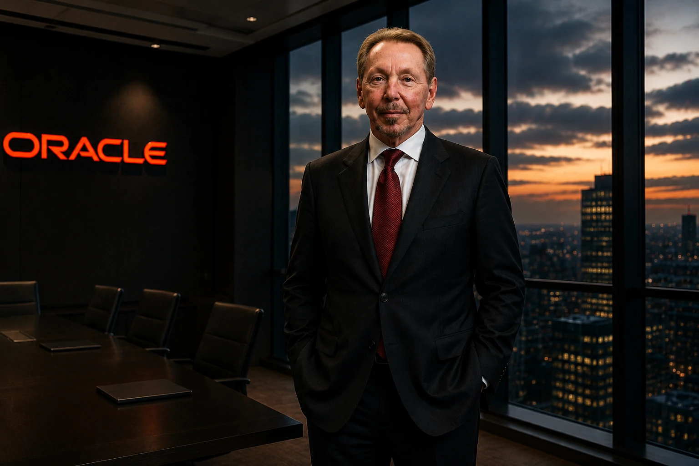
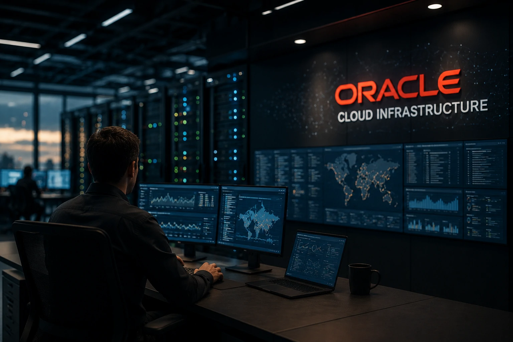

*During the last two years, much of the market's attention has been focused on companies such as **OpenAI**, **Google**, **Microsoft**, **Anthropic** and **Nvidia**. However, a less visible movement has begun to redesign the behind-the-scenes of artificial intelligence. The rise of **Oracle Cloud Infrastructure (OCI)** and billion-dollar investments in computing capacity have placed **Oracle** once again among the protagonists of global technological transformation.*

## Oracle is becoming one of the leading providers of artificial intelligence infrastructure

*The growth of specialized infrastructure for AI is repositioning Oracle within the value chain of the new digital economy.*

The artificial intelligence race does not just depend on advanced models.

It also requires computing capacity, storage, high-performance networks and data centers capable of sustaining operations on a global scale.

It is precisely at this point that **Oracle** started to gain relevance.

While many companies compete in the application layer, the company is strengthening its position in the infrastructure that makes these applications possible.

### Why has infrastructure become a strategic asset?

The expansion of generative AI has drastically increased the demand for processing.

Training, hosting, and running advanced models requires capabilities that few organizations can deliver at scale.

This has transformed infrastructure providers into central pieces of the technology chain.

### The market is entering a new phase

In the early years of the AI race, attention was focused on models.

Now the focus begins to shift to the ability to sustain these models operationally.

This movement has already appeared in topics covered by Notícia Tech, such as [Google bets US$ 80 billion on AI, computational infrastructure and war for the digital market](https://noticiatech.com.br/negocios/google-aposta-80-bilhoes-ia-infraestrutura-computacional-guerra-mercado-digital/) and [Jensen Huang accelerates Nvidia's vision and transforms AI into strategic infrastructure for companies](https://noticiatech.com.br/negocios/jensen-huang-acelera-vis%C3%A3o-da-nvidia-e-transforma-ia-em-infraestrutura-estrat%C3%A9gica-para-empresas/).

## Larry Ellison has returned to the center of decisions shaping the next generation of technology

*The founder of Oracle reappears as one of the most influential figures in building artificial intelligence infrastructure.*

For years, many investors associated **Oracle** primarily with the enterprise database market.

This perception begins to change.

The company expanded its cloud operations, accelerated investments in infrastructure and began competing for space in one of the most strategic markets of the decade.

### The return of a technology veteran

Few executives have followed as many technological transformations as **Larry Ellison**.

The founder of Oracle participated in the expansion of databases, the corporate internet, cloud computing and is now seeking to position the company at the center of artificial intelligence.

### The importance of long-term vision

Unlike many AI startups, Oracle has decades of relationships with large companies.

This installed base creates important competitive advantages in offering integrated corporate solutions.

For organizations operating critical systems, trust and stability remain decisive factors.

## The dispute over infrastructure may be more important than the dispute over models

*Companies are beginning to realize that the infrastructure needed to run AI can become as strategic as the models themselves.*

Competition between AI models receives enormous media coverage.

However, there is a parallel battle going on behind the scenes.

Whoever controls the infrastructure will be able to capture a significant portion of the value generated by the new digital economy.

### The market is building the new operational layer of AI

Enterprise artificial intelligence depends on a complex combination of elements:

- computational capacity;
- data storage;
- connectivity;
- security;
- governance;
- business integration.

Without this foundation, intelligent agents cannot operate reliably.

### Opportunity beyond content generation

Most public discussions about AI still revolve around chatbots and assistants.

In the corporate environment, however, transformation occurs in processes, operations and systems.

This connects directly to trends analyzed by Notícia Tech in [OpenAI and Salesforce accelerate the transformation of corporate software](https://noticiatech.com.br/negocios/openai-salesforce-agentic-saas-transformacao-softwares-corporativos/) and [MCP: the infrastructure that connects AI agents to systems corporate](https://noticiatech.com.br/inteligencia-artificial/mcp-infraestrutura-conecta-agentes-ia-sistemas-corporativos/).

## Companies can benefit from new competition between cloud giants

Oracle's expansion into AI infrastructure doesn't just affect investors.

It can also generate direct impacts for organizations seeking to accelerate digital transformation.

The greater the competition between providers, the greater the offer of specialized solutions tends to be.

### What changes for companies?

Companies gain more options for:

- implement AI agents;
- run advanced models;
- reduce dependence on a single supplier;
- negotiate better infrastructure conditions;
- accelerate corporate automation projects.

Market diversification reduces risks and expands strategic possibilities.

### What to watch for in the coming years?

The next phase of artificial intelligence will likely be marked by less attention to isolated models and more focus on the ecosystems that enable its operation.

In this scenario, infrastructure, data, integration and governance begin to have similar importance to that of the models themselves.

The AI ​​race continues to be presented as a dispute between companies that create increasingly advanced algorithms. However, the biggest winners can emerge precisely in the least visible layer of the market. While the world watches who develops the most powerful models, companies like **Oracle** work to build the technological foundation that will support the next generation of intelligent systems. And in the history of technology, whoever controls infrastructure often occupies as strategic a position as whoever controls visible innovation.

---