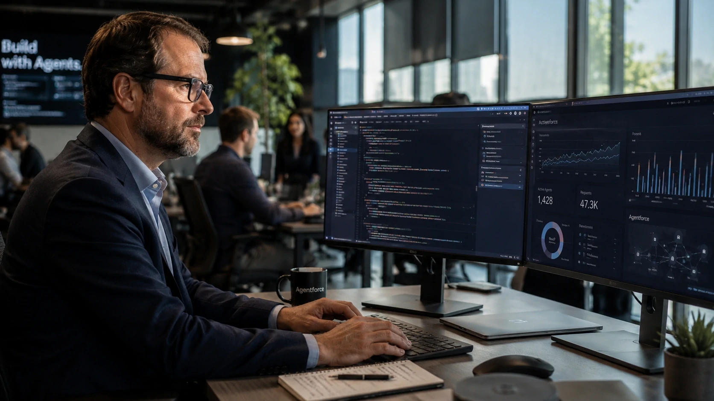

*The debate about artificial intelligence no longer revolves solely around generative models and has definitively entered the operational structure of companies. Recent statements by **Marc Benioff**, founder of **Salesforce**, show that the next phase of digital transformation may be less about creating new software and more about building hybrid teams made up of humans and AI agents.*

## Marc Benioff says AI agents are already changing the way companies hire

Technology companies are starting to use AI agents not just as productivity tools, but as operational components capable of changing strategic hiring decisions.



**Marc Benioff**'s recent statements caught the market's attention after the executive stated that **Salesforce** practically stopped expanding its engineering staff in recent expansion cycles. According to the CEO, the advancement of programming agents has significantly increased internal productivity.

### What has changed within Salesforce?

The company claims that AI tools are accelerating software development, testing and implementation processes.

This does not necessarily mean the disappearance of engineers.

What changes is the ability of the same team to produce more deliveries using specialized agents.

### Productivity has become the new field of dispute

For years, companies have competed by growing teams.

Now, the competition is beginning to shift to AI-augmented operational productivity.

This movement helps explain why companies are directing billions toward enterprise agent platforms, data infrastructure, and advanced automation.

## Salesforce tries to transform AI agents into a new operational layer for companies

Salesforce's strategy is not limited to adding AI within CRM.

The objective is to position intelligent agents as an operational layer integrated into corporate processes.


The **Agentforce** platform has become one of the company's main bets for the coming years. According to recent results, initiatives related to AI and data already represent billions in annual recurring revenue for the company.

### The concept of agentic company

The market begins to use the term "Agentic Enterprise".

The definition describes organizations where intelligent agents actively participate in the execution of internal processes.

These agents can perform support, sales, service, data analysis and administrative tasks.

### Why is the market observing this movement?

Because Salesforce powers some of the largest corporate operations in the world.

When a company of this scale changes its operational strategy, investors, competitors and customers begin to observe the potential domino effect.

This movement is directly related to trends previously discussed in:

[Satya Nadella accelerates Microsoft's bet on AI agents and redefines the next dispute in the corporate market](https://noticiatech.com.br/negocios/satya-nadella-acelera-aposta-da-microsoft-em-agentes-de-ia-e-redefine-a-pr%C3%B3xima-disputa-do-mercado-corporativo/)

and also:

[The era of AI agents has begun: How Microsoft, OpenAI, and Google are turning companies into systems autonomous](https://noticiatech.com.br/inteligencia-artificial/a-era-dos-agentes-de-ia-j%C3%A1-come%C3%A7ou-como-microsoft-openai-e-google-est%C3%A3o-transformando-empresas-em-sistemas-aut%C3%B4nomos/)

## The market is beginning to question whether AI threatens or strengthens the traditional software model

The rise of agents has generated a new concern among investors: the so-called “SaaSpocalypse” thesis.

The theory suggests that AI agents could reduce dependence on traditional enterprise software.


The concern gained strength after the advancement of tools capable of creating personalized applications using natural language.

### The critics' argument

According to this vision, companies could develop solutions internally that were previously dependent on SaaS providers.

This would reduce historical technical barriers.

It could also change traditional licensing models.

### The Salesforce Argument

**Marc Benioff** continues to defend the opposite.

For him, AI increases the value of corporate platforms because agents need structured data, governance and reliable integration to operate at scale.

In practice, the discussion is less about the disappearance of software and more about redefining what enterprise software means.

## The next AI race could happen within the organizational structure of companies

The most relevant transformation may not be in the technology itself.

The real impact can happen in the way companies organize work, productivity and decision making.

### What changes for executives?

Executives now face new questions:

- What functions can be expanded by agents?
- Which processes should remain human?
- How to measure hybrid productivity?
- How to create governance for automated decisions?

These issues are beginning to occupy increasing space on corporate boards.

### What changes for teams?

Professionals no longer compete only with other professionals.

The new scenario requires the ability to work alongside autonomous systems.

Skills linked to business context, relationships, negotiation and strategic supervision tend to gain relevance.

### What does this reveal about the next phase of enterprise AI?

**Marc Benioff**'s speeches show that the market has entered a different stage in the adoption of artificial intelligence.

The discussion is no longer restricted to more advanced models or new conversational interfaces.

The focus begins to shift to organizational architecture, increased productivity and operational integration.

While many companies are still experimenting with isolated AI tools, giants like **Salesforce**, **Microsoft**, **OpenAI** and **Google** are already competing to provide the invisible infrastructure that will support the next generation of digital organizations.

And this dispute could redefine not only corporate software, but also the very logic of companies' growth in the coming years.
```