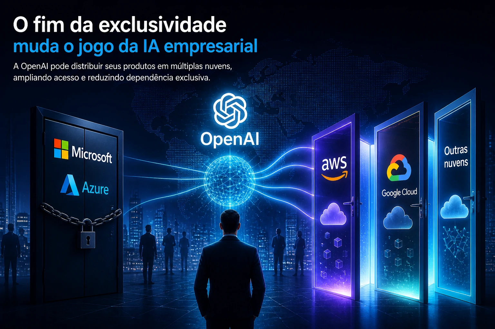
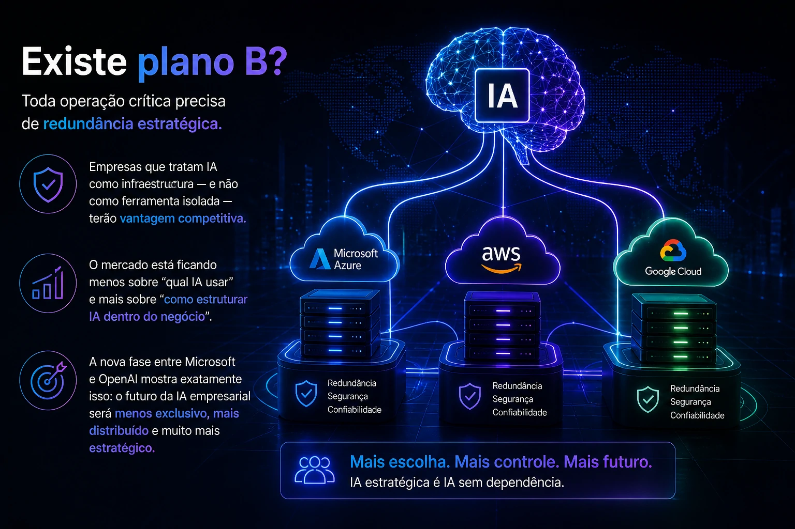

**The relationship between Microsoft and OpenAI has entered a new phase, and this matters much more for companies than it seems.**

The change in the agreement between the giants signals something bigger: corporate artificial intelligence is ceasing to be a closed ecosystem and entering a more open, flexible and strategic logic.

For Brazilian companies, this changes cost, infrastructure, technological dependence and adaptability.

## The end of exclusivity changes the game for enterprise AI

For years, Microsoft has been the main enterprise gateway to OpenAI models, mainly via Azure. This arrangement helped consolidate the company's leadership in the corporate AI market.

Now the scenario has changed.

With the new agreement, OpenAI can distribute its products across multiple clouds, expanding access and reducing exclusive dependence on Microsoft infrastructure.

In practice, this means that companies can start thinking about AI with more strategic freedom.

It's not just a contractual change.

It is a structural change in the market.

The new phase of the partnership maintains Microsoft as a strategic partner, but makes room for a more flexible distribution and integration ecosystem.

## The silent risk of relying on a single AI vendor

Many Brazilian companies are building automation, service, data analysis and productivity on top of a single ecosystem.

This model has risks.

### Costs may become less predictable

If every operation depends on a single infrastructure, readjustments or commercial changes directly impact margin and operations.

### Technological flexibility is limited

Switching suppliers after processes are deeply integrated can be expensive and slow.

### Innovation can be blocked

The market is accelerating. New models emerge quickly. Being stuck with a single stack reduces adaptability.

This movement between Microsoft and OpenAI reinforces a trend: companies will need to think about AI architecture like they think about cloud architecture.

## The multicloud era of artificial intelligence has begun

OpenAI's decision to expand availability in multiple environments confirms a greater movement.

Corporate AI is moving towards a more distributed model.

This makes room for:

### Cost negotiation

More suppliers means more commercial power.

### Better operational fit

Each company can choose the environment most compatible with its stack.

### Reduction of operational risk

Distributing dependency reduces vulnerability.

Expansion to multiple infrastructures reinforces a new competitive model in the enterprise AI market.

## What Brazilian companies should do now

This is the time to review strategy.

Companies already using AI need to answer a few questions:

### Where is my AI hosted?

Understanding the infrastructure is the first step.

### Does my operation depend on a single supplier?

If so, it's worth mapping alternatives.

### Is there plan B?

Every critical operation needs strategic redundancy.

Companies that treat AI as infrastructure — and not as an isolated tool — will have a competitive advantage.

The market is becoming less about “which AI to use” and more about “how to structure AI within the business”.

The new phase between Microsoft and OpenAI shows exactly that: the future of enterprise AI will be less exclusive, more distributed and much more strategic.