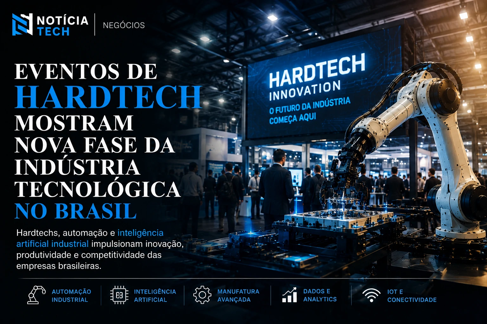

*The accelerated growth of hardtechs and events focused on industrial innovation shows that Minas Gerais is beginning to occupy an increasingly strategic position within the Brazilian ecosystem of technology, automation and artificial intelligence applied to business.*

## Minas Gerais begins to gain relevance in the Brazilian industrial innovation ecosystem

### Brazilian interior enters the new technological race

The advancement of digital transformation in Brazilian companies is beginning to accelerate a new technological race outside the country's large traditional hubs.

In recent years, cities in the interior have started to attract startups, universities, research centers and companies interested in developing solutions aimed at:
- industrial automation;
- artificial intelligence;
- advanced manufacturing;
- robotics;
- internet of things;
- technological infrastructure;
- corporate software;
- operational efficiency.

### Minas Gerais expands its role in industrial innovation

Within this scenario, Minas Gerais began to gain increasing prominence in the national industrial innovation market.

Events such as HardTech Innovation help to show how the state has increased relevance in sectors linked to:
- advanced industry;
- engineering;
- automation;
- digital transformation;
- applied technology;
- industrial artificial intelligence.

The movement accompanies a structural change in the Brazilian market.

Companies stopped seeing innovation just as a competitive differentiator and started treating technology as a strategic infrastructure for productivity, operational efficiency and long-term growth.

### Companies accelerate investments in corporate AI

Notícia Tech has previously shown how Brazilian companies accelerate investments in corporate artificial intelligence and operational automation.

Also read:
[Companies double investments in corporate AI and Brazil accelerates adoption of intelligent agents](https://noticiatech.com.br/inteligencia-artificial/empresas-dobram-investimentos-em-ia-corporativa-e-brasil-acelera-ado%C3%A7%C3%A3o-de-agentes-inteligentes/)

## Hardtech events show a new phase of the technology industry in Brazil

### What differentiates hardtechs from traditional startups

The growth of events focused on hardtechs reveals an important transformation within the Brazilian innovation ecosystem.

Unlike startups focused only on applications or digital platforms, hardtechs work with deeper and more structural technologies involving:
- hardware;
- automation;
- sensors;
- artificial intelligence;
- industrial systems;
- robotics;
- engineering;
- technological manufacturing;
- industrial infrastructure.

### Hardtechs require long-term investment and research

This type of market typically requires:
- advanced search;
- continuous technological development;
- integration between universities and companies;
- long-term investment;
- more complex operational structure.

At the same time, the advancement of artificial intelligence began to accelerate new possibilities within Brazilian industry.

### Artificial intelligence begins to transform industrial operations

Companies started investing in:
- predictive maintenance;
- operational automation;
- real-time data analysis;
- intelligent systems integration;
- energy efficiency;
- reduction of operating costs;
- industrial monitoring;
- automated productivity.

The advancement of these technologies shows how artificial intelligence is beginning to be directly integrated into industrial operations in the country.

Notícia Tech also previously showed how Brazilian companies accelerate investments in corporate artificial intelligence and operational automation.

Also read:
[Companies double investments in corporate AI and Brazil accelerates adoption of intelligent agents](https://noticiatech.com.br/inteligencia-artificial/empresas-dobram-investimentos-em-ia-corporativa-e-brasil-acelera-ado%C3%A7%C3%A3o-de-agentes-inteligentes/)

## Universities and regional hubs accelerate a new generation of Brazilian innovation

### Universities strengthen regional technology ecosystems

Another important factor involves the strengthening of regional technology and engineering hubs outside the country's large traditional centers.

Universities, research centers and local ecosystems are beginning to play an increasingly important role in the advancement of Brazilian hardtechs.

This scenario creates opportunities to:
- industrial startups;
- automation companies;
- artificial intelligence projects;
- development of industrial software;
- integration of corporate systems;
- applied research;
- training of specialized professionals.

### Interior gains strength as a new Brazilian technology hub

The growth of these hubs also helps to decentralize the Brazilian innovation ecosystem, reducing dependence on markets like São Paulo and strengthening new technological hubs in the interior of the country.

At the same time, industrial digital transformation increases the demand for professionals prepared to work with:
- AI;
- automation;
- data engineering;
- intelligent systems;
- operational integration;
- technological infrastructure;
- corporate software.

### Companies still face challenges implementing AI

Notícia Tech has previously shown how many Brazilian companies still face difficulties in implementing artificial intelligence in a practical way.

Also read:
[Brazil accelerates interest in AI, but most companies are still unable to implement technology](https://noticiatech.com.br/negocios/brasil-acelera-interesse-por-ia-mas-maioria-das-empresas-ainda-n%C3%A3o-consegue-implementar-tecnologia/)

## The advancement of hardtechs can transform Brazilian industrial competitiveness

### New Brazilian industry will be based on AI and automation

Experts estimate that the growth of hardtechs could accelerate an important structural transformation within the Brazilian economy in the coming years.

The integration between:
- artificial intelligence;
- automation;
- engineering;
- corporate software;
- robotics;
- digital infrastructure;
- intelligent industrial systems;

begins to create a new scenario for industrial competitiveness in Brazil.

### Industrial modernization becomes a strategic priority

More than just a trend, industrial modernization has come to represent a strategic necessity for companies that wish to increase productivity, operational efficiency and innovation capacity.

The growth of hardtech events shows that Brazil is beginning to build a new phase of the national industry based on artificial intelligence, advanced automation and long-term technological infrastructure.