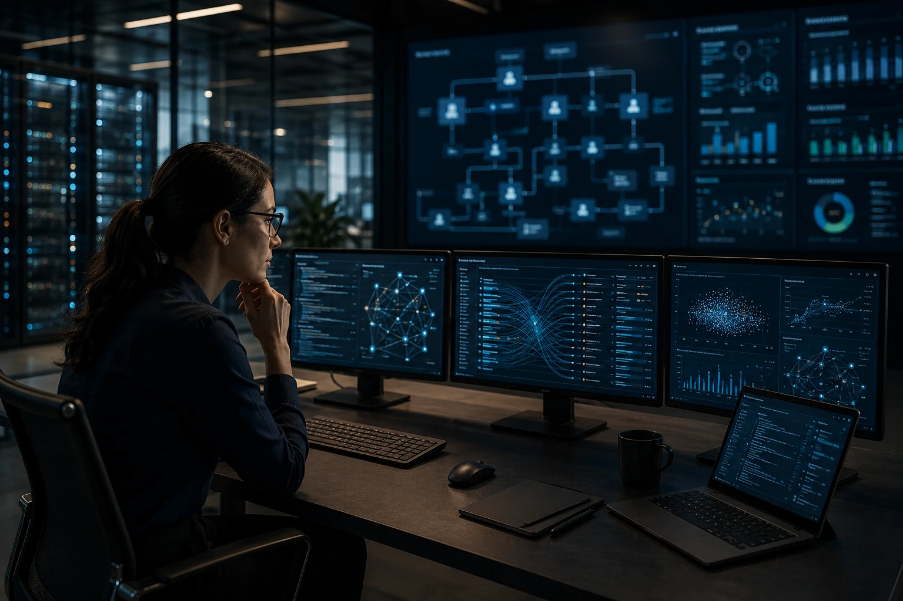

*A silent change is happening in the corporate market. While the public debate continues to focus on chatbots and digital assistants, giants like **OpenAI**, **Salesforce**, **Microsoft** and several infrastructure startups are accelerating a deeper transformation: the conversion of traditional enterprise software into platforms operated by autonomous agents. The movement could represent the biggest structural change in the SaaS market since the popularization of cloud computing.*

## Agentic SaaS represents the natural evolution of enterprise software

The concept of **Agentic SaaS** describes platforms capable of performing tasks autonomously using AI agents connected to data, processes and business systems.

For years, companies have invested in increasingly sophisticated dashboards, forms and interfaces. Now, the logic starts to change. Instead of accessing dozens of screens to perform an activity, users now request results directly from intelligent agents.

### Software stops being a tool and becomes an operator

The main difference is in the operational layer.

In the traditional model, the software provides resources for the user to perform a task.

In the agentic model, the software performs the task and only presents the final result.

This movement can already be observed on corporate platforms that incorporate agents capable of generating reports, updating CRMs, creating campaigns, analyzing contracts and responding to internal requests.

### The conversational interface becomes the new center of the experience

The rise of agents reinforces a trend that was already being observed in initiatives by **OpenAI**, **Microsoft Copilot** and **Salesforce Agentforce**.

The interface stops being visual and becomes contextual.

The user describes the objective and the system decides how to execute the operation.

## OpenAI accelerates a change that could affect the entire SaaS market

**OpenAI**'s recent strategy shows that the company intends to expand its presence beyond language models.

The increasing focus on agents, persistent memory, task execution, and integration with enterprise tools suggests a scenario in which AI becomes a universal operational layer.

### The goal is not to replace applications in isolation

The transformation is broader.

Instead of competing directly with every existing corporate software, AI starts to function as a layer capable of operating multiple systems simultaneously.

This reduces reliance on training, simplifies workflows, and reduces operational friction.

### SaaS enters an abstraction phase

Historically, companies needed to learn how to use each platform.

Now, the trend is for agents to learn how to use platforms for users.

This shift can drastically reduce the importance of traditional interfaces and increase the value of APIs, integrations, and data infrastructure.

This scenario dialogues directly with the evolution described in [MCP connects AI agents to corporate systems](https://noticiatech.com.br/inteligencia-artificial/mcp-infraestrutura-conecta-agentes-ia-sistemas-corporativos/), where interoperability becomes a strategic requirement.

## Structured data becomes the most important asset of the new generation of SaaS

Companies are discovering that agents can only generate value when they have access to organized information.

Therefore, the dispute over the future of SaaS is also a dispute over the quality of corporate data.

### APIs gain more importance than interfaces

In the age of agents, APIs are no longer just integration mechanisms.

They become the main gateway to operations performed by AI.

Systems without robust APIs may struggle to compete in a market increasingly driven by intelligent automation.

### Data products and knowledge graphs gain prominence

The new generation of applications depends on the ability to understand organizational context.

This explains the growth of interest in structures such as:

- Data Products
- Knowledge Graphs
- Context Engineering
- Corporate memory
- Interoperability protocols

The trend complements analyzes already observed in [AI Data Products](https://noticiatech.com.br/negocios/ai-data-products-dados-corporativos-produtos-agentes-ia/) and in [Context Engineering for companies](https://noticiatech.com.br/inteligencia-artificial/context-engineering-agentes-ia-empresas/).

## The financial impact may be greater than migrating to the cloud

Companies are beginning to realize that Agentic SaaS does not just represent a technological update.

This is an economic change.

By reducing manual steps, reducing operational dependence and accelerating decisions, agents can completely change the relationship between people and software.

### SaaS providers will need to reinvent themselves

The competitive advantage is no longer just in the interface.

It becomes the ability to provide context, automation and operational intelligence.

Platforms that continue to focus solely on screens and forms may face increasing competitive pressure.

### A new race for invisible infrastructure emerges

Just as cloud computing created winners like **Amazon Web Services**, **Microsoft Azure**, and **Google Cloud**, the Agentic SaaS era can create a new generation of leaders based on:

- Infrastructure for agents;
- Integration protocols;
- Corporate memory;
- Organizational context;
- Orchestration of multiple systems.

The question no longer seems to be whether agents will transform the corporate software market.

The question becomes which companies will be able to adapt their products before artificial intelligence becomes the main work interface within organizations.

---