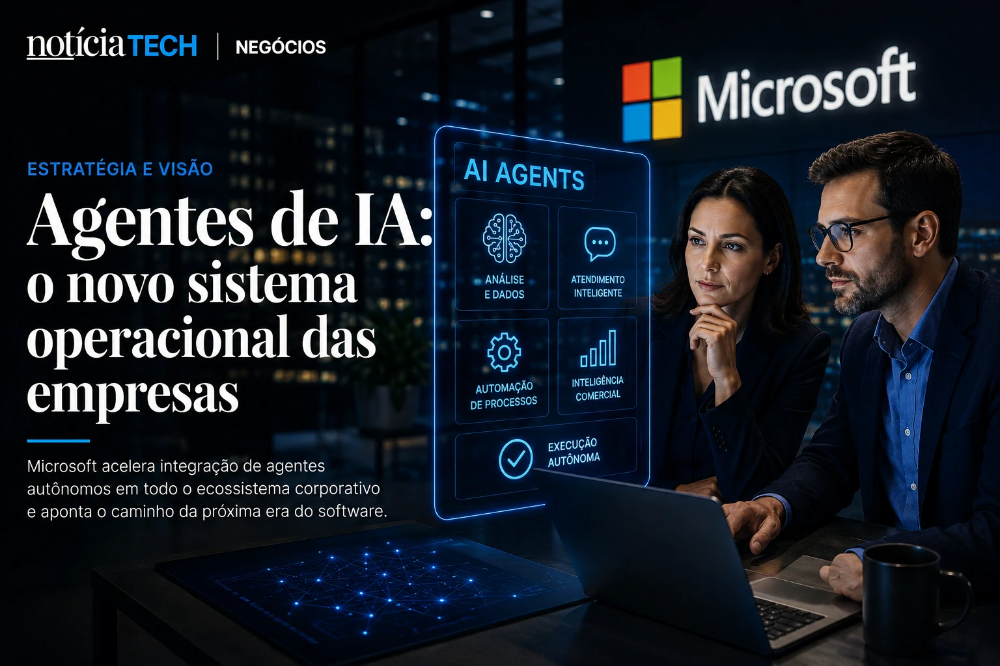
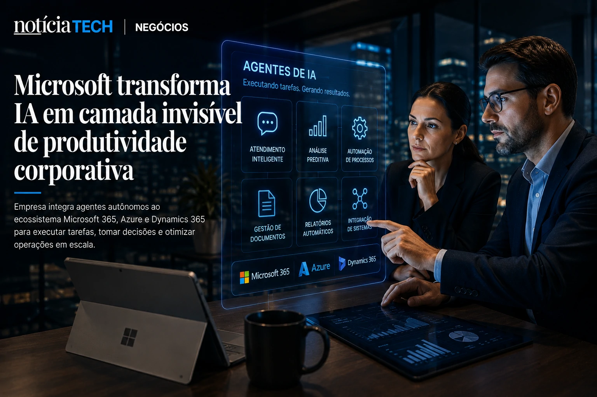

*While many companies are still trying to understand how to use artificial intelligence in a practical way, **Microsoft** is already starting to treat autonomous agents as the next operational layer of the corporate market. In recent days, statements and movements led by **Satya Nadella** have reinforced an important signal for the B2B sector: the AI dispute is no longer just about generative models and has started to revolve around platforms capable of performing real work within companies.*

**Microsoft**'s new strategy isn't just about productivity. The goal now is to transform AI agents into operational infrastructure for sales, service, data analysis, software development and business automation.

This move could accelerate a structural change in the global enterprise software market.

## Satya Nadella's strategy shows that AI agents are becoming the new operating system for companies

**Satya Nadella**'s vision indicates that AI agents will no longer function solely as conversational assistants and will begin to operate as autonomous systems integrated into corporate flows.

In recent days, **Microsoft** executives have publicly reinforced that the company wants to position the **Copilot** ecosystem as a central layer of operational execution within companies. The strategy directly connects products such as **Microsoft 365**, **Azure**, **GitHub Copilot**, **Dynamics 365** and AI-based enterprise automations.

The move comes at a time when technology giants are vying for who will control the new corporate AI interface.

The strategic logic is clear:

- who controls the agents;
- controls workflows;
- controls the data;
- controls productivity;
- controls the distribution of corporate software.

**Microsoft** itself has been expanding this positioning for months. The topic speaks directly to previous analyzes by NOTÍCIA TECH on the transformation of autonomous agents in the business environment:

- [The era of AI agents has begun: how Microsoft, OpenAI and Google are transforming companies into systems autonomous](https://noticiatech.com.br/inteligencia-artificial/a-era-dos-agentes-de-ia-j%C3%A1-come%C3%A7ou-como-microsoft-openai-e-google-est%C3%A3o-transformando-empresas-em-sistemas-aut%C3%B4nomos/)

- [Companies begin to create AI Operations positions to control autonomous agents](https://noticiatech.com.br/negocios/empresas-come%C3%A7am-a-criar-cargos-de-ai-operations-para-controlar-agentes-aut%C3%B4nomos/)

What changes now is the speed of this transition.

The narrative is no longer experimental.

It starts to go on a corporate scale.

### What do AI agents actually do within companies?

Corporate agents are systems capable of:

- perform tasks without constant human intervention;
- navigate between platforms;
- analyze documents;
- respond to customers;
- generate reports;
- make operational decisions;
- automate repetitive processes;
- integrate multiple corporate software.

In practice, the promise is to drastically reduce dependence on manual operations.

This explains why the enterprise software market is beginning to undergo a quiet reorganization.

## Microsoft wants to transform AI into an invisible layer of corporate productivity

The new phase of **Microsoft**'s strategy shows that the company does not just want to sell AI as an isolated tool. The objective is to transform artificial intelligence into invisible infrastructure within business operations.

This movement has a huge impact on the B2B market because it redefines how companies consume software.

Historically, companies needed to:

- open platforms;
- navigate dashboards;
- interpret reports;
- perform tasks manually.

With autonomous agents, some of these steps begin to disappear.

The user no longer operates software directly.

The software starts operating on its own.

This scenario helps explain why the global corporate AI market is expected to exceed hundreds of billions of dollars in the coming years, according to projections from consultancies such as **McKinsey**, **PwC** and **Gartner**.

The change also puts pressure on competitors such as:

- **Google**;
- **OpenAI**;
- **Salesforce**;
- **Oracle**;
- **SAP**;
- **Amazon**;
- **Anthropic**.

They all try to occupy the “operational layer of corporate AI” space.

The dispute is no longer just technological.

It has become a war over the infrastructure of digital work.

### Why does this threaten the traditional enterprise software model?

The advancement of autonomous agents creates a strategic problem for traditional software companies:

If AI can perform tasks directly, part of the complexity of corporate systems loses relevance.

This means that:

- dashboards can lose prominence;
- traditional interfaces may decrease;
- isolated software can become commodities;
- agents can centralize operations.

This movement already appears in several sectors.

NOTÍCIA TECH has been following this transformation in recent analyses:

- [AI Operating Systems: why companies are starting to replace isolated software with autonomous AI ecosystems](https://noticiatech.com.br/negocios/ai-operating-systems-por-que-empresas-come%C3%A7am-a-substituir-softwares-isolados-por-ecossistemas-aut%C3%B4nomos-de-ia/)

- [Companies begin to replace dashboards with analytical copilots powered by generative AI](https://noticiatech.com.br/negocios/empresas-come%C3%A7am-a-substituir-dashboards-por-copilotos-anal%C3%ADticos-movidos-por-ia-generativa/)

The impact could be comparable to the transformation caused by cloud computing years ago.

But now the speed seems faster.

## The B2B market is beginning to realize that AI is no longer just an experimental tool

The main sign left by **Microsoft**'s recent moves is that corporate AI is beginning to leave the testing stage and enter the operational core of companies.

For a long time, companies saw AI as:

- complementary resource;
- experimental chatbot;
- productivity tool;
- secondary support.

Now the market is starting to treat autonomous agents as strategic infrastructure.

This change alters decisions on:

- technology;
- investments;
- hiring;
- security;
- governance;
- operational architecture.

It also creates new concerns.

### What concerns companies in this new AI race?

As agents gain autonomy, new challenges arise:

- operational governance;
- data security;
- permissions control;
- traceability;
- human supervision;
- technological dependence;
- integration between multiple AIs.

This explains why the debate about:

- AI Operations;
- AI governance;
- Shadow AI;
- hybrid agent ecosystems.

NOTÍCIA TECH itself has already shown how this problem is starting to grow within companies:

- [Shadow AI: companies discover that the invisible use of artificial intelligence has already become an operational risk in 2026](https://noticiatech.com.br/negocios/shadow-ai-empresas-descobrem-que-uso-invis%C3%ADvel-de-intelig%C3%AAncia-artificial-j%C3%A1-virou-risco-operacional-em-2026/)

- [AI governance becomes a priority for companies](https://noticiatech.com.br/inteligencia-artificial/governanca-ia-prioridade-empresas/)

The next phase of the AI race is unlikely to be won by the best generative model alone.

It tends to be won by the company that manages to integrate autonomous agents directly into the daily functioning of organizations.

And today, few companies seem as positioned to do so as **Satya Nadella's **Microsoft**.

---