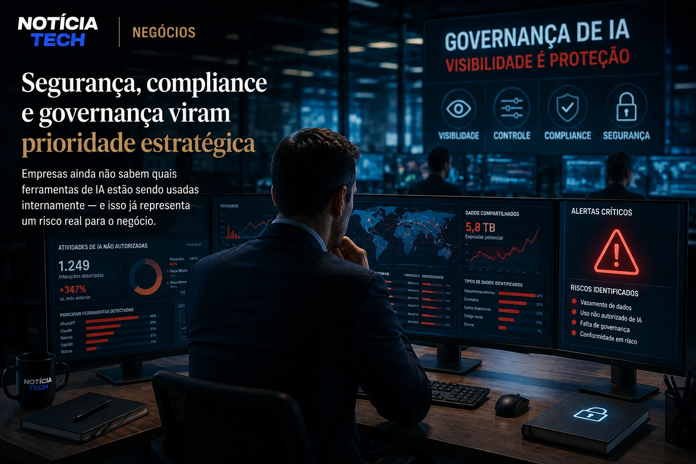

*While the corporate race for artificial intelligence accelerates at a record pace, a silent phenomenon is beginning to gain strength within companies: employees using AI tools without formal authorization from the company. The movement, known globally as **Shadow AI**, is already beginning to change governance, digital security and operational management strategies in large organizations.*

*The problem is no longer just technological. In 2026, the expansion of generative AI within companies created a new layer of invisible risk, involving data leaks, unsupervised automated decisions and increasing dependence on external platforms.*

## Shadow AI begins to escape corporate control

The concept of **Shadow AI** follows the same logic as the old “Shadow IT”, when employees adopted external software without approval from technology teams. The difference is that now the impact has become much greater.

Tools such as generative assistants, productivity copilots, intelligent automations and analysis platforms began to be used directly by commercial, marketing, HR and operations teams without any internal standardization.

In practice, companies have discovered that a large proportion of their employees already use AI on a daily basis, even in organizations that do not yet have an official adoption strategy.

This movement has gained momentum because the new generation of generative tools has drastically reduced the technical barrier. Today, practically any professional can automate tasks, create reports, analyze data and generate presentations using AI.

The problem is that many of these interactions involve:

- internal data;
- corporate contracts;
- strategic information;
- financial data;
- confidential documents.

In many cases, executives themselves discovered too late that entire teams were already integrating AI into the operational flow.

This scenario is directly connected to the advancement of the so-called industrialization of artificial intelligence in Brazilian companies, a topic that is already transforming the corporate market at an accelerated pace.

See also:

- [2026 became the year of AI industrialization in Brazil](https://noticiatech.com.br/inteligencia-artificial/2026-virou-o-ano-da-industrializa%C3%A7%C3%A3o-da-ia-no-brasil/)
- [Companies begin to replace traditional software with AI agents](https://noticiatech.com.br/automacao/empresas-come%C3%A7am-a-substituir-softwares-tradicionais-por-agentes-de-ia/)

### The invisible growth of enterprise AI

One of the factors that worries experts the most is precisely the speed of adoption.

While traditional software projects typically required months of implementation, AI platforms can enter the operational routine in just a few hours.

This creates a new phenomenon within corporations:

- technology arrives before governance;
- productivity grows before regulation;
- risks appear before standardization.

Companies that previously tightly controlled their systems now face an environment where employees can connect external tools directly to internal operations.

## Security, compliance and governance become a strategic priority

The advancement of **Shadow AI** begins to put pressure on areas of:

- information security;
- compliance;
- legal;
- data governance;
- risk management.

The main reason is simple: many companies still don't know exactly which AI tools are being used internally.

In larger organizations, the challenge grows even more.

Distributed teams use multiple platforms simultaneously, creating a fragmented environment where strategic information can circulate without adequate oversight.

This raised concerns about:

### Indirect data leak

Many generative platforms store prompts and interactions for training or system improvement.

When employees enter:

- contracts;
- commercial strategies;
- proprietary codes;
- financial data;
- customer information;

companies can lose control over critical information.

### Invisible operational dependency

Another critical point is that several operational flows begin to depend on AI without official documentation.

In some companies, professionals created their own automations for essential tasks without leadership having technical knowledge about how these routines work.

This creates a new operational risk:

- lack of traceability;
- low predictability;
- dependence on external platforms;
- operational continuity failures.

The market is already beginning to respond to this new scenario with specific management and operational supervision structures for AI.

See also:

- [Companies begin to create AI Operations positions to control autonomous agents](https://noticiatech.com.br/negocios/empresas-come%C3%A7am-a-criar-cargos-de-ai-operations-para-controlar-agentes-aut%C3%B4nomos/)
- [Companies discover that AI without internal organization increases costs and reduces productivity](https://noticiatech.com.br/negocios/empresas-descobrem-que-ia-sem-organiza%C3%A7%C3%A3o-interna-aumenta-custos-e-reduz-produtividade/)

### The new phase of corporate governance

The trend now is not to prevent the use of AI.

The strongest market movement points to:

- creation of internal policies;
- safe AI environments;
- approved corporate platforms;
- operational training;
- continuous audit of intelligent agents.

Companies have realized that completely blocking generative tools has become practically unfeasible.

The new priority became creating sufficient governance to enable innovation without losing operational control.

## The market begins to reorganize entire structures around AI

The growth of **Shadow AI** also reveals a larger transformation happening in the corporate market.

Artificial intelligence is no longer just a complementary tool.

Now it starts to redefine:

- operational structure;
- decision making;
- productivity;
- corporate management;
- workflow;
- organization of teams.

In many companies, employees began to operate as “AI managers”, supervising multiple intelligent agents at the same time.

This even changes the traditional logic of corporate software.

Instead of manually navigating dozens of systems, professionals are starting to use copilots capable of centralizing tasks, reports and operational execution.

This movement already appears in different sectors of the digital market.

See also:

- [Companies begin to replace dashboards with analytical copilots powered by generative AI](https://noticiatech.com.br/negocios/empresas-come%C3%A7am-a-substituir-dashboards-por-copilotos-anal%C3%ADticos-movidos-por-ia-generativa/)
- [Cursor, Windsurf and GitHub Copilot are changing the development market](https://noticiatech.com.br/inteligencia-artificial/cursor-windsurf-e-github-copilot-est%C3%A3o-mudando-o-mercado-de-desenvolvimento/)

### The next dispute will be for operational control of AI

The first phase of the AI race was based on adoption.

Now the market enters a second stage:

Whoever can control, organize and scale artificial intelligence efficiently will have a relevant operational advantage.

This new scenario can create a clear division between companies that:

- only use AI;
- and companies that can operate AI on a large scale with real governance.

In the long term, experts believe that the management of artificial intelligence will become as important as financial management or digital security today.

The difference is that the transformation happens at a much greater speed.

While many companies are still discussing internal policies, employees are already silently automating entire operations.

And this could make **Shadow AI** one of the biggest corporate challenges of the new digital economy.