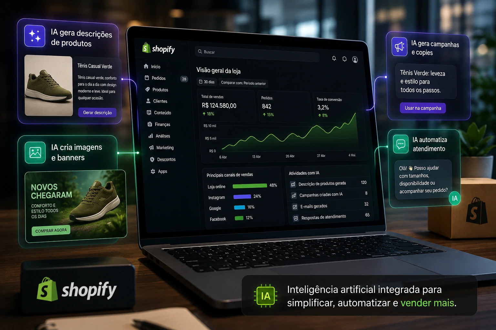
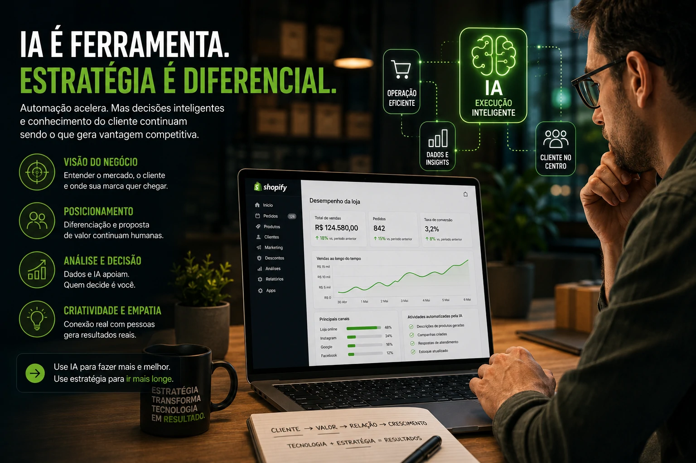

*Creating an online store used to require staff, time and technical knowledge. Now, with artificial intelligence integrated into operations, smaller companies are able to reduce costs, speed up processes and compete with larger structures.*

Artificial intelligence is no longer just a support tool and has started to take on central roles within digital commerce. **__Shopify__**'s new move reinforces this scenario: the platform is accelerating the integration of AI for creating stores, campaigns, product descriptions and operational automation.

## What changes with Shopify AI

**__Shopify__**'s new phase focuses artificial intelligence on critical areas of the operation.

### Automated product registration

Companies can generate complete descriptions, optimized titles and categorizations automatically.

In practice:

- less operating time  
- catalog standardization  
- internal SEO improvement

This directly impacts productivity.

### Faster campaigns

Creatives, copies and segmentations can be structured in minutes.

Before:

- briefing  
- creation  
- review  
- publication

Now:

- AI generates initial base  
- operator adjusts  
- campaign goes live

For smaller businesses, this reduces external dependency and speeds up execution.

## Small businesses gain operational scale

One of the biggest bottlenecks in Brazilian digital retail is operations.

Many small businesses get stuck at:

- manual registration  
- campaign management  
- repetitive service  
- stock update  
- performance analysis

With embedded AI, the gain is not just speed.

It's structure.

A small operation can work with operational logic close to larger companies.

This changes the competitive capacity of the small business.

## The real impact for Brazilian companies

In Brazil, digital commerce remains pressured by margin.

Acquisition costs rose.

Competition increased.

And efficiency became survival.

Integrating AI within platforms like **__Shopify__** reduces three classic pain points:

### Operating time

Fewer repetitive tasks.

More focus on growth.

### Production cost

Less need for initial outsourcing.

Especially in marketing.

### Test speed

Companies can validate campaigns, products and offers faster.

This point is critical.

Whoever tests faster, learns faster.

## The risk of relying too much on automation

Automation does not replace strategy.

This is a common mistake.

AI accelerates execution.

But it still requires:

- commercial vision  
- positioning  
- market analysis  
- reading customer behavior

Tools help.

Decision remains human.

This point speaks directly to our analysis of technological diversification in corporate environments:

[Microsoft and OpenAI change partnership and warn companies: depending on a single AI can be a risk](https://noticiatech.com.br/negocios/microsoft-e-openai-mudam-parceria-e-deixam-alerta-para-empresas-sobre-o-risco-de-depender-de-uma-%C3%BAnica-ia/)

## The new competitive standard for e-commerce

The trend is clear:

AI integrated into operation will be standard.

Non-differential.

Companies that understand this early can operate with more efficiency, lower cost and greater speed.

In modern e-commerce, winning doesn't just mean selling more.

It means operating better.

And this is increasingly automated.