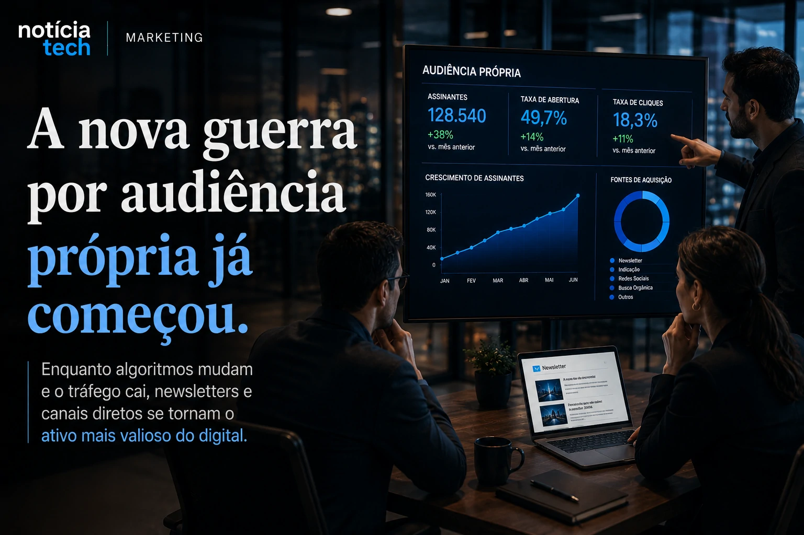

*For years, social platforms and search engines dominated digital distribution. Companies have grown dependent on algorithms, paid media and organic reach to gain an audience. Now, the rise of generative artificial intelligence, AI Overviews and the progressive decline in traditional traffic is beginning to bring about a structural change in the digital market: the reconstruction of its own audience. In this new scenario, newsletters return to the center of companies' strategy and become increasingly valuable assets for retention, distribution and conversion.*

## The dispute for its own audience has entered a new phase

The transformation of digital traffic has started to accelerate in recent months.

With search engines incorporating artificial intelligence directly into the results, companies began to notice an important change in the dynamics of the internet.

The user continues to consume information.

But now, part of this consumption happens without necessarily accessing the original website.

### AI Overviews begin to reduce traditional traffic

Tools based on generative AI are changing search behavior.

Instead of clicking on multiple links, users start receiving summarized answers directly within the search engine experience.

This creates a direct impact on:
- organic traffic;
- retention;
- content discovery;
- digital distribution;
- monetization of publishers.

Notícia Tech itself has previously analyzed how GEO and AI search are beginning to redefine traditional SEO:

[GEO is replacing SEO: how AI search can change internet traffic](https://noticiatech.com.br/inteligencia-artificial/geo-est%C3%A1-substituindo-o-seo-como-a-busca-por-ia-pode-mudar-o-tr%C3%A1fego-da-internet/)

Now, companies are beginning to understand that relying exclusively on external platforms can represent an increasingly greater strategic risk.

### The organic reach of social networks has also lost predictability

At the same time, social networks have become more competitive.

Organic reach has decreased.

Paid media has become more expensive.

And platforms began to prioritize internal retention instead of directing users to external sites.

In practice, companies lost part of the control over their own distribution.

This helps explain why newsletters are growing so quickly again.

### The newsletter has once again become a strategic asset

For a long time, newsletters were treated just as email marketing tools.

Now, they begin to take on another role.

Companies started to see newsletters as:
- proprietary channel;
- retention asset;
- direct media;
- independent distribution mechanism;
- first-party data strategy.

The logic is simple.

Those who have direct access to the audience depend less on external algorithms.

## Companies begin to rebuild direct relationship channels

The current change isn't just about email.

It represents a broader transformation about audience ownership.

### First-party data has become a strategic priority

In recent years, companies have faced:
- cookie restrictions;
- privacy changes;
- increase in CAC;
- higher paid media costs;
- increasing dependence on platforms.

In this context, first-party data has gained enormous importance.

This means building direct relationships with:
- readers;
- customers;
- leads;
- communities;
- subscribers.

The newsletter appears exactly at this point.

It allows you to create a recurring connection without completely depending on external algorithms.

### Newsletters begin to operate as premium media

Another important movement is the professionalization of the format.

The strongest newsletters on the market no longer look like promotional campaigns.

Now, they operate as:
- editorial vehicles;
- intelligence hubs;
- premium curation;
- strategic distribution of content.

This model grows especially among:
- B2B companies;
- startups;
- creators;
- SaaS;
- specialized media.

The reason is straightforward.

Users are saturated with excessive superficial content on networks.

Well-constructed newsletters can deliver:
- depth;
- context;
- curation;
- analysis;
- recurring retention.

### Retention starts to count for more than just reach

For years, the digital market operated based on maximum scale.

Now, retention is once again gaining prominence.

Companies are beginning to realize that:
- recurring audience converts more;
- relationship reduces CAC;
- own distribution increases predictability;
- retention improves monetization.

This scenario also connects to the growth of AI applied to marketing that Notícia Tech has previously analyzed:

[AI already impacts sales and marketing and redefines growth strategies for companies](https://noticiatech.com.br/negocios/ia-impacta-vendas-marketing-estrategias-crescimento/)

With generative AI increasing the massive production of content, distribution and retention become even more important differentiators.

## The new internet economy can favor those who control their own distribution

The internet may be entering a new phase.

During the era of social platforms, companies mainly depended on:
- range;
- viralization;
- algorithms;
- paid media.

Now, the market is starting to migrate to another model.

### The strategic value of your own audience increases with AI

As AI systems begin to summarize content and intermediate searches, companies are beginning to look for ways to preserve direct relationships with the public.

This explains the growth of:
- newsletters;
- private communities;
- membership;
- own channels;
- recurring distribution.

Whoever controls their own audience wins:
- predictability;
- retention;
- partial independence of platforms;
- greater monetization capacity.

### Small publishers can gain a new competitive advantage

Interestingly, this transformation can benefit smaller companies.

Large platforms continue to dominate scale.

But newsletters allow you to create:
- highly qualified niches;
- recurring relationship;
- thematic authority;
- long-term retention.

This favors specialized editorial projects.

Notícia Tech has already shown how small companies are starting to use AI to compete in markets previously dominated by large structures:

[AI for small businesses: automated processes accelerate productivity](https://noticiatech.com.br/automacao/ia-pequenas-empresas-processos-automatizados/)

Now, this logic is also starting to reach media distribution.

### The future of marketing may depend less on algorithms and more on relationships

Rebuilding your own audience could become one of the most important changes in digital marketing in the coming years.

The rise of generative AI, AI Overviews, and automated distribution begins to reduce the value of purely opportunistic traffic.

At the same time, recurring relationships begin to gain strategic importance.

Companies that manage to build strong own channels will be able to operate with:
- greater predictability;
- less external dependence;
- higher retention;
- more resilient distribution.

In practice, newsletters are no longer just an email tool.

They are beginning to transform into one of the most important infrastructures of the new attention economy.