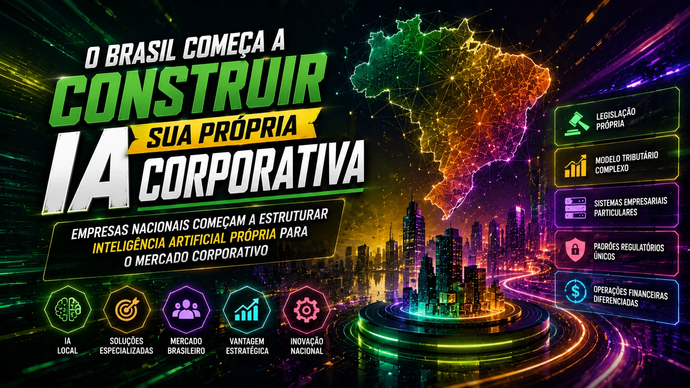
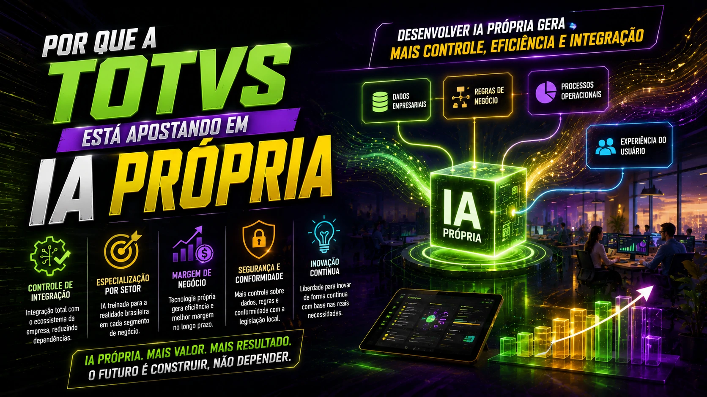

*The Brazilian corporate artificial intelligence market is entering a new phase. And this time, not just importing technology. **TOTVS**, one of the largest management software companies in Latin America, is reinforcing its strategy to develop its own and verticalized artificial intelligence for business. The movement signals something important: Brazil wants to build its own enterprise AI layer.*

*TOTVS strengthens its strategy to integrate its own AI into its corporate software ecosystem.*

## Brazil begins to build its own corporate AI

*National companies begin to structure their own artificial intelligence for the corporate market.*

During recent years, a large part of the Brazilian artificial intelligence market has been based on imported technology.

Models developed by giants like **OpenAI**, **Google** and **Anthropic** have dominated the ecosystem.

But this is changing.

**TOTVS** is accelerating investments to incorporate its own artificial intelligence into its portfolio.

The aim is not to compete directly with global foundational models.

It is about building specialized solutions for the Brazilian corporate environment.

And that makes a difference.

Because the local market has specific characteristics:

- own legislation  
- complex tax model  
- private business systems  
- different financial operations  
- unique regulatory standards

The verticalization of AI can be a strategic advantage.

## Why TOTVS is betting on its own AI

*Developing your own AI can generate greater control, efficiency and integration.*

**TOTVS**'s movement is not just technological.

It's strategic.

Creating your own artificial intelligence generates important benefits.

### Integration control

When a company controls its own AI, it controls full integration with its ecosystem.

This reduces external dependence.

And increases operational efficiency.

### Specialization by sector

An AI trained for the Brazilian reality can be much more efficient.

Especially in areas such as:

- tax  
- accounting  
- financial  
- human resources  
- business management

This type of specialization increases perceived value.

### Business margin

Using third-party technology generates recurring costs.

Having your own technology improves margins in the long term.

And this directly impacts profitability.

This movement speaks directly to the global consolidation of AI infrastructure, where controlling operations has become a priority.

## The impact on Brazilian companies

*Specialized AI for Brazil can accelerate productivity and reduce operational complexity.*

If **TOTVS**'s strategy advances as expected, the impact on the Brazilian market could be great.

Mainly for small and medium-sized companies.

Today, many companies face difficulties applying AI to operations because of:

- complex integration  
- high costs  
- limited adaptation  
- technical barriers

Native AI for enterprise software can reduce these barriers.

And accelerate adoption.

Especially in critical areas such as:

**ERP**

**CRM**

**financial**

**tax**

**process automation**

This reinforces a movement we've already seen in companies using AI to reduce operational costs without increasing teams.

The difference now is the level of integration.

## The Brazilian market can reduce international dependence

Today, much of the innovation in AI comes from abroad.

This creates dependence.

Technological dependence.

Operational dependence.

Financial dependence.

Brazilian companies pay in dollars.

They depend on external policies.

And they are exposed to changes in price and rules.

When a national company develops its own solutions, part of this dependence decreases.

And this strengthens the local ecosystem.

Not just the company.

But partners, integrators and customers.

## The next AI dispute in Brazil will be vertical

The global market has already understood this.

The new dispute is no longer just who has the most powerful AI.

It’s whoever has the most useful AI for each sector.

And Brazil follows this path.

The trend now is vertical AI growth for:

- health  
- retail  
- financial  
- legal  
- industry  
- logistics

Whoever dominates these niches can build very strong positions.

And **TOTVS** seems to want to occupy this space before its competitors.

## The future of business AI in Brazil could be born within ERPs

This is perhaps the most important point.

Corporate AI does not necessarily need to be born outside.

It can be born within the system that the company already uses.

Inside the ERP.

Inside CRM.

Inside the operation.

And that changes everything.

Because it reduces friction.

Reduces adoption curve.

Reduces cost.

And it increases implementation speed.

If this movement gains strength, the Brazilian market could enter a new phase:

less external dependence

more local specialization

more operational efficiency

more competitiveness

And this could redefine the role of Brazilian technology in the global artificial intelligence market.