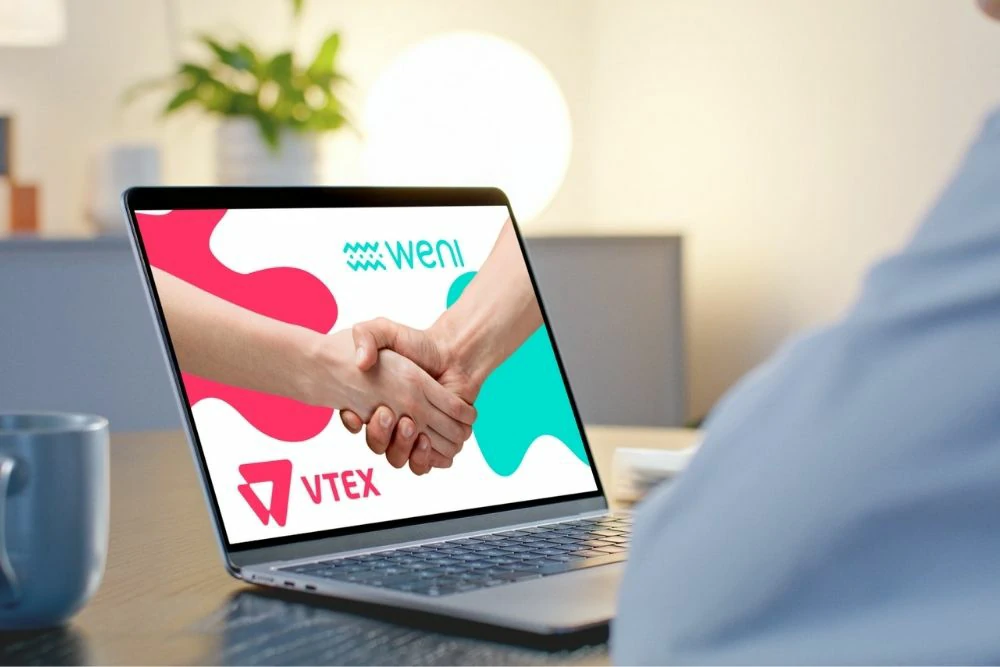

VTEX presented a strategic change in its platform: artificial intelligence stopped being a complementary resource and became the center of the operation.

The movement marks an important change in digital commerce.

It's not just about technology.

It is a structural change in the way companies operate sales, service and customer relationships.

For medium-sized companies, this can represent a direct gain in efficiency and scale.

## What VTEX launched in practice

During VTEX Day 2026, the company presented a new architecture based on three main pillars.

### Commerce platform

Responsible for central sales, ordering and catalog operations.

### Customer experience platform

Focused on personalization, relationships and retention.

### Monetization platform

Focused on internal media, advertisements and new sources of revenue.

The difference is that everything now operates connected by artificial intelligence.

## The game-changing feature: AI performing operational tasks

The main change is not just in data analysis.

It's in execution.

The platform now operates tasks that previously depended on human teams.

## Automatic generation of B2B orders

Artificial intelligence can now automatically generate orders and quotes.

### How it works

From different inputs:

- files sent by customers  
- texting  
- voice commands

The system interprets the demand and transforms it into an order.

This reduces manual steps in the business process.

## Automated after-sales service

The platform also expands post-sales automation.

### What AI can solve

Demands such as:

- order status  
- exchanges  
- returns

are now treated automatically in most cases.

This reduces operational load and improves response time.

## Personal shopper with AI

VTEX also presented a digital seller model based on artificial intelligence.

### What does he do

The system:

- conversation with the customer  
- understands purchase intention  
- recommends products  
- leads the purchasing journey

In practice, it works as a scalable digital seller.

## The real impact for medium-sized companies

The change directly affects companies that operate digital commerce with lean teams.

## Reduction in operational costs

Previously manual processes become automated.

This reduces the operational need for repetitive tasks.

## Increased conversion without team expansion

With AI applied to sales and service, companies can scale results without expanding their structure.

This point is especially relevant for growing operations.

## Complete operational integration

Marketing, sales and service now operate in an integrated manner.

### The gain from this integration

This reduces:

- rework  
- loss of information  
- operational delays

and improves the overall efficiency of the operation.

## What the market is signaling

VTEX's movement reinforces a clear trend.

Artificial intelligence is no longer a differentiator.

It is becoming operational infrastructure.

Companies that take time to adapt their processes may lose competitiveness.

## Where to start within a medium company

Not every company needs to transform its entire operation at once.

The most efficient path is to start in areas with the quickest return.

### Service

Automation of frequently asked questions and initial support.

### Sales

Lead qualification and automatic order generation.

### After-sales

Monitoring processes, exchanges and automated support.

These areas tend to generate quick impact.

## The new operational standard for digital commerce

The trend is clear.

Artificial intelligence is moving from operational support to the core of the operation.

Companies that move first tend to win:

- more efficiency  
- more speed  
- better operating margin

In the medium term, this stops being an innovation and becomes a competitive standard.