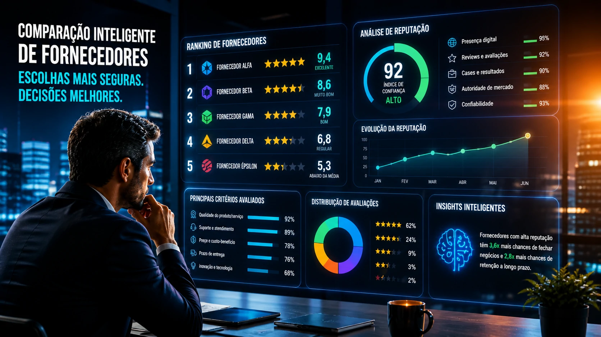

Brazilian companies still invest heavily in commercial prospecting, SDRs and outbound, but buyer behavior has changed silently — and perhaps definitively. Even before the first meeting, the decision is already being shaped by artificial intelligence, digital reputation and structured content.

A new dynamic is transforming the market: now, AI participates in pre-sales on the buyer's side.

## The new B2B purchasing journey begins without a salesperson

For years, the traditional B2B sales model followed a predictable logic:

the buyer identified a problem, looked for solutions, contacted suppliers and initiated commercial meetings.

But that has changed.

Today, tools such as **__OpenAI__**, **__Microsoft__ Copilot**, **__Google__ Gemini** and AI search engines have started to act as preliminary purchase consultants.

According to a survey cited by WebFX, 94% of B2B buyers already use LLMs in the purchasing process and 83% define acquisition criteria before even speaking to a salesperson. This means that much of the commercial persuasion now happens before the commercial team enters the scene. 
In practice:

AI compares suppliers  
summarizes reviews  
analyzes reputation  
organizes differences  
and generates shortlists

In other words: the seller arrives later.

## The problem for companies: algorithmic invisibility

If before the challenge was to appear on Google, now the challenge is to appear in the AI's response.

And that completely changes the game.

When a buyer asks:

"What are the best CRMs for medium-sized companies in Brazil?"

or

"which marketing automation tool has the best support?"

the AI mounts a response based on signals such as:

official website  
public reviews  
presence in communities  
documented cases  
educational content  
external mentions  
topic authority

If your company doesn't have these structured signals, it may simply not exist for this buyer.

This creates a new phenomenon:

technically good companies, but commercially invisible.

And that can be fatal.

## Reputation became commercial infrastructure

B2B Stack's research with more than 19 thousand users shows a Brazilian buyer who is more discerning, more comparative and more dependent on social validation.

This data is important.

Because AI doesn't invent trust.

It reorganizes trust.

If your brand has poor reviews, a low digital presence, or inconsistent messaging, AI amplifies this.

If your brand has a good reputation, clear cases and a strong presence, AI also amplifies it.

In practice, reputation became an operational asset.

It's not branding anymore.

It's pipeline.

## Brazil accelerates — and that changes competitive pressure

The **International Data Corporation (IDC)** estimates that investments in AI in Brazil should reach US$3.4 billion in 2026, with growth above 30%.

This number is not just about technology adoption.

It's about competitive infrastructure change.

If buyers are using AI to evaluate suppliers and suppliers are using AI to sell better, it creates a double acceleration environment.

Anyone who delays loses efficiency on both sides.

This is especially true for companies:

software  
corporate services  
consultancy  
logistics  
marketing  
HR  
industry

## Digital Sales Rooms: the new commercial battlefield

Another relevant movement is the rise of Digital Sales Rooms.

According to market projections, around 30% of B2B sales cycles in 2026 are already being conducted using this model.

In practice, this means that the sale leaves the linear format (calls, emails and PDFs) and enters a centralized digital environment where buyer and seller share:

documents  
proposals  
videos  
comparative  
ROI calculators  
timelines  
FAQs

This format speaks directly to the new AI-driven buyer.

Because it reduces friction.

And speeds up decision making.

## The B2B salesperson did not die — but changed roles

Many people interpret this scenario as a threat to sales.

It's a mistake.

The seller remains relevant.

But its role has changed.

Before:

educated the market.

Now:

validates decisions already partially made.

Before:

introduced solutions.

Now:

removes specific objections.

Before:

controlled information.

Now:

interprets information.

The commercial is no longer the gateway.

It became a closing accelerator.

## What Brazilian companies need to do now

The impact of this is immediate.

Companies that want to remain competitive need to review five pillars:

### 1. Structure digital presence for AI

Technical content  
clear pages  
concrete evidence  
verifiable data

AI prioritizes clarity.

### 2. Build distributed reputation

Reviews  
testimonials  
assessment platforms  
market mentions

Decentralized trust matters.

### 3. Integrate marketing and sales

If AI is part of the beginning of the journey, marketing has started to influence sales in an even more direct way.

The separation between teams becomes less efficient.

### 4. Review the commercial funnel

If the lead arrives more informed, the commercial process needs to follow this new level of maturity.

Old script loses strength.

### 5. Monitor how your brand appears in AI

This may be the new B2B marketing discipline.

Understand:

what AI says about your company  
How does your brand compare?  
which competitors appear together  
what objections does it highlight

This monitoring tends to become routine.

## The next B2B dispute will be for algorithmic presence

The market is entering a phase where the first impression of your company may not come from your salesperson.

It could come from an AI.

And that changes everything.

Because it means that trust, authority and clarity are no longer marketing differentiators.

They became sales infrastructure.

Brazilian companies that understand this early can capture real competitive advantage.

Those who ignore it may discover too late that they were losing business even before the first meeting.