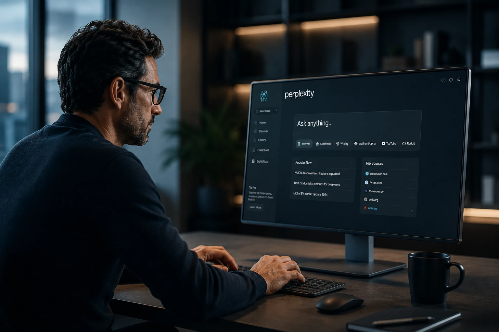

*The artificial intelligence market has entered a new phase. After the widespread adoption of generative AI chatbots, businesses have begun searching for tools that combine speed, reliability, and analytical capabilities. In this environment, **Perplexity Pro** has emerged as a compelling platform that blends web search, advanced AI models, and source-backed answers. But is it truly worth the investment in 2026?*

## Perplexity Pro is an AI-powered research platform designed for productivity and decision-making

*Perplexity has gained attention by transforming complex research tasks into structured, contextualized answers.*

**Perplexity Pro** is the premium version of **Perplexity AI**, a platform that combines modern search capabilities with advanced artificial intelligence models.

Unlike traditional search engines, the platform does not simply return links. Instead, it interprets the query, analyzes multiple sources, and provides a consolidated response.

This approach significantly reduces the time professionals spend gathering information from different websites.

### How does Perplexity work?

When users submit a query, the platform searches across multiple public sources and generates a structured answer.

Its biggest differentiator is the inclusion of citations and references used during the response-generation process.

This allows professionals to quickly verify information before incorporating it into reports, presentations, research projects, or business decisions.

### What changes with the Pro version?

The premium subscription unlocks additional capabilities.

Key benefits include:

- Access to advanced AI models;
- More in-depth research capabilities;
- Faster response generation;
- Enhanced search features;
- Better performance for professional workflows.

These upgrades make **Perplexity Pro** particularly attractive for business environments.

## Perplexity Pro addresses the growing demand for competitive intelligence

*Businesses are increasingly adopting AI research platforms to accelerate market analysis and identify emerging trends.*

The primary strength of **Perplexity Pro** lies in its ability to transform large amounts of information into actionable insights.

In a world where data is produced at unprecedented speed, quickly identifying relevant information has become a competitive advantage.

### How are businesses using Perplexity?

Organizations across multiple industries are leveraging AI-powered research tools to reduce operational costs and improve efficiency.

Common use cases include:

- Market research;
- Competitive intelligence;
- Content creation;
- Trend analysis;
- Industry studies;
- Business intelligence.

Teams that previously spent hours navigating multiple websites can now consolidate information in minutes.

### What changes for marketing professionals?

Digital marketing teams are among the biggest beneficiaries of this technology.

The platform can accelerate:

- SEO research;
- Trend discovery;
- Editorial planning;
- Competitor analysis;
- Strategic content development.

As AI becomes increasingly integrated into business workflows, research efficiency is becoming just as important as content production itself.

## Comparing Perplexity Pro with ChatGPT and other AI platforms

*The enterprise AI market has become increasingly competitive in 2026.*

One of the most common questions surrounding **Perplexity Pro** involves comparisons with **ChatGPT**, **Claude**, and **Gemini**.

Although all these platforms rely on artificial intelligence, they are optimized for different objectives.

### Perplexity vs ChatGPT

**ChatGPT** excels at content creation, reasoning tasks, workflow automation, and conversational interactions.

**Perplexity Pro**, however, focuses more heavily on research and information retrieval backed by external sources.

For professionals who require fact-checking and source validation, this distinction can be highly valuable.

### Perplexity vs Claude

**Claude** has earned recognition for handling long documents, deep analysis, and enterprise productivity tasks.

**Perplexity**, on the other hand, delivers an experience that feels closer to an intelligent search engine.

As a result, many organizations use both tools together rather than choosing one over the other.

### Can Perplexity replace other AI tools?

In most cases, no.

The current trend among businesses is the creation of AI ecosystems.

Different tools fulfill different functions:

- **Perplexity** for research;
- **ChatGPT** for content creation;
- **Claude** for document analysis;
- **Gemini** for integration with the Google ecosystem.

This multi-platform approach is likely to become even more common over the next few years.

## Does the cost of Perplexity Pro make sense for businesses and content creators?

The short answer is yes—provided the platform is used frequently.

The subscription should be evaluated through the lens of productivity rather than software expenses alone.

### When is the investment worth it?

The return on investment is often strongest for:

- Consultants;
- Market analysts;
- Marketing professionals;
- Content creators;
- Journalists;
- Research teams;
- Technology leaders.

In these situations, saving several hours of research each week can easily outweigh the cost of the subscription.

### When is the free version enough?

Casual users may find that the free plan satisfies most of their needs.

Individuals conducting occasional research or simple searches are unlikely to take full advantage of the premium features.

For this reason, the decision should be based primarily on usage frequency.

### What is Perplexity Pro’s biggest competitive advantage?

The platform's greatest strength is not simply its technology.

Its true advantage lies in reducing the friction between asking a question, conducting research, and obtaining a reliable answer.

While many professionals still spend significant time switching between browser tabs, **Perplexity Pro** delivers structured context within seconds.

This represents a meaningful productivity gain in environments where time and information quality directly influence business outcomes.

The growth of AI-powered research platforms suggests that the market is gradually shifting from traditional search engines toward context-driven information systems. In this environment, **Perplexity Pro** stands out as one of the most compelling tools for professionals who depend on high-quality information, analytical speed, and competitive intelligence. Rather than replacing search engines altogether, the platform signals a broader transformation in how digital research will be conducted in the AI era.

---