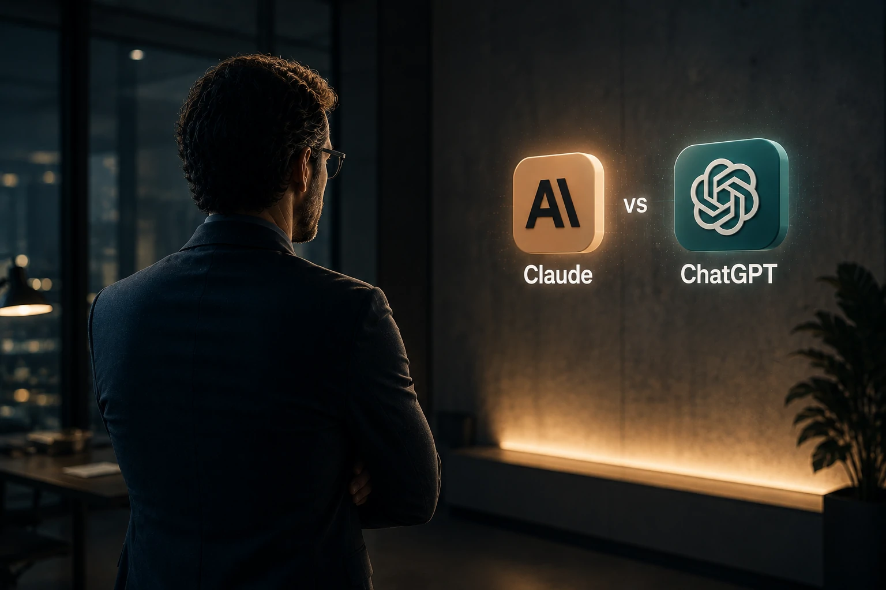

*For years, the dispute between artificial intelligence platforms was treated as a comparison of the quality of responses. By 2026, this approach no longer makes sense for most companies. The strategic question has changed. Instead of looking for which AI writes best, managers want to discover which platform generates more productivity, reduces more operational costs and creates a sustainable competitive advantage.*

*In this scenario, **Claude**, from **Anthropic**, and **ChatGPT**, from **OpenAI**, became the two main candidates to occupy the role of corporate interface for the new economy based on intelligent agents.*

## Claude and ChatGPT are no longer chatbots and have started to function as business platforms

*AI platforms are evolving to become knowledge-based enterprise operating systems.*

The main change observed in 2026 is that both **Claude** and **ChatGPT** no longer act solely as conversational assistants.

Today, both platforms are used to automate processes, structure internal knowledge, support decisions, accelerate software development and power autonomous agents capable of performing complex business tasks.

### What has changed in the corporate market?

Companies are not just buying an AI.

They are choosing which cognitive infrastructure will underpin their digital operations in the coming years.

This trend appears in movements observed across the market, including the growth of so-called corporate AI agents and organizational memory systems.

To understand this transformation, it is also worth checking how the concept of corporate memory is evolving in [Corporate memory with AI: why companies are transforming internal knowledge into competitive advantage](https://noticiatech.com.br/negocios/mem%C3%B3ria-corporativa-com-ia-por-que-empresas-est%C3%A3o-transformando-conhecimento-interno-em-vantagem-competitiva/).

### The role of AI in business productivity

The adoption of AI is no longer an experimental project.

More and more organizations are using generative models to:

- customer service;
- content production;
- document analysis;
- commercial support;
- software development;
- operational automation;
- corporate research.

In this context, choosing the wrong platform can generate hidden costs, rework and future limitations.

## Claude often excels at in-depth context analysis and corporate documentation

*Claude has gained space among organizations that work with large volumes of knowledge and documentation.*

**Anthropic**'s proposal is to position **Claude** as a highly reliable AI for business environments.

The model became known for its ability to deal with extensive contexts and interpret large sets of documents with high consistency.

### Where does Claude usually deliver the most value?

Companies often use Claude to:

- contractual analysis;
- compliance;
- technical documentation;
- strategic research;
- internal audits;
- corporate knowledge bases.

In environments where the quality of document interpretation is critical, Claude is often considered a very competitive option.

### What changes for knowledge-driven companies?

Organizations that rely on complex documentation often face challenges related to information retrieval.

In these scenarios, Claude can function as an intelligent layer on top of existing corporate knowledge.

This movement is directly connected to the expansion of so-called corporate knowledge graphs, a topic covered in [AI Knowledge Graphs: why companies begin to transform internal data into a competitive advantage for AI agents](https://noticiatech.com.br/negocios/ai-knowledge-graphs-por-que-empresas-come%C3%A7am-a-transformar-dados-internos-em-vantagem-competitiva-para-agentes-de-ia/).

## ChatGPT has an advantage when the objective is automation, integration and AI agents

*The OpenAI ecosystem is rapidly advancing as a platform for building intelligent flows and enterprise agents.*

When the focus is on business automation, **ChatGPT** generally presents a more comprehensive proposal.

**OpenAI**'s strategy is not limited to the language model.

The company has been building a complete ecosystem that includes APIs, agents, connectors, custom GPTs and integration with corporate tools.

### Why has ChatGPT gained space in companies?

The main reason is the ability to integrate different systems.

Companies can connect the model to:

- CRMs;
- ERPs;
- service platforms;
- databases;
- internal systems;
- productivity tools.

This integration creates conditions for the emergence of so-called corporate agents.

The topic has already been discussed in depth in the article [The era of AI agents has begun: how Microsoft, OpenAI and Google are transforming companies into systems autonomous](https://noticiatech.com.br/inteligencia-artificial/a-era-dos-agentes-de-ia-j%C3%A1-come%C3%A7ou-como-microsoft-openai-e-google-est%C3%A3o-transformando-empresas-em-sistemas-aut%C3%B4nomos/).

### What changes for small and medium-sized companies?

For smaller companies, ChatGPT tends to have a faster adoption curve.

The combination of customized GPTs, automations and integrations reduces the need for specialized technical teams.

This allows you to implement AI projects in weeks, not months.

## Security, governance and scalability are the factors that really define the choice

The choice between **Claude** and **ChatGPT** should rarely be made solely based on the quality of the answers.

In corporate environments, structural factors tend to have more weight.

### Corporate governance

Companies need to control:

- access to data;
- internal use of AI;
- regulatory compliance;
- traceability;
- process audit.

Governance is no longer a differentiator and has become an operational requirement.

This concern increasingly appears in [AI Governance as a priority for companies] initiatives (https://noticiatech.com.br/inteligencia-artificial/governanca-ia-prioridade-empresas/).

### Scalability and future growth

A choice made today can impact the next five years.

The company must evaluate:

- integration capacity;
- expansion of users;
- creation of agents;
- automation of flows;
- long-term costs;
- technological dependence.

In this regard, many organizations are already starting to treat AI platforms as part of the critical infrastructure of the business.

### Executive comparison

**Claude may make more sense when the priority is:**

- document analysis;
- strategic research;
- compliance;
- interpretation of complex context;
- knowledge management.

**ChatGPT may make more sense when the priority is:**

- automation;
- AI agents;
- integrations;
- operational productivity;
- creation of intelligent flows.

## The real winner depends on the company's AI maturity stage

The question "Claude or ChatGPT?" it often seems simple.

In practice, it reveals a more strategic question: what role artificial intelligence will have within the organization.

Companies that are still beginning their journey typically seek quick productivity gains, a scenario in which the **ChatGPT** ecosystem often presents operational advantages.

Organizations that rely heavily on structured knowledge, technical documentation and in-depth context analysis can find in **Claude** a proposal that is more aligned with their needs.

The most important point is that the dispute no longer happens only between language models.

Competition now takes place between platforms capable of becoming the central cognitive layer of companies.

And, as autonomous agents, advanced automation and corporate memory systems gain ground, the decision about which AI to adopt is likely to become one of the most relevant technological choices of this decade.

---