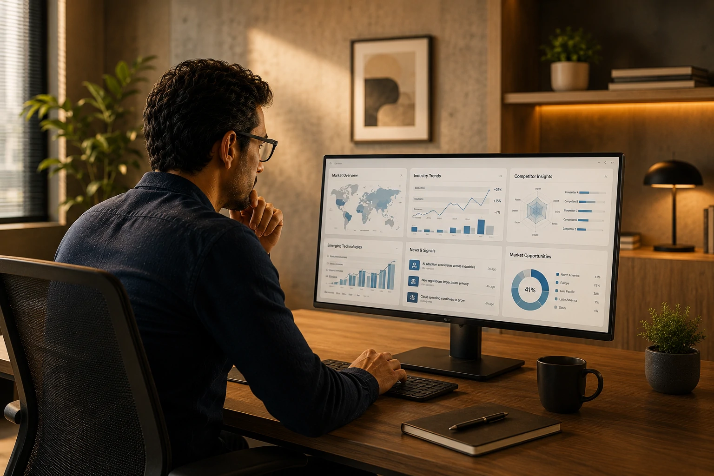

*O volume de informações disponível para empresas nunca foi tão grande. Ao mesmo tempo, a velocidade das mudanças tecnológicas, econômicas e regulatórias exige decisões cada vez mais rápidas. Nesse cenário, ferramentas de inteligência artificial deixaram de ser apenas recursos de produtividade e passaram a ocupar um papel estratégico na pesquisa de mercado, monitoramento de concorrentes e geração de insights para negócios. Em 2026, as organizações que conseguem transformar informação em conhecimento acionável possuem uma vantagem competitiva difícil de replicar.*

## As melhores ferramentas de IA para pesquisa ajudam empresas a transformar informação em vantagem competitiva

*Plataformas de IA estão redefinindo a forma como empresas pesquisam mercados e analisam concorrentes.*

A inteligência competitiva sempre foi um dos pilares da estratégia empresarial.

A diferença é que, em 2026, a coleta e análise de dados passaram a ser amplamente assistidas por inteligência artificial.

Enquanto equipes tradicionais precisavam navegar por dezenas de sites, relatórios e bases de dados, as novas plataformas conseguem consolidar informações em poucos minutos.

### Por que a inteligência competitiva se tornou prioridade?

Mercados mudam rapidamente.

Novos concorrentes surgem constantemente.

Mudanças regulatórias podem alterar setores inteiros.

Além disso, tecnologias emergentes estão encurtando ciclos de inovação.

Empresas que monitoram esses movimentos com eficiência possuem mais capacidade de adaptação.

### O que muda com a IA?

A IA reduz drasticamente o tempo gasto na busca de informações.

Além disso, permite identificar padrões que passariam despercebidos em análises manuais.

O resultado é uma tomada de decisão mais rápida e baseada em evidências.

## Perplexity lidera entre as ferramentas focadas em pesquisa e descoberta de informações

*O Perplexity se consolidou como uma das principais plataformas de pesquisa baseada em IA.*

O **Perplexity** ocupa atualmente uma posição de destaque entre as ferramentas de pesquisa assistida por inteligência artificial.

Seu diferencial está na combinação entre respostas geradas por IA e referências verificáveis.

Isso reduz um dos principais problemas enfrentados por usuários de IA generativa: a validação das informações.

### Quando o Perplexity é a melhor escolha?

O **Perplexity** se destaca em situações como:

- Pesquisa de mercado;
- Inteligência competitiva;
- Benchmarking;
- Análise setorial;
- Estudos de tendências;
- Produção de relatórios.

Para profissionais que trabalham diariamente com informações externas, a plataforma pode representar um ganho significativo de produtividade.

### O que diferencia o Perplexity de outros modelos?

Enquanto muitos chatbots se concentram na geração de texto, o **Perplexity** prioriza a descoberta de informações.

Por isso, tornou-se uma escolha frequente para consultores, analistas e gestores.

Para uma análise aprofundada da plataforma, vale conferir o artigo [Perplexity Pro Vale a Pena em 2026](https://noticiatech.com.br/ferramentas/perplexity-pro-vale-a-pena-2026/).

## ChatGPT Claude e Gemini formam o núcleo das plataformas de análise estratégica

*Ferramentas de IA generativa estão se tornando parte do fluxo de trabalho corporativo.*

Embora o **Perplexity** seja forte em pesquisa, outras plataformas desempenham papéis igualmente relevantes.

### ChatGPT

O **ChatGPT** continua sendo uma das ferramentas mais versáteis do mercado.

Empresas utilizam a plataforma para:

- Produção de conteúdo;
- Planejamento estratégico;
- Análise de documentos;
- Automação de tarefas;
- Geração de relatórios.

Sua flexibilidade permite atuar em praticamente qualquer área corporativa.

### Claude

O **Claude** conquistou espaço especialmente em ambientes empresariais.

Seu desempenho em textos longos e análise documental faz com que seja amplamente utilizado por consultorias, escritórios jurídicos e equipes de pesquisa.

Esse posicionamento pode ser observado no artigo [Claude vs ChatGPT para Empresas em 2026](https://noticiatech.com.br/ferramentas/claude-vs-chatgpt-para-empresas-2026/).

### Gemini

O **Gemini** se beneficia da integração com o ecossistema da **Google**.

Empresas que já utilizam ferramentas como Workspace encontram vantagens na integração entre produtividade e inteligência artificial.

Essa proximidade com dados corporativos tende a fortalecer sua adoção ao longo dos próximos anos.

## NotebookLM Grok e You.com representam a nova geração de ferramentas especializadas

A próxima fase da inteligência competitiva não será dominada por uma única plataforma.

A tendência aponta para ecossistemas compostos por múltiplas ferramentas especializadas.

### NotebookLM

O **NotebookLM** ganhou relevância por permitir que usuários construam bases de conhecimento personalizadas.

A plataforma é especialmente útil para:

- Pesquisadores;
- Analistas;
- Consultores;
- Equipes de inovação.

Seu foco está na compreensão profunda de documentos e fontes específicas.

### Grok

O **Grok** possui uma proposta diferente.

Integrado ao ecossistema social da plataforma X, oferece acesso a sinais em tempo real e discussões que frequentemente antecipam tendências de mercado.

Isso o torna particularmente interessante para monitoramento de movimentos emergentes.

### You.com

O **You.com** combina recursos de busca e IA generativa.

Sua proposta é oferecer uma experiência híbrida que une pesquisa tradicional e respostas contextualizadas.

Embora ainda tenha participação menor que alguns concorrentes, continua atraindo usuários corporativos interessados em alternativas ao modelo dominante de pesquisa.

## Como escolher a melhor ferramenta de IA para inteligência competitiva

A resposta depende dos objetivos da organização.

Não existe uma plataforma universal capaz de resolver todos os desafios de pesquisa e análise.

### Para pesquisa e descoberta

A melhor opção costuma ser o **Perplexity**.

Sua estrutura baseada em fontes verificáveis favorece análises mais confiáveis.

### Para criação e produtividade

O **ChatGPT** continua sendo uma das escolhas mais completas.

Sua flexibilidade permite adaptação a diferentes áreas corporativas.

### Para análise documental

O **Claude** apresenta vantagens importantes em contextos que exigem interpretação de grandes volumes de texto.

### Para integração corporativa

O **Gemini** possui forte sinergia com empresas que utilizam soluções da **Google**.

### O que muda para pequenas empresas?

Pequenas empresas podem utilizar essas ferramentas para:

- Reduzir custos de pesquisa;
- Melhorar marketing;
- Identificar tendências;
- Monitorar concorrentes;
- Aumentar produtividade.

O acesso a recursos antes disponíveis apenas para grandes corporações tornou-se muito mais democrático.

Mais importante do que escolher uma única plataforma é construir um fluxo de trabalho que combine diferentes capacidades. A inteligência competitiva baseada em IA está evoluindo rapidamente, e as organizações que aprenderem a integrar pesquisa, análise e geração de insights terão melhores condições de antecipar mudanças de mercado. Em 2026, a vantagem competitiva não depende apenas de possuir informações, mas da capacidade de transformá-las em decisões estratégicas antes que os concorrentes façam o mesmo.

---