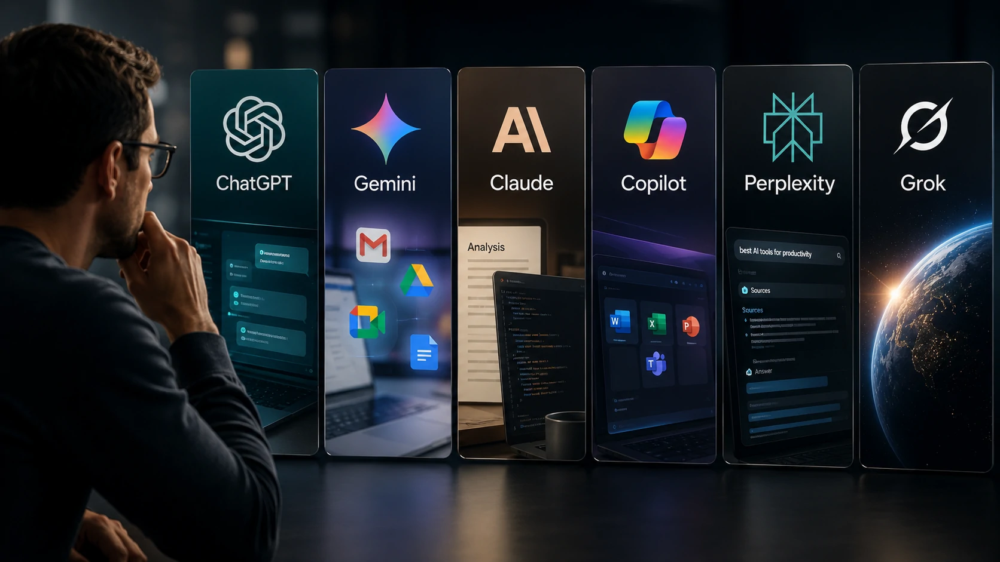
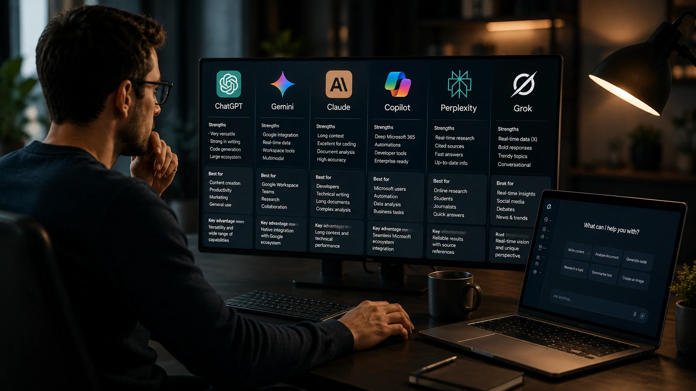

*Escolher uma plataforma de inteligência artificial deixou de ser apenas uma curiosidade tecnológica. Em 2026, profissionais, empresas e estudantes avaliam produtividade, integração com ferramentas corporativas, qualidade das respostas e custo-benefício antes de decidir qual IA utilizar diariamente.*

A rápida evolução do mercado também aumentou a concorrência entre **ChatGPT**, **Gemini**, **Claude**, **Microsoft Copilot**, **Perplexity**, **Grok** e outras soluções. Cada plataforma passou a investir em recursos específicos para conquistar usuários corporativos e ampliar participação no mercado.

## Qual IA oferece o melhor equilíbrio entre qualidade e produtividade?

A resposta depende do perfil de uso. Nenhuma plataforma é superior em todos os cenários, mas algumas se destacam em tarefas específicas, como programação, pesquisa, produção de conteúdo ou integração com ambientes empresariais.

*Cada plataforma concentra investimentos em áreas diferentes para conquistar usuários profissionais.*

### ChatGPT continua sendo a referência em versatilidade

O **ChatGPT** permanece entre as plataformas mais completas do mercado.

Seu principal diferencial está na variedade de modelos disponíveis, criação de GPTs personalizados, análise de arquivos, geração de imagens e integração com diversos serviços.

Para profissionais que atuam em marketing, atendimento, programação, criação de conteúdo e produtividade, continua sendo uma das opções mais equilibradas.

### Gemini aposta na integração com o ecossistema Google

O **Gemini** concentra sua estratégia na integração com o **Google Workspace**.

Usuários que trabalham diariamente com **Gmail**, **Google Docs**, **Drive**, **Meet** e **Planilhas** conseguem automatizar tarefas sem sair do ambiente de trabalho.

Essa integração tornou a plataforma especialmente interessante para empresas que já utilizam os serviços do Google.

Como complemento, vale conhecer nossa análise sobre o avanço da IA no setor automotivo:

https://noticiatech.com.br/inteligencia-artificial/gemini-chatgpt-carros-inteligentes-industria-automotiva/

## Claude cresce entre profissionais que trabalham com textos e programação

O **Claude**, desenvolvido pela **Anthropic**, tornou-se uma das alternativas mais fortes para usuários corporativos.

*O foco do Claude está na qualidade das respostas, contexto longo e produtividade profissional.*

### Excelente compreensão de contexto

Um dos maiores diferenciais do Claude é sua capacidade de analisar documentos extensos sem perder coerência durante toda a conversa.

Esse comportamento beneficia atividades como:

- revisão contratual;
- documentação técnica;
- produção de relatórios;
- pesquisa;
- desenvolvimento de software.

### Programadores encontram vantagens importantes

Entre desenvolvedores, o Claude ganhou espaço pela qualidade da geração de código e pela capacidade de identificar problemas complexos durante revisões.

Essa evolução acompanha o movimento estratégico da **Anthropic**, que vem ampliando sua presença no mercado corporativo e fortalecendo a disputa com **OpenAI**, **Google** e **Microsoft**.

Esse crescimento também se conecta ao avanço da infraestrutura empresarial para IA abordado pelo Notícia Tech em:

https://noticiatech.com.br/inteligencia-artificial/rag-modelos-proprios-dados-corporativos-empresas/

## Como escolher a melhor IA para cada perfil de usuário?

A melhor escolha depende da atividade realizada diariamente. Em vez de procurar uma única plataforma vencedora, vale analisar qual solução entrega maior retorno para seu fluxo de trabalho.

*Cada plataforma prioriza diferentes casos de uso, desde produtividade individual até operações corporativas.*

### Para criação de conteúdo

Profissionais de marketing, redatores e criadores costumam encontrar excelente equilíbrio no **ChatGPT**.

A plataforma oferece boa capacidade de escrita, revisão, brainstorming, criação de imagens e automação de tarefas, além de um ecossistema bastante consolidado.

### Para empresas que utilizam Google Workspace

O **Gemini** se destaca quando a rotina envolve documentos compartilhados, reuniões e colaboração em equipe.

Sua integração nativa reduz etapas operacionais e melhora a produtividade em ambientes corporativos.

### Para programação e documentação técnica

O **Claude** aparece entre as melhores escolhas para quem trabalha diariamente com desenvolvimento de software, documentação extensa e análise de grandes volumes de informação.

Sua janela de contexto ampla reduz a necessidade de dividir projetos em várias conversas.

### Para pesquisa na internet

O **Perplexity** ganhou espaço por combinar respostas geradas por IA com referências atualizadas da web.

Esse modelo reduz o tempo gasto pesquisando informações distribuídas em diferentes sites.

## O mercado de IA ficou mais competitivo em 2026

A disputa deixou de acontecer apenas entre duas ou três empresas.

Hoje, grandes fabricantes buscam diferenciação por meio de infraestrutura, integração empresarial, qualidade dos modelos e experiências específicas para determinados segmentos.

Enquanto a **OpenAI** amplia seu ecossistema de produtos, o **Google** fortalece o **Gemini**, a **Anthropic** investe no **Claude** para o mercado corporativo, a **Microsoft** evolui o **Copilot**, e outras empresas aceleram o lançamento de novas soluções.

Essa concorrência beneficia diretamente os usuários, que passam a contar com plataformas mais completas, preços mais competitivos e recursos cada vez mais especializados.

## Vale a pena utilizar mais de uma IA?

Para muitos profissionais, sim.

Cada plataforma possui vantagens que podem ser exploradas conforme a necessidade do trabalho.

Uma estratégia comum consiste em utilizar:

- **ChatGPT** para criação de conteúdo e automações;
- **Claude** para programação e análise documental;
- **Gemini** para produtividade integrada ao Google Workspace;
- **Perplexity** para pesquisas rápidas com referências atualizadas.

Essa combinação permite aproveitar o melhor de cada solução sem depender exclusivamente de uma única ferramenta.

À medida que novos modelos chegam ao mercado, a tendência é que a especialização aumente ainda mais. Em vez de existir uma inteligência artificial capaz de dominar todos os cenários, o mercado caminha para plataformas cada vez mais focadas em necessidades específicas de empresas, desenvolvedores e profissionais do conhecimento. Para quem acompanha essa evolução, entender as diferenças entre **ChatGPT**, **Gemini**, **Claude** e seus concorrentes tornou-se uma decisão estratégica capaz de impactar produtividade, custos e competitividade nos próximos anos.

---