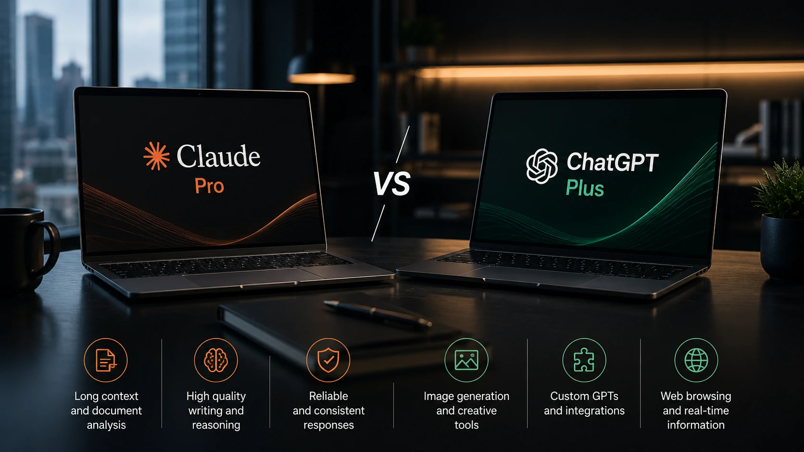

*À medida que a inteligência artificial se torna parte da rotina corporativa, escolher a ferramenta certa deixou de ser apenas uma decisão tecnológica e passou a ser uma decisão financeira. Entre as principais opções do mercado, o **Claude Pro** ganhou espaço por oferecer foco em produtividade, qualidade de escrita e análise de documentos extensos.*

## Claude Pro vale a pena em 2026?

Para profissionais que utilizam **IA** diariamente, o **Claude Pro** pode oferecer um excelente retorno sobre o investimento ao reduzir tempo gasto com produção de conteúdo, pesquisa, programação e análise de informações.

*O Claude Pro é voltado para usuários que dependem de inteligência artificial como ferramenta de trabalho.*

O crescimento da **Anthropic** no mercado corporativo mostra que a empresa deixou de competir apenas como alternativa ao **ChatGPT**. Hoje, ela disputa diretamente contratos empresariais, integrações em nuvem e projetos voltados à produtividade.

A proposta do **Claude Pro** não é apenas gerar respostas rapidamente, mas produzir conteúdos consistentes, interpretar documentos longos e auxiliar na tomada de decisões baseada em grandes volumes de informação.

Para profissionais de tecnologia, marketing, jurídico, pesquisa, educação e negócios digitais, isso representa um ganho significativo de produtividade.

### O que o plano Pro adiciona?

Entre os principais benefícios estão:

- maior limite de utilização;
- prioridade durante horários de maior demanda;
- acesso antecipado aos modelos mais recentes;
- melhor desempenho em tarefas complexas;
- experiência mais estável para uso profissional.

### Quem aproveita melhor a assinatura?

O investimento tende a fazer mais sentido para:

- produtores de conteúdo;
- desenvolvedores;
- analistas de dados;
- consultores;
- pesquisadores;
- gestores;
- pequenas equipes que utilizam IA diariamente.

Quem utiliza inteligência artificial apenas ocasionalmente dificilmente perceberá benefícios suficientes para justificar uma assinatura.

## Quais recursos realmente fazem diferença?

O principal diferencial do **Claude Pro** está na qualidade das respostas em tarefas que exigem raciocínio, contexto e organização de grandes quantidades de informação.

*O grande diferencial do Claude está na interpretação de conteúdos extensos e estruturados.*

Enquanto muitas plataformas priorizam velocidade, o **Claude** ganhou reconhecimento pela capacidade de trabalhar com documentos extensos, contratos, pesquisas, códigos e materiais técnicos.

Essa característica tornou a ferramenta especialmente interessante para empresas que precisam transformar conhecimento em produtividade.

### Excelente desempenho com documentos

Um dos pontos mais elogiados pelos usuários é a facilidade para:

- resumir documentos;
- identificar inconsistências;
- comparar versões;
- produzir análises detalhadas;
- estruturar relatórios.

Esse perfil aproxima o **Claude** de ambientes corporativos que lidam diariamente com grande volume de informação.

### Foco em produtividade

Outro aspecto importante é que a plataforma foi desenhada para reduzir trabalho repetitivo.

Em vez de apenas responder perguntas, ela auxilia na organização de processos, revisão de textos, criação de apresentações, documentação técnica e planejamento estratégico.

Para quem já utiliza o **ChatGPT**, também pode ser interessante conhecer nosso comparativo entre as principais plataformas de IA:
https://noticiatech.com.br/ferramentas/chatgpt-gemini-claude-comparativo-melhor-ia-2026/

Também vale conferir nossa análise sobre como a **Anthropic** está expandindo sua presença no mercado corporativo:
https://noticiatech.com.br/inteligencia-artificial/anthropic-claude-microsoft-azure-gpus-nvidia-gb300/

## Claude Pro ou ChatGPT Plus: qual oferece melhor custo-benefício?

A resposta depende do perfil de uso. O **Claude Pro** costuma ser mais indicado para quem trabalha com documentos longos, pesquisa e produção textual, enquanto o **ChatGPT Plus** oferece um ecossistema mais amplo, com geração de imagens, GPTs personalizados e maior diversidade de recursos.

*Cada plataforma possui vantagens distintas, e a escolha ideal depende do tipo de atividade realizada diariamente.*

Nenhuma ferramenta é superior em todos os cenários. O ideal é avaliar quais recursos geram mais valor para o seu fluxo de trabalho.

### Quando escolher o Claude Pro

O **Claude Pro** tende a ser a melhor escolha para quem:

- trabalha com documentação extensa;
- produz relatórios técnicos;
- realiza pesquisas aprofundadas;
- desenvolve conteúdos de alta qualidade;
- precisa interpretar grandes volumes de texto.

Sua principal vantagem está na capacidade de manter contexto durante conversas longas e produzir respostas consistentes.

### Quando o ChatGPT Plus pode ser mais interessante

O **ChatGPT Plus** costuma ser mais vantajoso para usuários que desejam uma plataforma multifuncional.

Além da geração de textos, ele reúne recursos como criação de imagens, análise de arquivos, GPTs personalizados, navegação e diversas integrações que ampliam sua aplicação em diferentes áreas.

Profissionais que alternam frequentemente entre criação, programação, brainstorming e automação costumam aproveitar melhor esse ecossistema.

## Para quem o Claude Pro realmente vale a pena?

O **Claude Pro** oferece maior retorno para usuários que transformam produtividade em receita ou redução de custos.

Quem utiliza inteligência artificial diariamente consegue diluir facilmente o custo da assinatura ao economizar horas de trabalho em atividades repetitivas ou complexas.

Os perfis que mais costumam justificar o investimento incluem:

- consultores;
- advogados;
- analistas;
- programadores;
- equipes de marketing;
- redatores;
- pesquisadores;
- empreendedores digitais.

Já estudantes ou usuários ocasionais normalmente conseguem atender suas necessidades utilizando a versão gratuita, principalmente quando o uso acontece poucas vezes por semana.

Outro ponto importante é considerar o crescimento do ecossistema da **Anthropic**. A empresa vem ampliando parcerias estratégicas com grandes provedores de infraestrutura e fortalecendo sua presença no mercado corporativo, indicando que o **Claude** deve continuar evoluindo como uma das principais plataformas de inteligência artificial voltadas para negócios.

A tendência para 2026 é que empresas deixem de escolher apenas "o melhor chatbot" e passem a selecionar plataformas especializadas conforme cada necessidade. Nesse cenário, o **Claude Pro** consolida sua posição como uma solução voltada para produtividade, análise documental e geração de conhecimento, enquanto outras ferramentas atendem melhor casos de uso diferentes.

Para profissionais que utilizam IA como parte do trabalho diário, a assinatura tende a representar um investimento em eficiência. Para quem faz uso esporádico, entretanto, a versão gratuita continua sendo suficiente na maior parte dos casos, tornando a decisão muito mais dependente da intensidade de uso do que da qualidade da ferramenta em si.

---