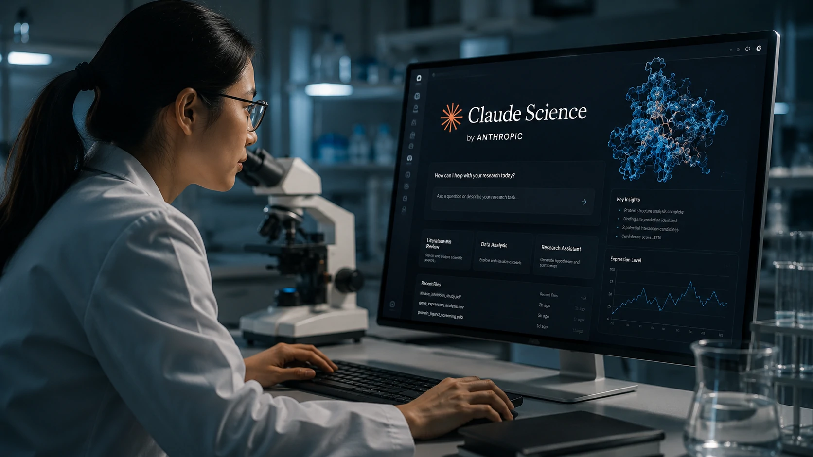
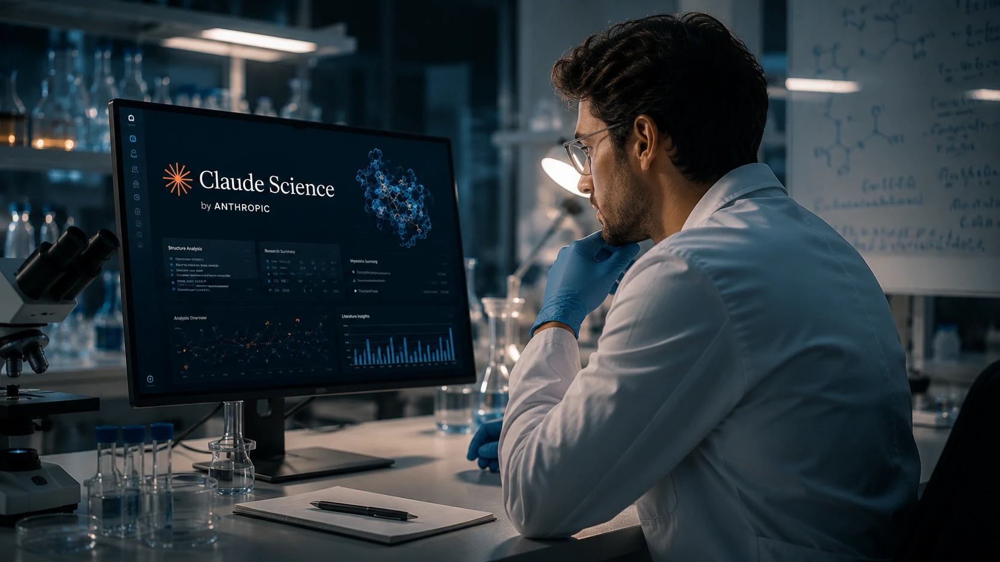
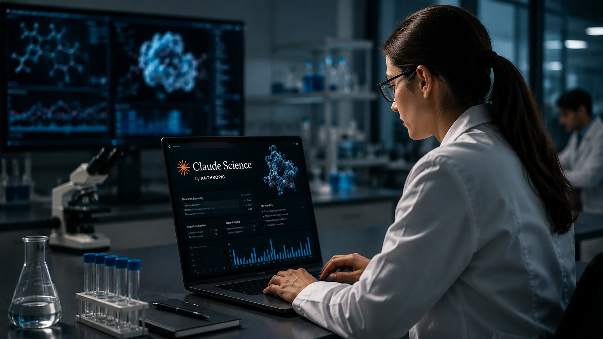

*Durante os últimos dois anos, a corrida da inteligência artificial foi marcada principalmente por modelos generalistas. Agora, a estratégia começa a mudar. Em vez de desenvolver apenas assistentes capazes de responder qualquer pergunta, empresas como a **Anthropic** passam a investir em plataformas especializadas, capazes de compreender profundamente determinados setores. O lançamento do **Claude Science** é um dos exemplos mais claros dessa nova fase.*

## Claude Science marca a entrada da Anthropic na IA especializada para pesquisa científica

A criação do **Claude Science** representa uma mudança estratégica importante para a **Anthropic**. Em vez de disputar apenas espaço entre os grandes chatbots generalistas, a empresa passa a oferecer uma solução desenhada especificamente para pesquisadores, universidades, centros de inovação e equipes de pesquisa corporativa.

A plataforma combina os modelos mais recentes da empresa com ferramentas utilizadas diariamente pela comunidade científica, permitindo que pesquisadores acelerem etapas como revisão bibliográfica, análise de documentos técnicos, organização de hipóteses e interpretação de grandes volumes de informação.

### Uma plataforma construída para fluxos científicos

*O Claude Science foi desenvolvido para aproximar inteligência artificial e pesquisa científica em um único ambiente de trabalho.*

Diferentemente de um chatbot convencional, o **Claude Science** procura se integrar ao ambiente de trabalho dos pesquisadores. A proposta não é apenas responder perguntas, mas participar de diferentes etapas da produção científica.

Entre os principais objetivos estão:

- acelerar revisões de literatura;
- apoiar análise de artigos científicos;
- organizar bases de conhecimento;
- auxiliar na interpretação de resultados;
- reduzir o tempo gasto em tarefas repetitivas.

Essa abordagem aproxima a inteligência artificial do cotidiano de universidades, institutos de pesquisa e departamentos de inovação empresarial.

### A especialização pode se tornar vantagem competitiva

Nos últimos meses, empresas como **OpenAI**, **Google** e **Microsoft** passaram a investir em soluções voltadas para segmentos específicos. Em vez de um único modelo capaz de atender qualquer demanda, cresce o interesse por plataformas treinadas para compreender contextos altamente especializados.

Esse movimento fortalece uma tendência importante: a próxima disputa da inteligência artificial pode ocorrer menos entre modelos generalistas e mais entre soluções verticais desenvolvidas para mercados específicos.

Nesse contexto, o **Claude Science** posiciona a **Anthropic** de forma diferente dentro da corrida pela IA corporativa.

Para entender como a empresa vem ampliando sua atuação no mercado enterprise, vale conferir também a análise publicada pelo Notícia Tech sobre a expansão do **Claude** para a infraestrutura da Microsoft Azure:

https://noticiatech.com.br/inteligencia-artificial/anthropic-claude-microsoft-azure-gpus-nvidia-gb300/

## O lançamento mostra como a IA corporativa está migrando para soluções verticais

O surgimento do **Claude Science** confirma uma transformação importante na estratégia das empresas de inteligência artificial. O foco deixa de ser apenas criar modelos cada vez maiores e passa a oferecer soluções capazes de gerar valor imediato para setores específicos.

*O mercado começa a migrar dos grandes modelos generalistas para plataformas especializadas em setores de alto valor.*

Para organizações que trabalham com pesquisa científica, essa mudança pode representar ganhos significativos de produtividade. Em vez de adaptar ferramentas genéricas para tarefas complexas, equipes passam a utilizar plataformas desenhadas para compreender o próprio contexto de trabalho.

### Pesquisa científica exige um tipo diferente de IA

Produzir conhecimento científico envolve interpretar artigos técnicos, analisar grandes conjuntos de dados e conectar evidências provenientes de diferentes fontes.

Essas atividades exigem precisão, rastreabilidade e capacidade de trabalhar com linguagem altamente especializada.

Ao desenvolver uma plataforma dedicada a esse ambiente, a **Anthropic** busca reduzir uma das principais limitações dos modelos generalistas: a necessidade constante de adaptação para cenários extremamente técnicos.

### A estratégia fortalece o posicionamento da Anthropic

Além do impacto tecnológico, o lançamento possui forte significado estratégico.

A empresa amplia seu ecossistema ao criar novas possibilidades de aplicação para seus modelos, aumentando a presença da marca em ambientes de pesquisa, inovação e desenvolvimento tecnológico.

Essa estratégia também reforça um movimento observado em outras iniciativas da companhia, como a expansão dos recursos corporativos do **Claude** e sua crescente competição com **OpenAI**, **Google** e outros desenvolvedores de IA empresarial.

Outro artigo relacionado publicado pelo Notícia Tech mostra como a disputa entre diferentes plataformas de IA já influencia a escolha das empresas:

https://noticiatech.com.br/ferramentas/chatgpt-gemini-claude-comparativo-melhor-ia-2026/

## A especialização pode redefinir a próxima fase da inteligência artificial empresarial

O **Claude Science** também sinaliza uma mudança na forma como empresas e instituições deverão escolher plataformas de inteligência artificial nos próximos anos.

*O futuro da inteligência artificial corporativa tende a ser formado por plataformas especializadas em diferentes áreas do conhecimento.*

A decisão deixará de considerar apenas qual modelo responde melhor às perguntas dos usuários. Cada vez mais, organizações avaliarão quais soluções conseguem compreender profundamente o contexto do seu negócio, integrar ferramentas específicas e acelerar processos internos.

### A corrida agora acontece entre ecossistemas

Nos primeiros anos da IA generativa, a competição estava concentrada em parâmetros como velocidade, tamanho do modelo e qualidade das respostas.

Agora, o diferencial passa a ser outro.

Empresas que conseguem construir ecossistemas completos — combinando modelos, integrações, APIs, agentes inteligentes e soluções verticais — tendem a conquistar maior espaço dentro das organizações.

A **Anthropic** parece seguir exatamente esse caminho ao transformar o **Claude** em uma plataforma capaz de atender segmentos específicos sem abandonar sua atuação como modelo generalista.

### O impacto pode chegar além das universidades

Embora o foco inicial seja a comunidade científica, o conceito apresentado pelo **Claude Science** possui potencial para influenciar diversos mercados.

Nos próximos anos, é provável que surjam versões especializadas para áreas como:

- saúde;
- engenharia;
- setor jurídico;
- finanças;
- indústria;
- biotecnologia;
- energia;
- desenvolvimento de medicamentos.

Esse movimento pode reduzir significativamente o tempo gasto em atividades técnicas e aumentar a produtividade de profissionais altamente especializados.

## O Claude Science reforça uma tendência que deve acelerar em toda a indústria

Mais do que anunciar uma nova plataforma, a **Anthropic** apresenta uma visão sobre o futuro da inteligência artificial.

Em vez de depender exclusivamente de assistentes capazes de realizar tarefas genéricas, empresas deverão trabalhar com plataformas treinadas para compreender profundamente diferentes áreas do conhecimento.

### IA especializada pode se tornar padrão corporativo

À medida que organizações buscam maior precisão e menor risco operacional, soluções especializadas tendem a ganhar espaço.

Esse cenário favorece empresas capazes de combinar modelos avançados com conhecimento contextual específico, reduzindo erros e aumentando a confiabilidade das respostas.

Para gestores, isso significa que a escolha de uma plataforma de IA deixará de considerar apenas custo ou popularidade e passará a avaliar aderência ao setor de atuação.

### O que empresas devem observar daqui para frente

O lançamento do **Claude Science** mostra que a evolução da inteligência artificial não depende apenas de modelos mais poderosos, mas da capacidade de resolver problemas concretos em ambientes especializados.

Para empresas que acompanham a transformação digital, alguns pontos merecem atenção:

- crescimento das plataformas verticais de IA;
- integração entre modelos e ferramentas profissionais;
- aumento da produtividade em atividades intensivas em conhecimento;
- expansão de soluções específicas para diferentes setores da economia;
- fortalecimento da concorrência entre ecossistemas completos de inteligência artificial.

Esse movimento pode redefinir a forma como organizações selecionam tecnologias nos próximos anos e ampliar a competição entre **Anthropic**, **OpenAI**, **Google**, **Microsoft** e outros desenvolvedores que disputam o mercado corporativo.

À medida que a inteligência artificial deixa de ser apenas uma tecnologia de uso geral para assumir funções especializadas, iniciativas como o **Claude Science** indicam que a próxima etapa da inovação será construída menos por um único modelo capaz de fazer tudo e mais por plataformas desenvolvidas para resolver problemas específicos com maior profundidade, contexto e confiabilidade.

---