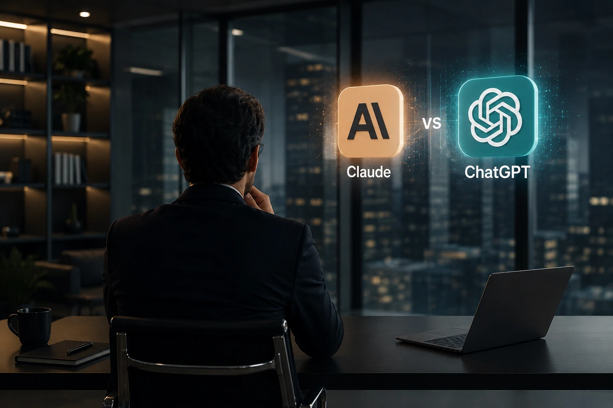
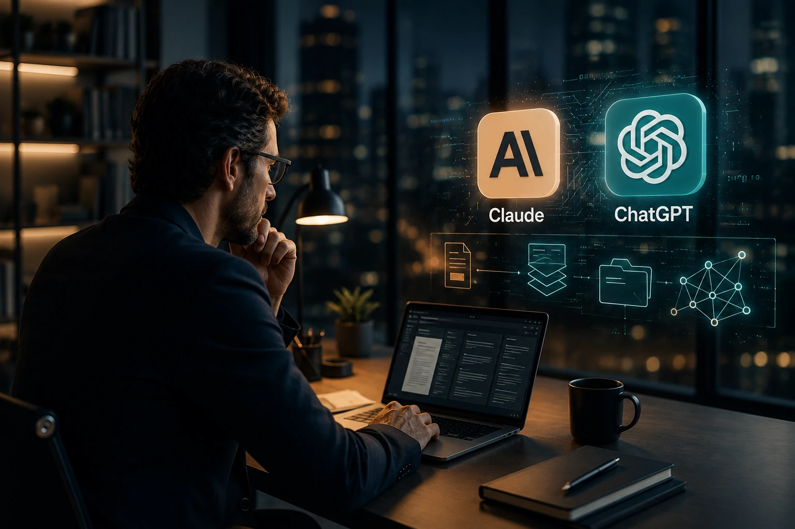

*Durante anos, a disputa entre plataformas de inteligência artificial foi tratada como uma comparação de qualidade de respostas. Em 2026, essa abordagem já não faz sentido para a maioria das empresas. A pergunta estratégica mudou. Em vez de buscar qual IA escreve melhor, gestores querem descobrir qual plataforma gera mais produtividade, reduz mais custos operacionais e cria vantagem competitiva sustentável.*

*Nesse cenário, **Claude**, da **Anthropic**, e **ChatGPT**, da **OpenAI**, se tornaram os dois principais candidatos a ocupar o papel de interface corporativa da nova economia baseada em agentes inteligentes.*

## Claude e ChatGPT já deixaram de ser chatbots e passaram a funcionar como plataformas empresariais

*As plataformas de IA estão evoluindo para se tornar sistemas operacionais corporativos baseados em conhecimento.*

A principal mudança observada em 2026 é que tanto **Claude** quanto **ChatGPT** deixaram de atuar apenas como assistentes conversacionais.

Hoje, as duas plataformas são utilizadas para automatizar processos, estruturar conhecimento interno, apoiar decisões, acelerar desenvolvimento de software e alimentar agentes autônomos capazes de executar tarefas empresariais complexas.

### O que mudou no mercado corporativo?

Empresas não estão comprando apenas uma IA.

Elas estão escolhendo qual infraestrutura cognitiva servirá de base para suas operações digitais nos próximos anos.

Essa tendência aparece em movimentos observados em todo o mercado, incluindo o crescimento dos chamados agentes corporativos de IA e dos sistemas de memória organizacional.

Para entender essa transformação, vale conferir também como o conceito de memória empresarial está evoluindo em [Memória corporativa com IA: por que empresas estão transformando conhecimento interno em vantagem competitiva](https://noticiatech.com.br/negocios/mem%C3%B3ria-corporativa-com-ia-por-que-empresas-est%C3%A3o-transformando-conhecimento-interno-em-vantagem-competitiva/).

### O papel da IA na produtividade empresarial

A adoção de IA deixou de ser um projeto experimental.

Cada vez mais organizações utilizam modelos generativos para:

- atendimento ao cliente;
- produção de conteúdo;
- análise de documentos;
- suporte comercial;
- desenvolvimento de software;
- automação operacional;
- pesquisa corporativa.

Nesse contexto, escolher a plataforma errada pode gerar custos ocultos, retrabalho e limitações futuras.

## Claude costuma se destacar em análise profunda de contexto e documentação corporativa

*O Claude ganhou espaço entre organizações que trabalham com grandes volumes de conhecimento e documentação.*

A proposta da **Anthropic** é posicionar o **Claude** como uma IA altamente confiável para ambientes empresariais.

O modelo se tornou conhecido pela capacidade de lidar com contextos extensos e interpretar grandes conjuntos de documentos com elevada consistência.

### Onde o Claude costuma entregar mais valor?

Empresas frequentemente utilizam o Claude para:

- análise contratual;
- compliance;
- documentação técnica;
- pesquisa estratégica;
- auditorias internas;
- bases de conhecimento corporativas.

Em ambientes onde a qualidade da interpretação documental é crítica, o Claude costuma ser considerado uma opção bastante competitiva.

### O que muda para empresas orientadas por conhecimento?

Organizações que dependem de documentação complexa geralmente enfrentam desafios relacionados à recuperação de informações.

Nesses cenários, o Claude pode funcionar como uma camada inteligente sobre o conhecimento corporativo existente.

Esse movimento está diretamente conectado à expansão dos chamados knowledge graphs corporativos, tema abordado em [AI Knowledge Graphs: por que empresas começam a transformar dados internos em vantagem competitiva para agentes de IA](https://noticiatech.com.br/negocios/ai-knowledge-graphs-por-que-empresas-come%C3%A7am-a-transformar-dados-internos-em-vantagem-competitiva-para-agentes-de-ia/).

## ChatGPT possui vantagem quando o objetivo é automação, integração e agentes de IA

*O ecossistema da OpenAI avança rapidamente como plataforma para construção de fluxos inteligentes e agentes corporativos.*

Quando o foco está em automação empresarial, o **ChatGPT** geralmente apresenta uma proposta mais abrangente.

A estratégia da **OpenAI** não se limita ao modelo de linguagem.

A empresa vem construindo um ecossistema completo que inclui APIs, agentes, conectores, GPTs personalizados e integração com ferramentas corporativas.

### Por que o ChatGPT ganhou espaço nas empresas?

A principal razão é a capacidade de integrar diferentes sistemas.

Empresas conseguem conectar o modelo a:

- CRMs;
- ERPs;
- plataformas de atendimento;
- bancos de dados;
- sistemas internos;
- ferramentas de produtividade.

Essa integração cria condições para o surgimento dos chamados agentes corporativos.

O tema já vem sendo discutido em profundidade no artigo [A era dos agentes de IA já começou: como Microsoft, OpenAI e Google estão transformando empresas em sistemas autônomos](https://noticiatech.com.br/inteligencia-artificial/a-era-dos-agentes-de-ia-j%C3%A1-come%C3%A7ou-como-microsoft-openai-e-google-est%C3%A3o-transformando-empresas-em-sistemas-aut%C3%B4nomos/).

### O que muda para pequenas e médias empresas?

Para empresas menores, o ChatGPT costuma apresentar uma curva de adoção mais rápida.

A combinação entre GPTs personalizados, automações e integrações reduz a necessidade de equipes técnicas especializadas.

Isso permite implementar projetos de IA em semanas, não em meses.

## Segurança, governança e escalabilidade são os fatores que realmente definem a escolha

A escolha entre **Claude** e **ChatGPT** raramente deve ser feita apenas pela qualidade das respostas.

Em ambientes corporativos, fatores estruturais costumam ter mais peso.

### Governança corporativa

Empresas precisam controlar:

- acesso aos dados;
- uso interno da IA;
- conformidade regulatória;
- rastreabilidade;
- auditoria de processos.

Governança deixou de ser um diferencial e passou a ser uma exigência operacional.

Essa preocupação aparece cada vez mais em iniciativas de [Governança de IA como prioridade para empresas](https://noticiatech.com.br/inteligencia-artificial/governanca-ia-prioridade-empresas/).

### Escalabilidade e crescimento futuro

Uma escolha feita hoje pode impactar os próximos cinco anos.

A empresa deve avaliar:

- capacidade de integração;
- expansão de usuários;
- criação de agentes;
- automação de fluxos;
- custos de longo prazo;
- dependência tecnológica.

Nesse aspecto, muitas organizações já começam a tratar plataformas de IA como parte da infraestrutura crítica do negócio.

### Comparativo executivo

**Claude pode fazer mais sentido quando a prioridade é:**

- análise documental;
- pesquisa estratégica;
- compliance;
- interpretação de contexto complexo;
- gestão de conhecimento.

**ChatGPT pode fazer mais sentido quando a prioridade é:**

- automação;
- agentes de IA;
- integrações;
- produtividade operacional;
- criação de fluxos inteligentes.

## O verdadeiro vencedor depende do estágio de maturidade da empresa em IA

A pergunta "Claude ou ChatGPT?" costuma parecer simples.

Na prática, ela revela uma questão mais estratégica: qual papel a inteligência artificial terá dentro da organização.

Empresas que ainda estão iniciando sua jornada normalmente buscam ganhos rápidos de produtividade, cenário em que o ecossistema do **ChatGPT** frequentemente apresenta vantagens operacionais.

Já organizações que dependem intensamente de conhecimento estruturado, documentação técnica e análise profunda de contexto podem encontrar no **Claude** uma proposta mais alinhada às suas necessidades.

O ponto mais importante é que a disputa deixou de acontecer apenas entre modelos de linguagem.

A competição agora ocorre entre plataformas capazes de se tornar a camada cognitiva central das empresas.

E, à medida que agentes autônomos, automação avançada e sistemas de memória corporativa ganham espaço, a decisão sobre qual IA adotar tende a se transformar em uma das escolhas tecnológicas mais relevantes desta década.

---