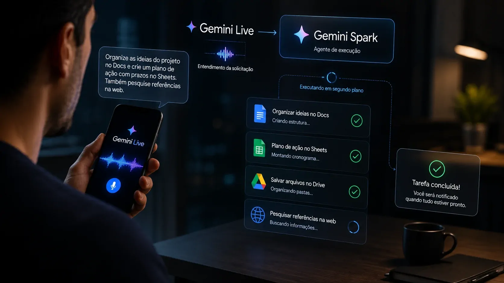
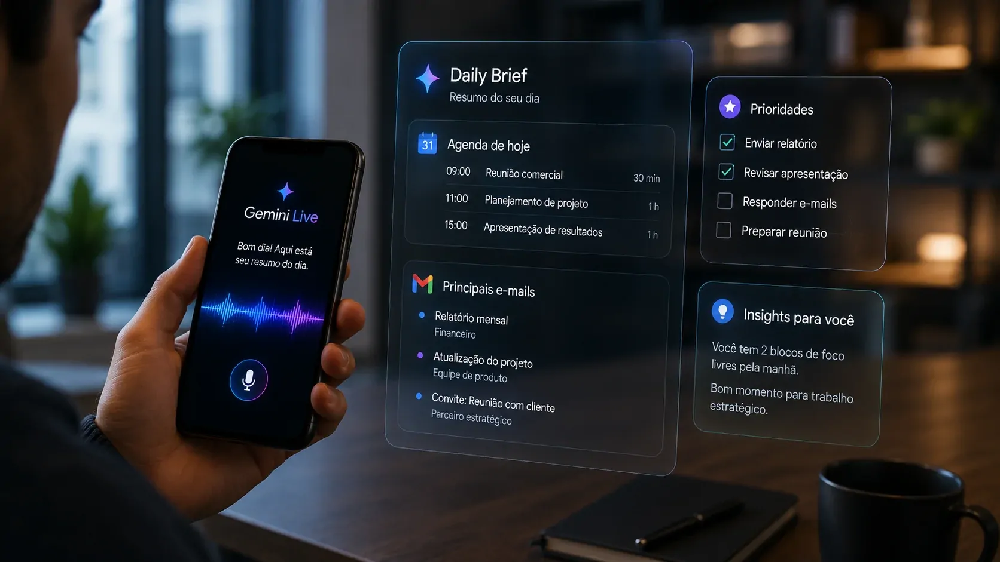
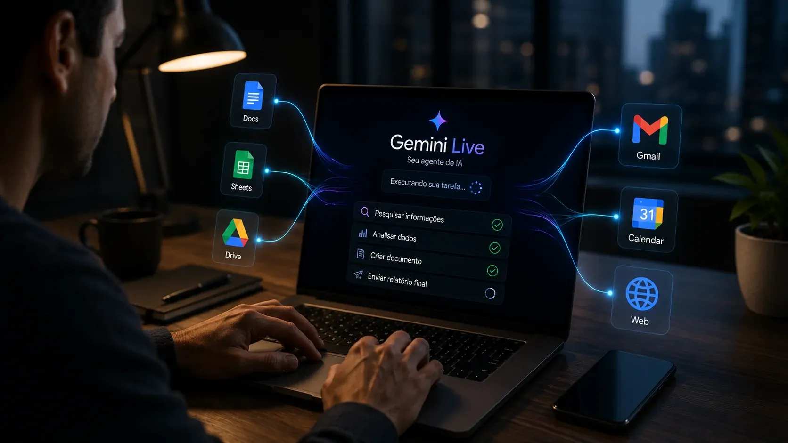

*O Google está transformando o Gemini Live de uma interface de conversa em uma porta de entrada para tarefas executadas pela IA. A integração com o Gemini Spark permite que comandos de voz iniciem trabalhos de várias etapas que continuam em segundo plano, aproximando o assistente de uma camada de automação pessoal.*

## O Gemini Live deixou de apenas responder

O **Google** anunciou em 26 de agosto uma atualização que amplia significativamente o papel do **Gemini Live**. A experiência de voz do Gemini agora pode interpretar uma solicitação e encaminhar tarefas complexas para o **Gemini Spark**, agente de IA do Google.

A mudança é importante porque altera o resultado esperado de uma conversa. Em vez de apenas receber uma resposta, o usuário pode descrever um objetivo e deixar que o sistema execute as etapas necessárias.

O Spark consegue trabalhar com **Google Docs, Sheets, Drive e a web**, inclusive em tarefas que podem se estender por dias ou semanas. A proposta aproxima o Gemini de um modelo em que a IA recebe uma intenção e continua trabalhando depois que a conversa termina.

### Da conversa para a execução

O conceito de **agente de IA** é central nessa mudança. Diferentemente de um chatbot convencional, um agente pode receber um objetivo, dividir o trabalho em etapas e utilizar ferramentas para chegar ao resultado.

No caso do Gemini Live, a voz passa a funcionar como o ponto de entrada para esse processo. O usuário não precisa necessariamente abrir o Spark ou descobrir qual recurso do Gemini deve utilizar.

### O papel do Gemini Spark

O **Gemini Spark** já havia sido apresentado pelo Google como um agente pessoal capaz de trabalhar em segundo plano. A novidade está em conectá-lo diretamente à experiência de voz do Live.

Na prática, isso cria uma camada mais simples entre intenção e execução: o usuário fala o que precisa, e o Gemini decide quando uma tarefa deve ser encaminhada ao agente.

## Voz passa a comandar tarefas em segundo plano

*O Gemini Live pode transformar uma solicitação falada em uma tarefa de várias etapas executada pelo Spark.*

Um dos exemplos apresentados pelo **Google** mostra o usuário falando sobre ideias ainda desorganizadas. O Spark pode organizar esse conteúdo e transformá-lo em uma estrutura no **Google Docs**, sem exigir que a pessoa pare a conversa para montar manualmente o documento.

Outro exemplo envolve planejamento de refeições. A partir de informações já disponíveis em documentos, o sistema pode organizar um plano semanal e criar uma lista de compras.

O ponto mais relevante não está em nenhuma dessas tarefas isoladamente. O avanço está na possibilidade de delegar um processo inteiro, em vez de pedir à IA uma ação individual a cada etapa.

### O que muda para quem trabalha com informação

Para profissionais que lidam diariamente com documentos, pesquisas, planejamento e organização, essa arquitetura pode reduzir a quantidade de operações manuais entre uma ideia e sua execução.

O usuário pode começar com uma instrução informal e deixar que o agente organize as etapas. Isso é diferente de simplesmente usar IA para gerar um texto ou responder a uma pergunta.

### A automação acontece depois da conversa

A capacidade de continuar trabalhando em segundo plano é especialmente relevante. O usuário não precisa permanecer diante do aplicativo enquanto uma tarefa de maior duração é processada.

Essa característica coloca o **Gemini Spark** mais próximo de ferramentas de automação do que de um assistente tradicional. A diferença passa a ser menos sobre geração de conteúdo e mais sobre execução contínua de objetivos.

## Gmail por voz reduz a distância entre pedir e agir

A atualização também amplia a integração do **Gemini Live com o Gmail**. O usuário pode perguntar sobre novas mensagens, procurar conteúdos específicos e pedir resumos sem precisar navegar manualmente pela caixa de entrada.

Também é possível realizar ações como marcar, arquivar e excluir mensagens usando comandos de voz. O recurso transforma o Gmail em mais uma superfície que pode ser operada por linguagem natural.

Isso pode ser particularmente útil em situações nas quais olhar para a tela não é conveniente. Mas, para empresas, a mudança também reforça uma questão importante: quanto mais autonomia uma IA recebe sobre sistemas de trabalho, maior passa a ser a importância de permissões e controle.

O Google exige que os aplicativos sejam conectados nas configurações de **Personal Intelligence** para que essas experiências funcionem. A disponibilidade também varia conforme o recurso e o plano de assinatura.

### A caixa de entrada vira uma fonte de contexto

A integração não trata o Gmail apenas como um lugar para executar comandos. As mensagens também passam a alimentar o contexto usado pelo Gemini para compreender o que está acontecendo no dia do usuário.

Isso aproxima o assistente de uma função de coordenação. Em vez de responder apenas "qual é a mensagem mais recente?", a IA pode ajudar a identificar informações relevantes dentro do fluxo de trabalho.

## Daily Brief transforma o Gemini em assistente de rotina

*O Daily Brief usa informações conectadas para apresentar uma visão resumida da agenda e das prioridades do usuário.*

Outro componente importante é o **Daily Brief**, que pode ser acessado por voz no Gemini Live. Ao perguntar o que há para o dia, o sistema combina informações relevantes do **Gmail** e do **Google Calendar** em um resumo falado.

A diferença em relação a um simples resumo é a intenção de priorização. O recurso tenta apresentar ao usuário aquilo que merece atenção, reduzindo a necessidade de abrir diferentes aplicativos para reconstruir a agenda.

A **Personal Intelligence** amplia esse contexto ao permitir que o Gemini utilize informações de conversas anteriores e aplicativos conectados para responder de maneira mais personalizada.

### O contexto passa a ser parte do produto

Esse movimento é estratégico porque agentes de IA dependem menos de uma única resposta e mais de contexto suficiente para tomar ações úteis.

Quando uma IA conhece documentos, mensagens, calendário e histórico de conversas, ela pode conectar informações que antes estavam separadas entre diferentes aplicativos.

É justamente essa integração que pode transformar o Gemini em uma camada de automação pessoal. O valor não está apenas no modelo de IA, mas no acesso coordenado às ferramentas onde o trabalho acontece.

### A disputa muda de lugar

A evolução também ajuda a explicar por que a disputa entre **Google, OpenAI e Anthropic** está avançando para agentes capazes de executar tarefas.

O mercado começa a sair da comparação baseada apenas em quem produz a melhor resposta. A capacidade de utilizar ferramentas, manter contexto e concluir tarefas passa a ser igualmente importante.

O movimento também se conecta ao que o **Notícia Tech** já acompanha sobre a transformação de assistentes de IA em sistemas capazes de executar trabalho, como no caso da **[nova camada de administração empresarial lançada pela OpenAI para o ChatGPT](https://noticiatech.com.br/inteligencia-artificial/openai-lanca-plugin-admin-administrar-empresas-chatgpt/)**.

## O que o avanço do Gemini muda para empresas

*O avanço do Gemini Live aproxima assistentes de IA de uma camada capaz de coordenar diferentes ferramentas de trabalho.*

Para empresas, a mudança merece atenção porque o modelo de interação começa a se aproximar de uma automação baseada em intenção. Em vez de configurar cada etapa de um fluxo, o usuário pode descrever o resultado desejado e delegar parte da execução.

Isso não significa que qualquer processo corporativo possa ser entregue integralmente ao Gemini. Tarefas envolvendo dados sensíveis, decisões críticas ou ações irreversíveis continuam exigindo controles, permissões e supervisão.

Mas a direção estratégica é clara: **IA generativa** está deixando de ocupar apenas o espaço de criação e consulta e avançando para a coordenação de ferramentas.

Esse movimento reforça uma tendência que também aparece em outras plataformas. O avanço de agentes especializados, como o apresentado pela Mistral para pesquisas e documentos complexos, mostra que o mercado está tentando transformar modelos de IA em sistemas capazes de executar processos mais longos. O **[movimento da Mistral em direção ao agentic search](https://noticiatech.com.br/inteligencia-artificial/mistral-agentic-search-documentos-complexos-ia/)** ajuda a contextualizar essa mudança.

### Produtividade deixa de ser apenas geração

A principal consequência é uma mudança na definição de produtividade com IA. Até pouco tempo, o ganho estava principalmente em escrever mais rápido, resumir documentos ou encontrar informações.

Agora, a promessa é eliminar partes inteiras do processo operacional. A IA pode receber a tarefa, consultar ferramentas, organizar informações e executar etapas sem exigir uma nova instrução a cada momento.

### O desafio passa a ser governança

Quanto maior a autonomia, maior a necessidade de governança. Empresas precisarão definir quais sistemas podem ser acessados por agentes, quais ações exigem confirmação e como registrar o que foi executado.

Esse ponto será decisivo para a adoção corporativa. A capacidade técnica de executar uma tarefa é apenas uma parte do problema. A outra é garantir que a execução ocorra dentro das permissões e regras estabelecidas pela organização.

O próprio avanço de agentes torna essa discussão mais urgente, especialmente em ambientes onde e-mail, documentos e sistemas internos concentram informações importantes.

O **Gemini Live** ainda é apresentado pelo Google como uma experiência de voz, mas a atualização muda o que essa interface pode representar. Quando uma conversa consegue acionar um agente, acessar aplicativos e iniciar um trabalho que continua em segundo plano, o assistente deixa de ser apenas uma ferramenta de respostas.

A questão estratégica passa a ser quem conseguirá transformar essa combinação de **voz, contexto, ferramentas e agentes** em uma experiência confiável o bastante para entrar na rotina de trabalho. O Google deu mais um passo nessa direção, e a resposta de seus concorrentes deve ajudar a definir a próxima fase da disputa por assistentes de IA.

---