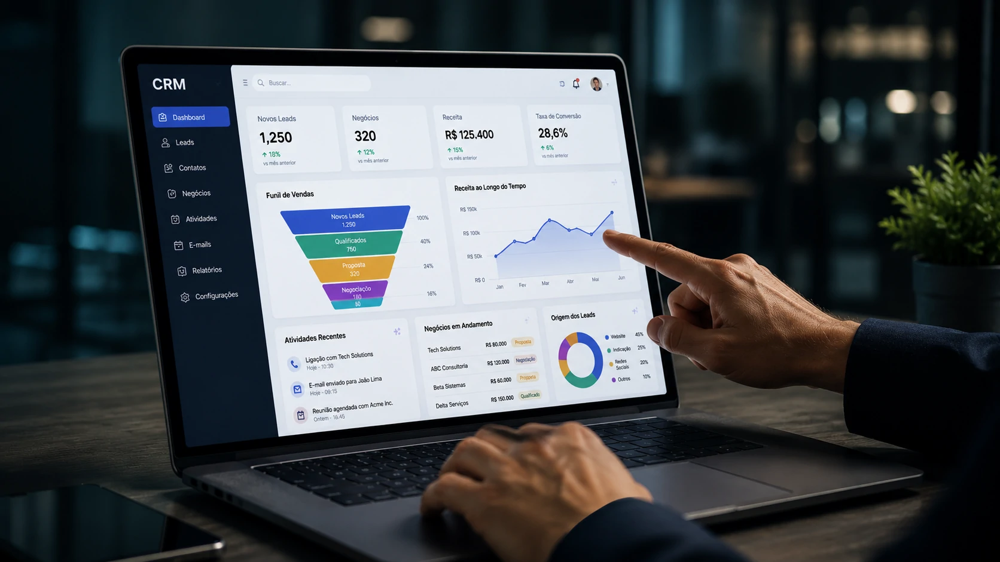
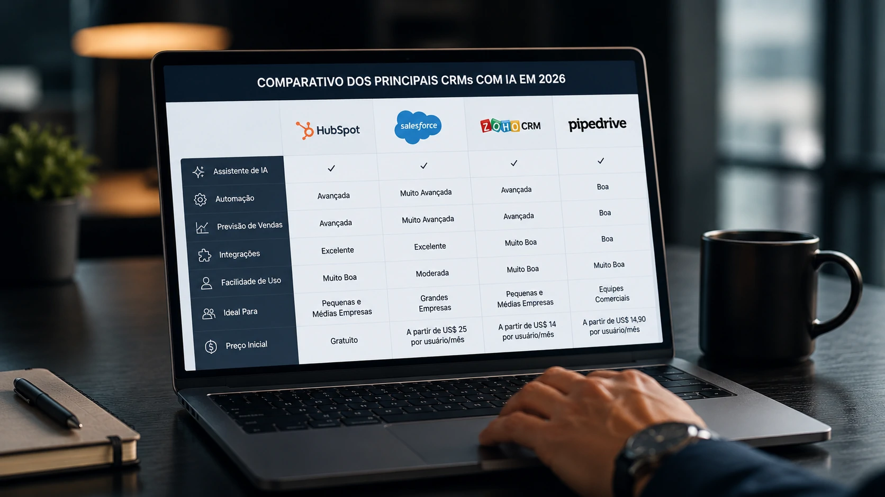
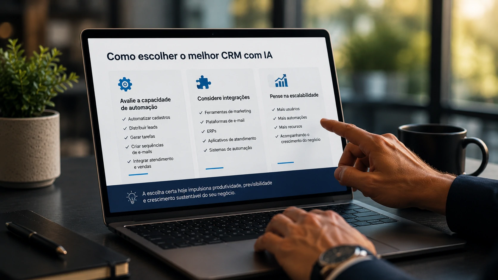

*O uso de **CRM com IA** deixou de ser uma tendência para se tornar uma estratégia competitiva. Empresas de todos os portes estão adotando plataformas que utilizam inteligência artificial para automatizar tarefas, melhorar previsões de vendas e oferecer experiências mais personalizadas aos clientes. Em um mercado cada vez mais orientado por dados, escolher a ferramenta certa pode representar uma vantagem significativa.*

## Como um CRM com IA pode transformar a gestão comercial

Empresas utilizam **CRM com inteligência artificial** para centralizar informações de clientes, automatizar processos comerciais e transformar dados em decisões mais rápidas.

*Ferramentas modernas utilizam inteligência artificial para automatizar vendas, atendimento e relacionamento com clientes.*

Ao contrário dos sistemas tradicionais, um **CRM com IA** aprende continuamente a partir do histórico de vendas, interações e comportamento dos clientes. Isso permite identificar oportunidades antes mesmo que um vendedor perceba sinais de compra.

### Muito além do armazenamento de contatos

Os CRMs modernos deixaram de ser simples bancos de dados.

Hoje eles conseguem:

- resumir reuniões automaticamente;
- sugerir respostas para e-mails;
- identificar clientes com maior chance de compra;
- prever receitas futuras;
- recomendar próximas ações comerciais.

Essa evolução acompanha uma tendência maior de produtividade assistida por IA, tema relacionado ao conceito de **AI Fluency**, já explorado pelo Notícia Tech.

### Benefícios para empresas

Entre os principais ganhos estão:

- redução de tarefas repetitivas;
- melhoria da produtividade da equipe;
- maior previsibilidade comercial;
- melhor acompanhamento do funil de vendas;
- atendimento mais personalizado.

## Comparativo dos principais CRMs com IA em 2026

Os melhores CRMs utilizam inteligência artificial para resolver problemas diferentes. A escolha depende do tamanho da empresa, orçamento e nível de maturidade digital.

*Cada plataforma possui pontos fortes diferentes conforme o perfil da empresa.*

### HubSpot

O **HubSpot CRM** continua sendo uma das referências do mercado.

Destaques:

- assistente de IA;
- geração de e-mails;
- criação de conteúdos;
- automações avançadas;
- excelente integração com marketing.

É indicado para empresas que desejam crescer utilizando uma plataforma única.

### Salesforce

O **Salesforce** permanece como referência entre grandes empresas.

Seu ecossistema oferece:

- IA preditiva;
- automações complexas;
- análises avançadas;
- grande capacidade de personalização.

Em contrapartida, exige maior investimento e implantação mais estruturada.

### Zoho CRM

O **Zoho CRM** aposta em excelente relação custo-benefício.

Seus recursos incluem:

- assistente de IA;
- previsão de vendas;
- automações;
- análise inteligente de desempenho.

É uma alternativa bastante competitiva para pequenas e médias empresas.

### Pipedrive

O **Pipedrive** mantém foco em simplicidade e produtividade.

Seu diferencial está na facilidade de uso, sendo indicado para equipes comerciais que desejam implementar rapidamente um CRM moderno sem grande curva de aprendizado.

## Como escolher o melhor CRM com IA para sua empresa

A escolha do **CRM com IA** ideal depende dos objetivos do negócio, do volume de clientes e da maturidade dos processos comerciais. Antes de comparar preços, é importante avaliar como a plataforma se encaixa na operação da empresa.

*Uma boa escolha considera estratégia, integração e potencial de crescimento do negócio.*

### Avalie a capacidade de automação

Um dos principais diferenciais dos CRMs modernos é a automação.

Verifique se a plataforma consegue:

- automatizar cadastros;
- distribuir leads automaticamente;
- gerar tarefas para vendedores;
- criar sequências de e-mails;
- integrar atendimento e vendas.

Quanto menos atividades manuais existirem, maior tende a ser o retorno sobre o investimento.

### Considere integrações

Um CRM dificilmente trabalha sozinho.

As melhores soluções integram-se com:

- ferramentas de marketing;
- plataformas de e-mail;
- ERPs;
- aplicativos de atendimento;
- sistemas de automação.

Essa integração reduz retrabalho e melhora a qualidade dos dados utilizados pela inteligência artificial.

### Pense na escalabilidade

Uma empresa pequena pode crescer rapidamente.

Por isso, vale escolher uma plataforma que permita ampliar usuários, automações e recursos sem necessidade de trocar todo o sistema após poucos anos.

## O futuro dos CRMs com IA será baseado em agentes inteligentes

A próxima geração de **CRMs com IA** tende a deixar de apenas sugerir ações para começar a executá-las de forma autônoma.

Agentes inteligentes serão capazes de acompanhar negociações, responder clientes, preparar propostas, atualizar registros e até identificar riscos de perda de oportunidades antes que eles ocorram.

Essa evolução acompanha a expansão dos **Agentes de IA**, tema já abordado pelo Notícia Tech em conteúdos como:

- https://noticiatech.com.br/automacao/o-que-e-ai-sdr-agentes-ia-vendas-b2b/
- https://noticiatech.com.br/automacao/o-que-e-ai-process-automation-automacao-processos-inteligencia-artificial/

Na prática, o CRM deixa de ser apenas uma ferramenta de registro e passa a atuar como um assistente inteligente para toda a equipe comercial.

Empresas que começarem essa transformação mais cedo tendem a acumular vantagem competitiva, especialmente em mercados onde velocidade de atendimento, personalização e análise de dados fazem diferença direta nos resultados.

Em 2026, a principal pergunta já não é mais se vale utilizar um **CRM com IA**, mas sim qual plataforma oferece o melhor equilíbrio entre automação, inteligência, integrações e potencial de crescimento para acompanhar a evolução do negócio.

---