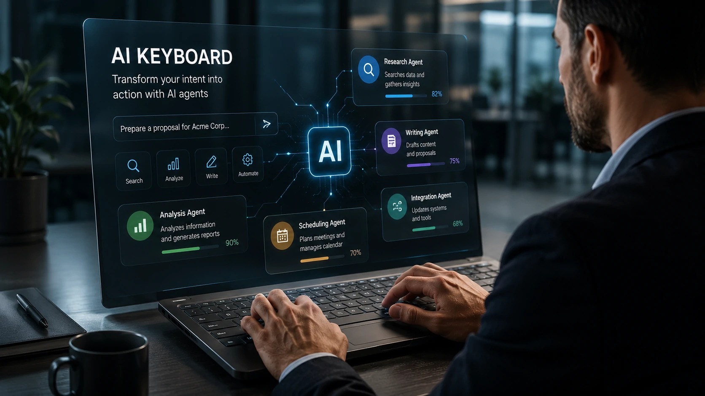
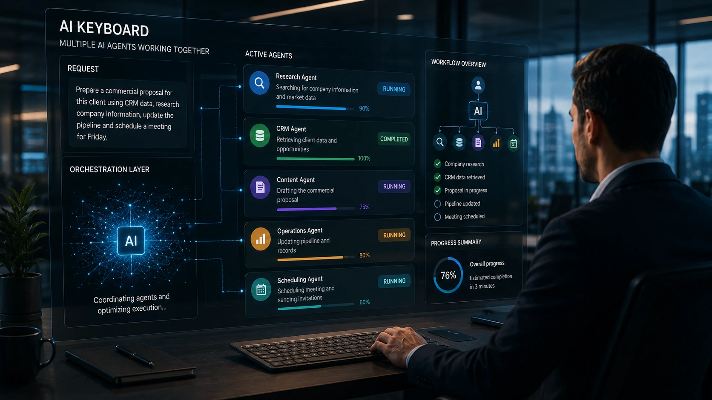
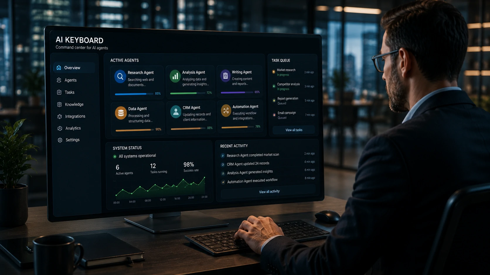

*Os agentes de inteligência artificial evoluem rapidamente, mas a forma como interagimos com eles ainda lembra a era dos chatbots tradicionais. A iniciativa da **OpenAI** de desenvolver um **AI Keyboard** sinaliza uma mudança importante: a interface pode deixar de ser apenas um campo de texto para se tornar um centro de comando capaz de coordenar agentes inteligentes durante toda a jornada de trabalho.*

## O que é AI Keyboard e por que essa interface é diferente

*Interface projetada para transformar comandos em fluxos completos executados por agentes de inteligência artificial.*

Durante anos, a principal forma de conversar com uma inteligência artificial foi digitando perguntas em um campo semelhante ao de um aplicativo de mensagens.

Com a evolução dos **agentes de IA**, esse modelo começa a mostrar limitações. Executar tarefas longas, acompanhar processos e coordenar diferentes ações exige uma interface muito mais sofisticada.

É exatamente nesse contexto que surge o conceito de **AI Keyboard**.

### Uma interface construída para agentes

Em vez de apenas enviar perguntas para um modelo de linguagem, o **AI Keyboard** interpreta intenções, organiza comandos e distribui atividades para diferentes agentes especializados.

Na prática, o usuário deixa de conversar apenas com um chatbot e passa a administrar um conjunto de inteligências capazes de executar trabalhos completos.

### Muito além do autocomplete

Os teclados inteligentes atuais já oferecem sugestões de palavras, correção automática e geração de texto.

O conceito apresentado pela **OpenAI** amplia essa ideia ao transformar o teclado em uma camada operacional capaz de iniciar fluxos de trabalho, resumir informações, pesquisar documentos, gerar respostas e acompanhar tarefas em andamento.

Essa visão complementa a estratégia apresentada no artigo sobre o **ChatGPT Work**, que mostra como agentes podem executar atividades durante horas sem intervenção constante do usuário.

Veja também:

- Para entender como essa evolução se conecta ao mercado corporativo, veja também o artigo 
**[Por que o ChatGPT Work marca o início da era dos agentes de IA para produtividade corporativa](/inteligencia-artificial/chatgpt-work-era-agentes-ia-produtividade-corporativa/)**.

## Por que os agentes de IA precisam de uma nova interface

Os modelos de linguagem evoluíram rapidamente, mas a experiência do usuário permaneceu praticamente igual.

Hoje ainda digitamos comandos como fazíamos há alguns anos.

Isso cria um gargalo para aplicações corporativas mais complexas.

### O desafio da coordenação

Quando uma empresa utiliza vários agentes especializados, cada um pode assumir funções diferentes.

Um agente pesquisa.

Outro escreve.

Outro analisa documentos.

Outro envia informações para sistemas internos.

Gerenciar tudo isso por uma simples conversa torna-se cada vez menos eficiente.

### O teclado passa a ser um centro de comando

Em vez de representar apenas um dispositivo de entrada de texto, o **AI Keyboard** pode atuar como uma camada responsável por organizar prioridades, acompanhar tarefas e distribuir solicitações automaticamente.

Essa tendência conversa diretamente com a evolução descrita pelo **Notícia Tech** sobre como **agentes de IA** estão transformando a automação empresarial.

Leia também:

- Esse movimento também complementa a análise publicada pelo **Notícia Tech** em 
**[Como os agentes de IA estão transformando a automação de processos nas empresas além do ChatGPT Work](/automacao/agentes-ia-transformando-automacao-processos-empresas-alem-chatgpt-work/)**.

## Como o AI Keyboard pode mudar a produtividade nas empresas

*O AI Keyboard pode se tornar a principal interface para controlar vários agentes de IA simultaneamente dentro das empresas.*

À medida que os **agentes de IA** deixam de apenas responder perguntas e passam a executar processos completos, a forma de interação também precisa evoluir.

Um profissional de vendas, por exemplo, pode solicitar uma única ação ao **AI Keyboard** e, nos bastidores, diversos agentes trabalham em conjunto para concluir a tarefa.

### Fluxos empresariais mais inteligentes

Imagine um gestor digitando:

> "Prepare uma proposta comercial para este cliente utilizando os dados do CRM, pesquise informações públicas da empresa, atualize o pipeline e agende uma reunião para sexta-feira."

Em vez de responder apenas com um texto, diferentes agentes podem:

- consultar o **CRM**;
- pesquisar informações externas;
- elaborar a proposta;
- atualizar o sistema comercial;
- enviar convites automaticamente.

O usuário continua enxergando apenas uma interface simples, enquanto dezenas de processos acontecem em segundo plano.

### Menos comandos, mais resultados

Essa mudança reduz a necessidade de alternar entre múltiplos aplicativos.

Em vez de abrir diferentes ferramentas, o profissional trabalha diretamente a partir de uma única interface inteligente.

Essa tendência também complementa o avanço de soluções de automação já abordadas pelo **Notícia Tech**, como:

- Se o foco da empresa for automação comercial, vale continuar a leitura em 
**[O que é AI SDR e como construir um sistema de geração de leads B2B com agentes de IA](/automacao/o-que-e-ai-sdr-geracao-leads-b2b-agentes-ia/)**.

Além disso, empresas que já utilizam plataformas de automação poderão integrar o **AI Keyboard** aos seus fluxos existentes, acelerando operações sem alterar completamente sua infraestrutura tecnológica.

## O futuro das interfaces inteligentes vai além dos chatbots

*A próxima geração de interfaces inteligentes deverá coordenar agentes especializados em vez de apenas responder perguntas.*

A notícia envolvendo o **AI Keyboard** mostra que a corrida pela inteligência artificial não acontece apenas entre modelos como **ChatGPT**, **Gemini** e **Claude**.

A competição também passa pela criação da melhor interface para conectar pessoas e agentes inteligentes.

### O teclado deixa de ser apenas um teclado

Historicamente, teclados evoluíram pouco.

Mudaram materiais, ergonomia e recursos de correção automática.

Agora, podem assumir um novo papel como camada operacional responsável por interpretar objetivos, organizar tarefas e coordenar agentes especializados.

Essa mudança aproxima a interação com IA da forma como profissionais realmente trabalham: realizando projetos completos e não apenas perguntas isoladas.

### Um novo capítulo para a computação corporativa

Ainda é cedo para afirmar como essa tecnologia será implementada comercialmente, mas a direção parece clara.

À medida que **OpenAI**, **Google**, **Microsoft**, **Anthropic** e outras empresas investem em agentes capazes de executar tarefas complexas, interfaces como o **AI Keyboard** tendem a ganhar importância estratégica.

Para empresas, isso significa menos tempo gasto alternando entre aplicações e mais foco na definição de objetivos, deixando a execução para agentes especializados.

Nos próximos anos, provavelmente deixaremos de medir a eficiência de uma inteligência artificial apenas pela qualidade das respostas. O diferencial competitivo estará na capacidade de transformar uma simples instrução em um fluxo completo de trabalho, executado de forma autônoma, segura e integrada aos processos do negócio.

---