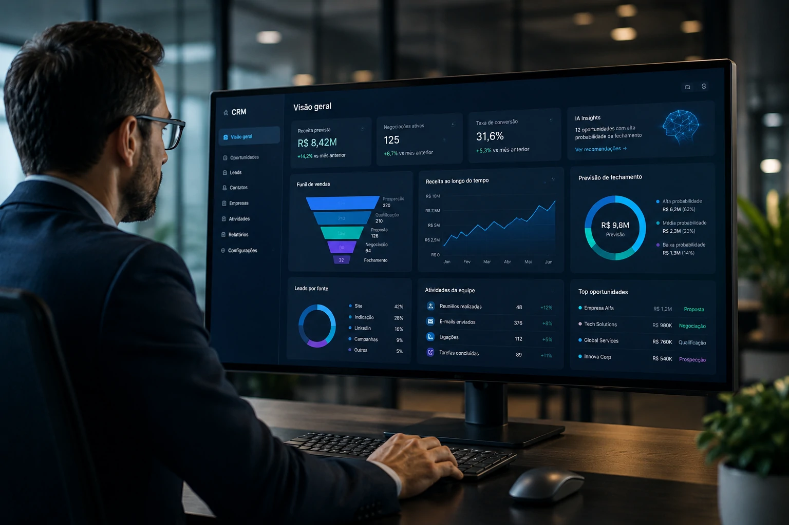
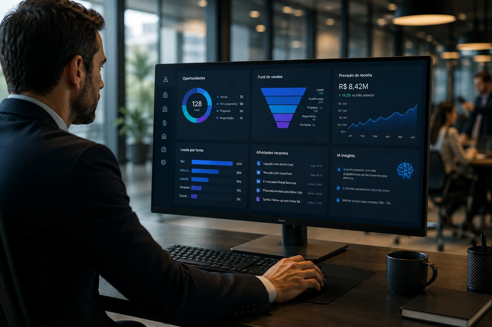
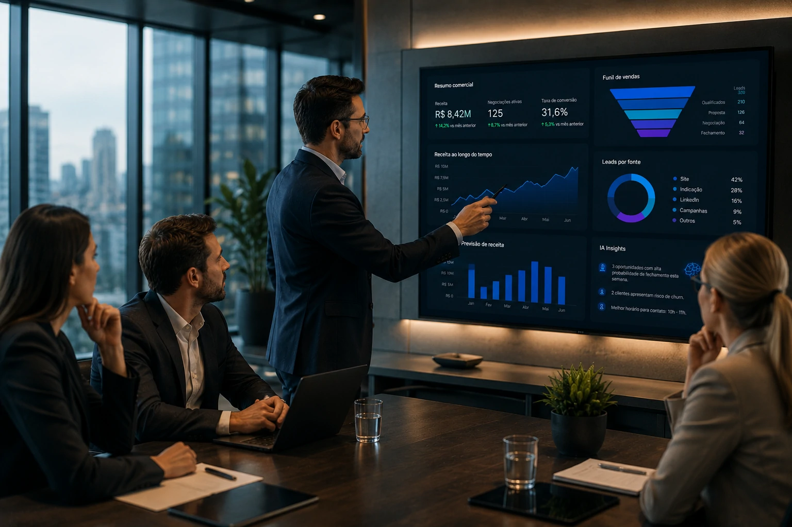

*À medida que a inteligência artificial avança dentro das operações corporativas, o CRM deixa de ser apenas um banco de dados de clientes para se tornar uma plataforma de apoio à decisão. Empresas que adotam recursos inteligentes começam a prever oportunidades, automatizar atividades repetitivas e aumentar a eficiência das equipes comerciais.*

## O que é CRM com IA?

*Os sistemas modernos de CRM utilizam algoritmos para identificar padrões, prever resultados e sugerir ações para equipes de vendas.*

Um **CRM com IA** é uma plataforma de gestão de relacionamento com clientes que incorpora recursos de **Inteligência Artificial** para analisar dados, automatizar processos e apoiar decisões comerciais.

Enquanto um CRM tradicional registra informações sobre clientes, oportunidades e negociações, um CRM inteligente interpreta esses dados e gera recomendações acionáveis.

### Como a inteligência artificial atua dentro do CRM

Os algoritmos conseguem identificar padrões em grandes volumes de dados comerciais.

Isso permite prever quais leads possuem maior probabilidade de conversão, quais clientes apresentam risco de cancelamento e quais oportunidades merecem prioridade.

### Diferença entre CRM tradicional e CRM com IA

No modelo tradicional, a equipe comercial depende da análise manual das informações.

No modelo baseado em IA, o sistema ajuda a identificar tendências, automatizar tarefas e sugerir próximos passos para acelerar o fechamento de negócios.

## Como funciona um CRM com IA na prática

*Automação, análise preditiva e recomendação de ações estão entre os principais recursos dos CRMs inteligentes.*

O funcionamento de um **CRM com IA** depende da coleta contínua de dados provenientes de contatos, reuniões, e-mails, históricos de vendas e interações com clientes.

A partir dessas informações, modelos de aprendizado de máquina identificam comportamentos recorrentes e padrões de compra.

### Lead Scoring Inteligente

Um dos recursos mais populares é o lead scoring automatizado.

A IA atribui pontuações aos contatos de acordo com critérios como interesse, histórico de navegação, perfil da empresa e comportamento de compra.

Com isso, vendedores concentram esforços nas oportunidades com maior potencial de conversão.

### Previsão de vendas

Outra aplicação relevante é a previsão de receita.

O sistema analisa negociações em andamento, taxas históricas de conversão e comportamento do pipeline para estimar resultados futuros com maior precisão.

## Benefícios do CRM com IA para empresas

*A combinação entre CRM e IA aumenta produtividade e melhora a tomada de decisão.*

A adoção de **CRM com IA** gera ganhos que vão além da automação operacional.

Empresas passam a tomar decisões mais rápidas e baseadas em dados.

### Aumento da produtividade comercial

Atividades repetitivas como atualização de registros, envio de lembretes e classificação de contatos podem ser automatizadas.

Isso libera tempo para que vendedores foquem em negociações e relacionamento com clientes.

### Melhor qualidade das previsões

Ao analisar milhares de variáveis simultaneamente, a IA reduz erros de estimativa e oferece maior visibilidade sobre metas comerciais.

### Personalização em escala

A tecnologia também permite criar experiências mais relevantes.

Com base no histórico de interações, o sistema pode sugerir abordagens personalizadas para cada cliente.

## Principais casos de uso do CRM com IA

Empresas de diferentes setores estão utilizando a tecnologia para resolver desafios específicos.

A tendência é que os recursos inteligentes se tornem padrão nos próximos anos.

### Qualificação automática de leads

A IA identifica contatos mais preparados para compra e reduz o tempo gasto com oportunidades pouco qualificadas.

### Identificação de risco de churn

Sistemas inteligentes conseguem detectar sinais de insatisfação antes que o cliente cancele contratos ou reduza compras.

### Recomendações para vendedores

Algumas plataformas sugerem o melhor momento para contato, mensagens mais eficazes e próximos passos para cada oportunidade.

## O futuro do CRM com IA

A próxima etapa da evolução envolve agentes autônomos capazes de executar tarefas comerciais completas.

Esses sistemas poderão pesquisar informações, atualizar registros, criar relatórios e até conduzir parte das interações iniciais com clientes.

Esse movimento está conectado ao crescimento dos **agentes de IA**, tema já explorado pelo Notícia Tech em conteúdos como [Como funciona MCP: guia completo sobre agentes de IA](https://noticiatech.com.br/inteligencia-artificial/como-funciona-mcp-guia-completo-agentes-ia/) e [O que é RAG e por que ele se tornou essencial para agentes inteligentes](https://noticiatech.com.br/inteligencia-artificial/o-que-e-rag-guia-completo-agentes-ia-empresas/).

Ao mesmo tempo, empresas também estão estruturando novas áreas de governança, como discutido em [AI Operations e a governança dos agentes de IA](https://noticiatech.com.br/inteligencia-artificial/ai-operations-governanca-agentes-ia-empresas/).

Nesse cenário, o CRM deixa de ser apenas uma ferramenta de registro para se tornar um sistema de inteligência comercial. As organizações que aprenderem a combinar dados, automação e inteligência artificial terão maior capacidade de escalar vendas, melhorar a experiência do cliente e competir em um mercado cada vez mais orientado por decisões baseadas em dados.

## Perguntas Frequentes

### O que é CRM com IA?

É um sistema de gestão de relacionamento com clientes que utiliza inteligência artificial para analisar dados, automatizar tarefas e gerar recomendações para equipes comerciais.

### Quais os benefícios do CRM com IA?

Os principais benefícios incluem aumento de produtividade, melhor previsão de vendas, qualificação inteligente de leads e personalização do relacionamento com clientes.

### CRM com IA substitui vendedores?

Não. A tecnologia apoia a tomada de decisão e automatiza atividades operacionais, mas o relacionamento humano continua fundamental em negociações complexas.

### Pequenas empresas podem usar CRM com IA?

Sim. Atualmente existem soluções acessíveis que oferecem recursos de inteligência artificial para pequenas e médias empresas.

---