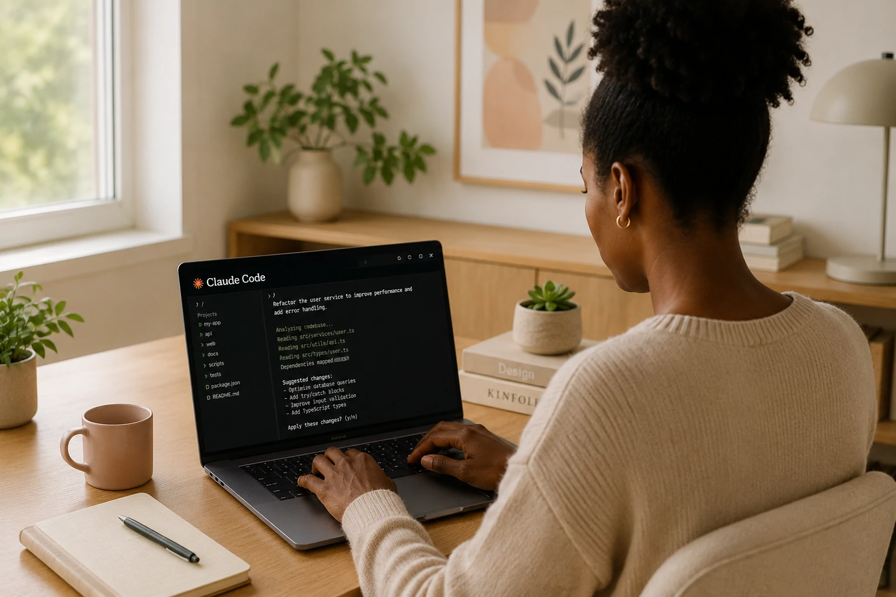

*Enquanto agentes de IA passam a executar tarefas completas, uma nova categoria de ferramentas começa a transformar a rotina dos desenvolvedores. O **Claude Code**, criado pela **Anthropic**, representa essa mudança ao levar inteligência artificial diretamente para o terminal e para o fluxo de desenvolvimento de software.*

O avanço da **IA Generativa** fez surgir dezenas de assistentes para programação. Entretanto, poucas soluções foram desenhadas para compreender projetos inteiros e colaborar continuamente durante o desenvolvimento.

É justamente nessa proposta que o **Claude Code** se diferencia. Em vez de apenas sugerir trechos de código, a ferramenta busca atuar como um parceiro técnico capaz de entender contexto, arquitetura, documentação e objetivos do projeto.

## O que é Claude Code?

*O Claude Code leva modelos de IA diretamente para o ambiente de desenvolvimento, permitindo interações naturais com o código.*

O **Claude Code** é uma ferramenta desenvolvida pela **Anthropic** que integra os modelos **Claude** diretamente ao ambiente de desenvolvimento por meio do terminal.

Em vez de copiar e colar trechos de código em um chatbot, o desenvolvedor conversa com a IA enquanto ela analisa o projeto local, identifica dependências, compreende arquivos e propõe alterações contextualizadas.

Essa abordagem aproxima o conceito de um verdadeiro assistente de engenharia de software.

Diferentemente de assistentes tradicionais, o **Claude Code** foi pensado para trabalhar continuamente durante o ciclo de desenvolvimento.

### Compreensão do projeto completo

Ao acessar o contexto do repositório, a ferramenta consegue entender relações entre arquivos, bibliotecas, documentação e padrões utilizados pela equipe.

Isso reduz respostas genéricas e aumenta a precisão das sugestões.

### Desenvolvimento baseado em linguagem natural

O desenvolvedor pode solicitar tarefas utilizando linguagem comum.

Exemplos:

- criar uma API;
- explicar uma função complexa;
- refatorar módulos;
- localizar bugs;
- escrever testes automatizados;
- documentar componentes.

## Como Claude Code muda o desenvolvimento moderno?

*O foco da ferramenta não é substituir programadores, mas ampliar significativamente sua produtividade.*

O principal diferencial do **Claude Code** está na mudança do fluxo de trabalho.

Em vez de alternar constantemente entre editor, navegador e chatbot, o desenvolvedor permanece dentro do ambiente onde o software é criado.

Essa integração reduz interrupções e aumenta a velocidade na resolução de problemas.

Além disso, a ferramenta consegue atuar em diversas etapas do ciclo de desenvolvimento.

### Automatização de tarefas repetitivas

Grande parte do tempo dos desenvolvedores é consumida por atividades que não envolvem criatividade.

Entre elas:

- documentação;
- testes;
- revisão de código;
- organização de arquivos;
- explicação de funções antigas.

Essas atividades podem ser aceleradas utilizando IA.

### Apoio à aprendizagem

Profissionais iniciantes também se beneficiam.

Em vez de apenas receber código pronto, podem solicitar explicações detalhadas sobre arquitetura, algoritmos e boas práticas, tornando o processo de aprendizado mais eficiente.

O crescimento desse modelo acompanha outras tendências já abordadas pelo **Notícia Tech**, como o conceito de **AI Fluency**:

https://noticiatech.com.br/inteligencia-artificial/o-que-e-ai-fluency-habilidade-profissionais-empresas/

## Quais são as principais vantagens do Claude Code para empresas?

*Empresas estão incorporando ferramentas de IA diretamente ao ciclo de desenvolvimento para reduzir custos e aumentar produtividade.*

O **Claude Code** oferece ganhos que vão além da geração automática de código. Sua maior contribuição está na capacidade de acelerar processos de engenharia de software mantendo contexto durante todo o desenvolvimento.

Para equipes corporativas, isso significa ciclos mais curtos, menor tempo gasto com tarefas repetitivas e maior foco em atividades estratégicas.

À medida que organizações adotam agentes inteligentes e plataformas de automação, ferramentas como o **Claude Code** tendem a se tornar parte da infraestrutura de desenvolvimento.

### Maior produtividade das equipes

Entre os principais benefícios estão:

- redução do tempo de desenvolvimento;
- geração de documentação técnica;
- criação de testes automatizados;
- auxílio na manutenção de sistemas legados;
- compreensão rápida de projetos complexos;
- apoio ao onboarding de novos desenvolvedores.

Esses ganhos tornam o trabalho mais eficiente sem alterar o papel estratégico dos profissionais.

### Integração com o futuro da IA corporativa

O mercado caminha para ecossistemas compostos por diferentes agentes especializados.

Nesse cenário, o **Claude Code** poderá atuar em conjunto com protocolos como **MCP (Model Context Protocol)**, plataformas de automação e ferramentas DevOps, criando fluxos praticamente contínuos de desenvolvimento.

Esse movimento complementa tendências apresentadas pelo **Notícia Tech** em:

https://noticiatech.com.br/automacao/o-que-e-ai-orchestration-substitui-disputa-modelos-ia-empresas/

## Claude Code representa uma nova fase da engenharia de software

O **Claude Code** não deve ser visto apenas como mais um assistente para programação.

Sua proposta sinaliza uma mudança na forma como profissionais interagem com sistemas de desenvolvimento. Em vez de utilizar IA apenas para responder perguntas, os desenvolvedores passam a trabalhar lado a lado com agentes capazes de compreender projetos completos e colaborar durante todo o ciclo de criação.

Essa evolução acompanha uma transformação mais ampla da indústria de tecnologia. O desenvolvimento de software tende a migrar para modelos em que humanos definem estratégia, arquitetura e regras de negócio, enquanto agentes inteligentes executam parte significativa das tarefas operacionais.

Para empresas, isso significa potencial para reduzir tempo de entrega, aumentar qualidade do código e acelerar inovação. Para profissionais, representa a necessidade de desenvolver novas competências relacionadas à colaboração com IA, mantendo pensamento crítico e capacidade de tomada de decisão.

Mais do que substituir programadores, ferramentas como o **Claude Code** indicam que o futuro da engenharia de software será construído por equipes híbridas, nas quais especialistas humanos e agentes de inteligência artificial trabalham de forma complementar para entregar soluções cada vez mais complexas.

---