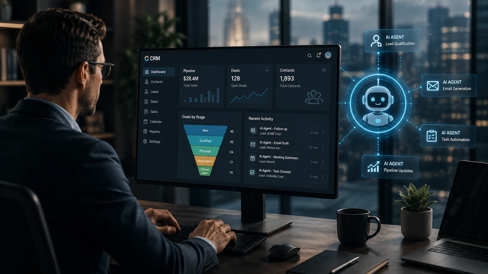
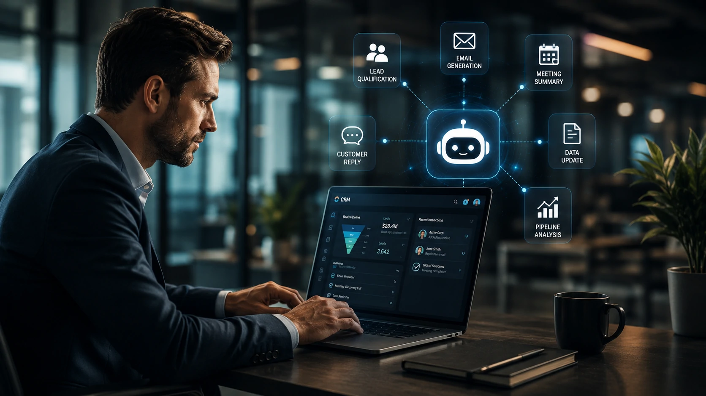
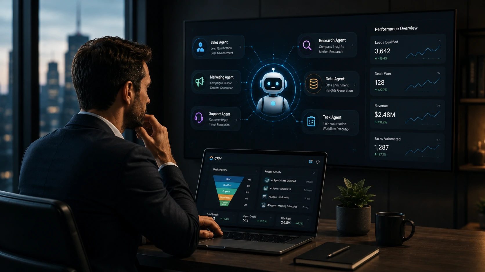

*Durante muitos anos, os sistemas de CRM evoluíram adicionando automações, integrações e análises de dados. Em 2026, porém, o mercado entrou em uma nova fase: plataformas capazes de operar com agentes de IA que executam tarefas quase como colaboradores digitais. Para empresas que desejam aumentar produtividade e competitividade, entender essa mudança tornou-se uma decisão estratégica.*

## Os CRMs estão deixando de ser bancos de dados para se tornarem plataformas de agentes inteligentes

*Os novos CRMs utilizam agentes inteligentes para executar tarefas comerciais, administrativas e de atendimento de forma contextual.*

Durante muitos anos, um **CRM** serviu principalmente para registrar clientes, acompanhar negociações e organizar o funil comercial.

Agora, a chegada dos **agentes de IA** transforma essas plataformas em ambientes capazes de executar atividades completas, reduzindo significativamente o trabalho manual das equipes.

### O que muda na prática?

Os chamados **AI Employees** conseguem interpretar solicitações, acessar informações do CRM, elaborar respostas, atualizar cadastros, resumir reuniões, qualificar leads e até iniciar fluxos de trabalho automaticamente.

Em vez de simplesmente armazenar dados, o sistema passa a atuar como um participante ativo das operações comerciais.

### Por que essa tendência acelera em 2026?

A popularização dos grandes modelos de linguagem tornou possível integrar inteligência conversacional diretamente aos softwares corporativos.

Ao mesmo tempo, empresas passaram a exigir plataformas que unam **IA**, automação e gestão comercial em um único ambiente, reduzindo custos operacionais e aumentando a produtividade das equipes.

Esse movimento complementa a evolução da automação empresarial já discutida pelo Notícia Tech no artigo sobre **AI Orchestration**:

https://noticiatech.com.br/automacao/o-que-e-ai-orchestration-substitui-disputa-modelos-ia-empresas/

## Como escolher um CRM preparado para agentes de IA

*Além das funções tradicionais, os melhores CRMs começam a incorporar agentes inteligentes capazes de atuar em múltiplos departamentos.*

Escolher um CRM em 2026 deixou de significar apenas comparar funcionalidades tradicionais.

A principal pergunta agora é: **a plataforma conseguirá acompanhar a evolução da inteligência artificial nos próximos anos?**

### Recursos que merecem prioridade

Ao avaliar uma solução, vale observar se ela oferece:

- agentes inteligentes nativos;
- integração com modelos de IA;
- automações avançadas;
- geração automática de conteúdo;
- análise preditiva;
- integrações abertas por API;
- recursos para vendas, marketing e atendimento.

Esses fatores tendem a definir quais plataformas permanecerão competitivas conforme novas capacidades de IA forem surgindo.

### Plataformas que lideram essa transformação

Entre os fornecedores que mais investem nessa direção estão **Salesforce**, **HubSpot**, **Microsoft Dynamics 365**, **Zoho CRM**, **Freshsales** e **Pipedrive**.

Embora cada solução possua foco diferente, todas caminham para incorporar agentes capazes de reduzir atividades repetitivas e ampliar a produtividade das equipes.

Essa evolução acompanha outra tendência importante analisada pelo Notícia Tech no comparativo dos **melhores CRMs com IA**, que mostra como a inteligência artificial já influencia a escolha das plataformas corporativas:

https://noticiatech.com.br/ferramentas/melhores-crms-com-ia-2026-comparativo-empresas/

## Quais são os principais CRMs com agentes de IA em 2026

*As principais plataformas disputam espaço oferecendo agentes inteligentes, automação avançada e recursos de inteligência artificial generativa.*

Embora todas as grandes plataformas estejam incorporando **Inteligência Artificial**, cada fornecedor adota uma estratégia diferente para transformar o CRM em uma plataforma de trabalho inteligente.

A escolha ideal depende do porte da empresa, da complexidade das operações e do nível de automação desejado.

### Salesforce

A **Salesforce** continua liderando o mercado corporativo com um forte investimento em agentes inteligentes integrados ao seu ecossistema.

Seu foco está em empresas que precisam de alto nível de personalização, grande volume de dados e automações complexas.

### HubSpot

A **HubSpot** mantém uma das experiências mais acessíveis para pequenas e médias empresas.

Os recursos de IA ajudam na geração de conteúdos, criação de e-mails, organização de contatos, atendimento e análise do pipeline comercial, reduzindo a curva de aprendizado das equipes.

### Microsoft Dynamics 365

O **Microsoft Dynamics 365** amplia sua integração com o ecossistema **Microsoft**, permitindo que agentes inteligentes trabalhem em conjunto com documentos, reuniões, calendário e ferramentas de produtividade.

Empresas que já utilizam soluções Microsoft costumam obter maior ganho operacional com essa integração.

### Zoho CRM, Freshsales e Pipedrive

Essas plataformas vêm ampliando rapidamente seus investimentos em IA.

Além das automações tradicionais, começam a incorporar agentes capazes de sugerir ações comerciais, resumir interações com clientes e apoiar decisões durante o ciclo de vendas.

Independentemente da plataforma escolhida, a tendência é clara: os CRMs deixam de ser apenas softwares de gestão para atuar como ambientes colaborativos entre pessoas e agentes inteligentes.

## O futuro dos CRMs será definido pelos AI Employees

Os próximos anos devem consolidar uma nova geração de plataformas corporativas em que agentes inteligentes atuarão lado a lado com equipes humanas.

Nesse cenário, o diferencial competitivo deixará de ser apenas registrar informações sobre clientes e passará a ser a capacidade do CRM executar tarefas, interpretar contexto e apoiar decisões em tempo real.

Empresas que iniciarem essa transição mais cedo terão maior facilidade para automatizar processos, reduzir custos operacionais e responder com rapidez às mudanças do mercado.

Ao mesmo tempo, a escolha da plataforma deixa de considerar apenas funcionalidades atuais. Será cada vez mais importante avaliar o potencial de evolução do fornecedor, a integração com modelos de IA e a abertura para novos agentes inteligentes.

Essa transformação acompanha outra tendência analisada pelo Notícia Tech sobre **AI Process Automation**, mostrando como a inteligência artificial amplia o papel da automação nas empresas.

https://noticiatech.com.br/automacao/o-que-e-ai-process-automation-automacao-processos-inteligencia-artificial/

Da mesma forma, compreender o conceito de **AI Fluency** torna-se essencial para que gestores consigam aproveitar todo o potencial dessas novas plataformas.

https://noticiatech.com.br/inteligencia-artificial/o-que-e-ai-fluency-habilidade-profissionais-empresas/

À medida que os **AI Employees** evoluem, os CRMs tendem a assumir um papel central na estratégia digital das organizações, funcionando como a principal interface entre pessoas, processos e inteligência artificial. Para empresas que pretendem crescer nos próximos anos, investir em uma plataforma preparada para essa nova geração de agentes inteligentes pode representar uma vantagem competitiva relevante.

---