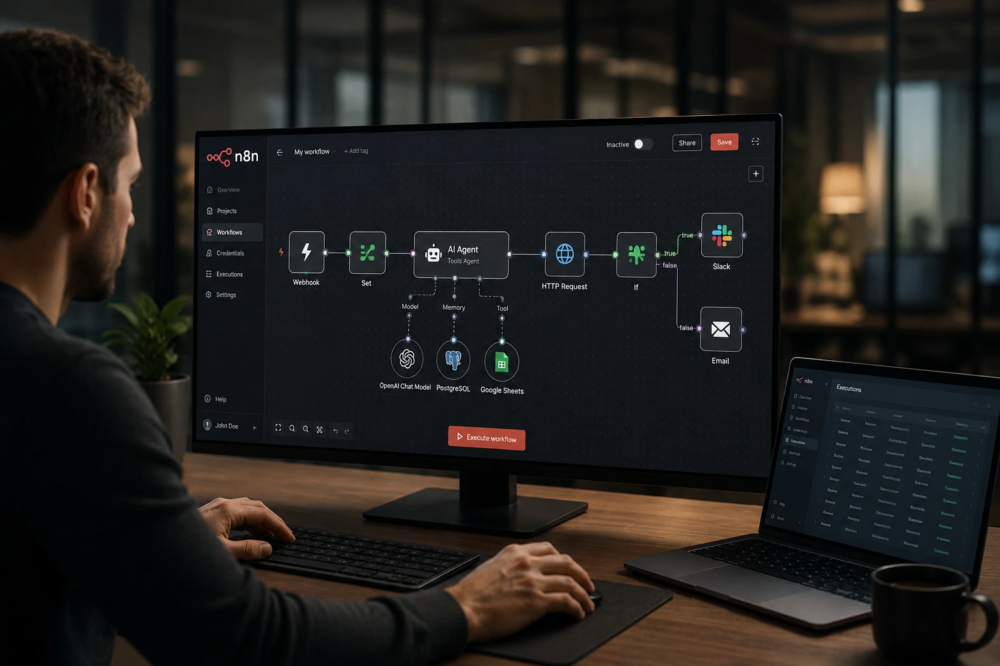
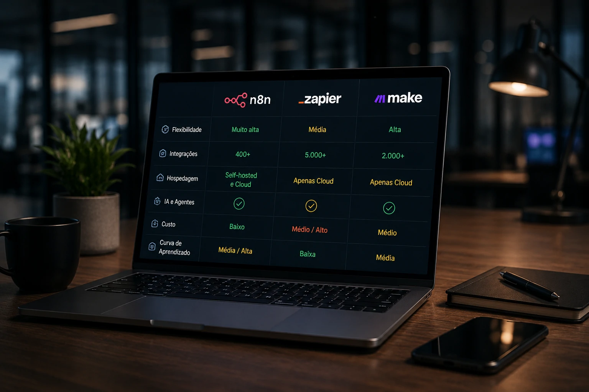

*À medida que empresas aceleram projetos de Inteligência Artificial, automação e agentes autônomos, plataformas capazes de conectar sistemas e executar fluxos complexos ganharam importância estratégica. Nesse cenário, o **n8n** deixou de ser apenas uma ferramenta de automação para se posicionar como uma camada operacional para a nova geração de aplicações baseadas em IA.*

## Sim, o n8n vale a pena em 2026 para empresas que buscam automação avançada e agentes de IA

*Fluxos automatizados conectando sistemas corporativos, APIs e modelos de IA.*

O **n8n** é uma plataforma de automação que permite integrar aplicativos, APIs, bancos de dados e serviços digitais por meio de fluxos visuais.

Diferentemente de soluções focadas apenas em automações simples, a plataforma ganhou espaço ao oferecer maior flexibilidade para processos empresariais, integrações personalizadas e projetos envolvendo **agentes de IA**.

O crescimento da automação inteligente também está ligado ao avanço de temas discutidos no Notícia Tech, como [MCP e a infraestrutura que conecta agentes de IA aos sistemas corporativos](https://noticiatech.com.br/inteligencia-artificial/mcp-infraestrutura-conecta-agentes-ia-sistemas-corporativos/) e a evolução dos ecossistemas de IA dentro das empresas.

### O que diferencia o n8n?

O principal diferencial é o equilíbrio entre interface visual e liberdade técnica.

Enquanto muitas plataformas limitam personalizações avançadas, o **n8n** permite executar lógica complexa, chamadas de API, scripts e integrações personalizadas.

### Para quem o n8n é indicado?

A ferramenta atende principalmente:

- Empresas em transformação digital;
- Equipes de operações;
- Profissionais de automação;
- Desenvolvedores;
- Times que implementam agentes de IA;
- Negócios que desejam reduzir tarefas repetitivas.

## O n8n se tornou uma peça estratégica para projetos de IA corporativa

*Agentes de IA operando processos empresariais por meio de automações integradas.*

A ascensão dos agentes de IA criou uma nova necessidade: conectar modelos inteligentes aos sistemas reais das empresas.

Um agente não gera valor apenas conversando. Ele precisa acessar CRM, ERP, bancos de dados, documentos e aplicações corporativas.

É nesse ponto que o **n8n** ganha relevância.

### Como o n8n trabalha com agentes de IA?

A plataforma permite criar fluxos que conectam modelos da **OpenAI**, **Anthropic**, bancos vetoriais e ferramentas empresariais.

Na prática, um agente pode:

- Consultar dados internos;
- Atualizar sistemas;
- Criar relatórios;
- Responder clientes;
- Executar processos automatizados.

Essa tendência acompanha movimentos analisados pelo Notícia Tech em conteúdos como [AI Operations e a governança dos agentes de IA nas empresas](https://noticiatech.com.br/inteligencia-artificial/ai-operations-governanca-agentes-ia-empresas/).

### O que muda para empresas?

Empresas deixam de utilizar automação apenas para tarefas isoladas.

O foco passa a ser a criação de fluxos inteligentes capazes de combinar dados, decisões e execução operacional.

Isso reduz custos, aumenta produtividade e acelera iniciativas de IA.

## n8n vs Zapier vs Make: qual plataforma escolher?

*Comparação entre plataformas modernas de automação empresarial.*

A escolha depende do perfil da organização.

O **Zapier** continua sendo uma das soluções mais acessíveis para usuários iniciantes.

O **Make** oferece excelente experiência visual para automações mais elaboradas.

Já o **n8n** se destaca pela flexibilidade e pela capacidade de atuar como infraestrutura operacional.

### Quando escolher o n8n?

O **n8n** costuma ser a melhor opção quando existe necessidade de:

- Integrações complexas;
- Uso intensivo de APIs;
- Projetos com IA;
- Hospedagem própria;
- Controle avançado dos fluxos.

### Quando outra plataforma pode ser melhor?

Para pequenas automações sem complexidade técnica, plataformas mais simples podem oferecer implantação mais rápida.

Por isso, a escolha deve considerar maturidade tecnológica, orçamento e objetivos de longo prazo.

## O maior valor do n8n está na construção da empresa orientada por automação

O **n8n** não deve ser analisado apenas como uma ferramenta de produtividade.

Seu verdadeiro valor está em funcionar como uma camada de integração entre sistemas, pessoas, dados e agentes inteligentes.

A transformação digital das empresas está evoluindo para modelos cada vez mais automatizados, conectados e orientados por IA.

Temas como [Context Engineering para agentes corporativos](https://noticiatech.com.br/inteligencia-artificial/context-engineering-agentes-ia-empresas/) e arquiteturas operacionais de IA mostram que o desafio deixou de ser apenas escolher um modelo inteligente.

A questão passou a ser como conectar inteligência, dados e execução em escala.

Nesse cenário, o **n8n** surge como uma das plataformas mais bem posicionadas para atender organizações que enxergam automação não como ferramenta isolada, mas como infraestrutura estratégica para a próxima geração de operações digitais.

---