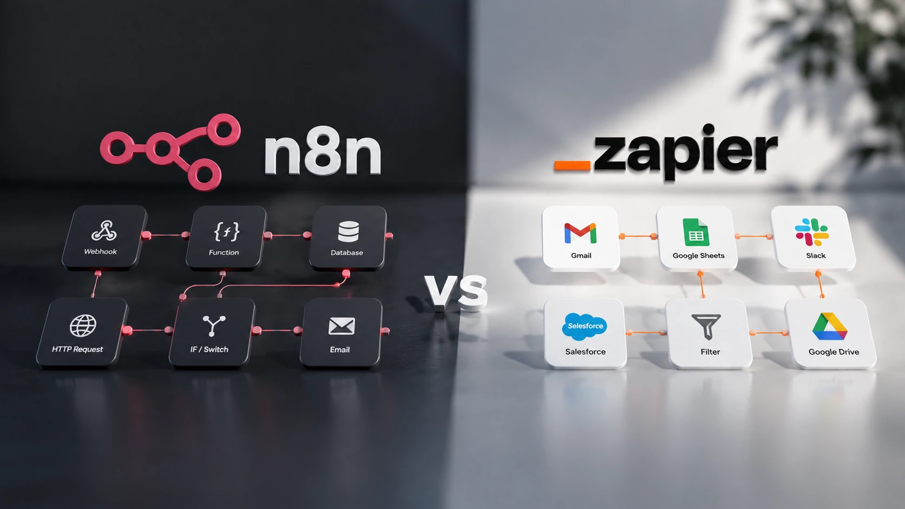
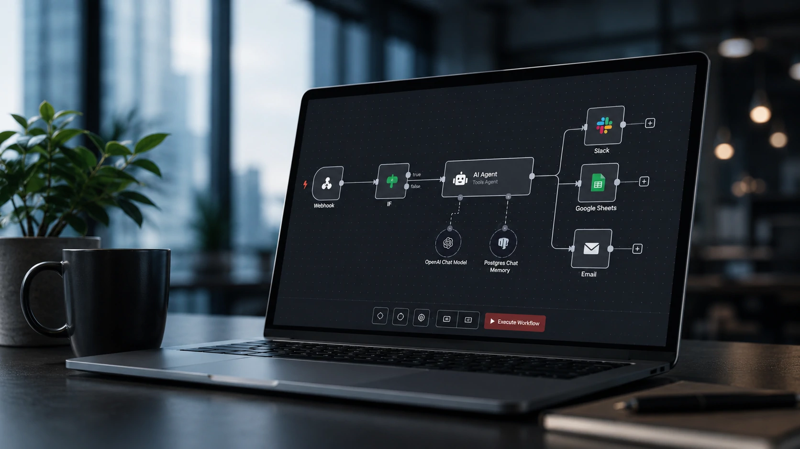
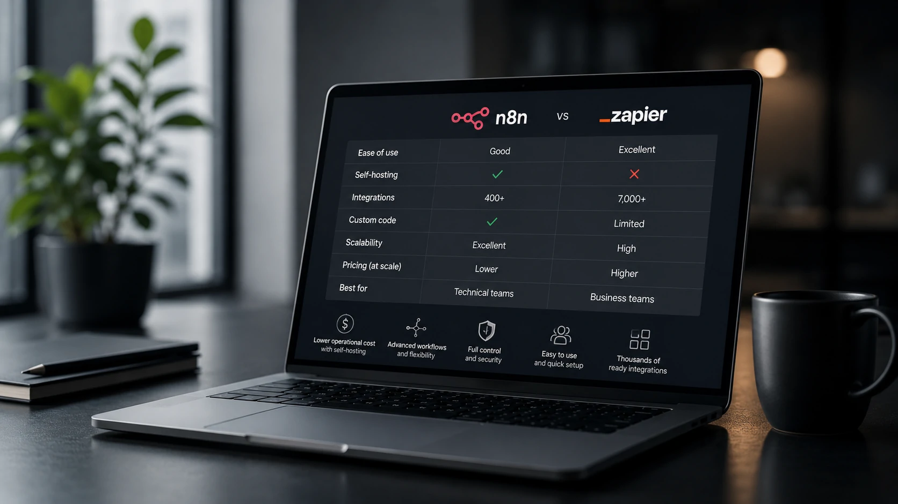

*À medida que agentes de IA deixam de ser experimentos para se tornarem parte da operação das empresas, a escolha da plataforma de automação passou a influenciar custos, produtividade e escalabilidade. Nesse cenário, **n8n** e **Zapier** surgem como duas das principais alternativas do mercado, mas com propostas bastante diferentes para organizações que desejam automatizar processos utilizando inteligência artificial.*

Empresas de todos os portes estão acelerando investimentos em automação inteligente. O crescimento dos agentes de IA, dos fluxos baseados em **LLMs** e das integrações entre aplicações transformou plataformas de automação em componentes estratégicos da infraestrutura digital.

Enquanto o **Zapier** consolidou sua posição como referência em automação no-code, o **n8n** ganhou enorme relevância ao oferecer maior flexibilidade, recursos avançados e possibilidade de hospedagem própria. A decisão entre as duas plataformas vai muito além do número de integrações disponíveis.

Neste guia, analisamos os principais critérios que gestores, profissionais de tecnologia e equipes de transformação digital devem considerar antes de escolher uma solução.

## n8n e Zapier possuem propostas diferentes para automação empresarial

Embora ambos permitam automatizar tarefas repetitivas, as duas plataformas foram desenvolvidas para públicos com necessidades distintas.

*O modelo arquitetural de cada plataforma influencia diretamente flexibilidade, custos e capacidade de expansão dos processos automatizados.*

O **Zapier** foi criado para simplificar integrações entre aplicativos por meio de uma interface extremamente intuitiva. Em poucos minutos é possível conectar ferramentas como CRM, e-mail, planilhas e sistemas de marketing sem escrever código.

Já o **n8n** nasceu com foco em flexibilidade. A plataforma permite criar fluxos complexos, executar lógica condicional, consumir APIs, integrar bancos de dados e utilizar código JavaScript quando necessário.

### Quando o Zapier faz mais sentido

Empresas que priorizam rapidez de implantação costumam obter excelentes resultados com o **Zapier**.

Entre seus principais diferenciais estão:

- configuração simples;
- milhares de integrações prontas;
- baixa curva de aprendizado;
- excelente experiência para usuários de negócios.

Essas características tornam a plataforma bastante atrativa para equipes comerciais, marketing e operações que desejam automatizar atividades sem depender continuamente da área de tecnologia.

### Quando o n8n se destaca

O **n8n** tende a ser a melhor escolha quando a empresa busca maior controle sobre sua infraestrutura.

Entre seus diferenciais estão:

- hospedagem própria (Self-Hosted);
- maior liberdade para personalizações;
- criação de fluxos altamente complexos;
- integração avançada com APIs;
- menor custo operacional em larga escala.

Por isso, organizações que utilizam agentes de IA, arquiteturas baseadas em **MCP**, integrações proprietárias ou múltiplos sistemas internos costumam enxergar maior valor na plataforma.

Quem deseja compreender como arquiteturas modernas de integração funcionam também pode conferir nosso guia sobre **MCP**:

https://noticiatech.com.br/inteligencia-artificial/como-funciona-mcp-guia-completo-agentes-ia/

## Inteligência artificial amplia a diferença entre as duas plataformas

A chegada dos modelos generativos mudou completamente o papel das plataformas de automação.

*Automação deixou de conectar aplicativos e passou a coordenar agentes inteligentes capazes de executar decisões, interpretar documentos e gerar conteúdo.*

Hoje não basta mover informações entre aplicativos. As empresas querem integrar **OpenAI**, **Claude**, **Gemini**, modelos open source e agentes inteligentes dentro dos mesmos fluxos de trabalho.

Nesse contexto, tanto **Zapier** quanto **n8n** evoluíram rapidamente, mas seguiram estratégias diferentes.

### O avanço do Zapier com IA

O **Zapier** incorporou recursos de inteligência artificial para facilitar a criação de automações utilizando linguagem natural.

O objetivo é permitir que profissionais de negócios construam fluxos inteligentes sem conhecimento técnico aprofundado, reduzindo o tempo necessário para implementar processos automatizados.

Essa abordagem favorece empresas que valorizam simplicidade operacional e velocidade de adoção.

### O crescimento do n8n entre projetos com agentes de IA

O **n8n**, por outro lado, tornou-se uma das plataformas favoritas entre desenvolvedores e equipes de IA.

Sua arquitetura facilita a construção de agentes personalizados, integrações com modelos de linguagem, pipelines de **RAG**, APIs corporativas e orquestração de múltiplos serviços.

Esse posicionamento acompanha uma tendência já discutida pelo **Notícia Tech** em nosso conteúdo sobre implementação de **MCP** nas empresas:

https://noticiatech.com.br/inteligencia-artificial/como-implementar-mcp-empresas-arquitetura-integracao-agentes-ia/

## Custos, escalabilidade e segurança definem a melhor escolha para cada empresa

O melhor custo-benefício depende da maturidade tecnológica da empresa, do volume de automações e do nível de personalização necessário.

*Além do preço da assinatura, empresas devem avaliar custos operacionais, capacidade de expansão e controle sobre os dados antes de escolher uma plataforma.*

Embora o **Zapier** apresente uma entrada mais simples para novos usuários, empresas que executam milhares de automações por mês podem encontrar limitações financeiras conforme a operação cresce.

Já o **n8n** exige maior conhecimento técnico para implantação, mas pode oferecer custos significativamente menores quando utilizado em infraestrutura própria.

### Comparativo entre n8n e Zapier

| Critério | **n8n** | **Zapier** |
|----------|---------|------------|
| Facilidade de uso | Boa | Excelente |
| Curva de aprendizado | Média | Baixa |
| Hospedagem própria | Sim | Não |
| Personalização | Muito alta | Média |
| Integração com APIs | Excelente | Muito boa |
| Execução de código | Sim | Limitada |
| Escalabilidade | Muito alta | Alta |
| Melhor perfil | Equipes técnicas | Usuários de negócio |

Na prática, empresas menores costumam valorizar a simplicidade do **Zapier**, enquanto organizações que desenvolvem produtos digitais, agentes de IA ou fluxos complexos frequentemente encontram maior retorno no **n8n**.

### Segurança também influencia a decisão

Outro aspecto frequentemente ignorado é o controle sobre os dados.

Ao utilizar o **n8n Self-Hosted**, a empresa pode manter suas automações dentro da própria infraestrutura, reduzindo dependências externas e facilitando requisitos de conformidade, privacidade e governança.

Para setores como financeiro, saúde e indústria, essa característica pode representar uma vantagem competitiva importante.

Já o **Zapier** oferece uma experiência totalmente gerenciada, reduzindo a necessidade de manutenção técnica, mas concentrando toda a operação na infraestrutura da plataforma.

## Qual plataforma vale mais a pena em 2026?

Não existe uma resposta única.

A decisão depende diretamente dos objetivos estratégicos da organização.

### Escolha o Zapier se sua empresa busca

- implantação rápida;
- pouca necessidade de suporte técnico;
- automações simples;
- produtividade imediata;
- equipes sem desenvolvedores dedicados.

### Escolha o n8n se sua empresa precisa

- construir agentes de IA;
- integrar APIs complexas;
- reduzir custos em grande escala;
- controlar totalmente sua infraestrutura;
- desenvolver automações altamente personalizadas.

Com a expansão da inteligência artificial corporativa, a tendência é que as plataformas de automação deixem de executar apenas tarefas repetitivas para coordenar fluxos inteligentes envolvendo múltiplos modelos de linguagem, bancos de dados e aplicações empresariais.

Esse movimento também reforça a importância de compreender conceitos como **RAG**, responsável por conectar modelos de IA a bases de conhecimento atualizadas:

https://noticiatech.com.br/inteligencia-artificial/o-que-e-rag-guia-completo-agentes-ia-empresas/

Da mesma forma, empresas que desejam evoluir para uma estratégia baseada em agentes inteligentes podem aprofundar o tema em nosso guia completo sobre **Agentic AI**:

https://noticiatech.com.br/inteligencia-artificial/o-que-e-agentic-ai-guia-completo-agentes-ia/

Em vez de perguntar qual plataforma é melhor, a questão mais relevante em 2026 é qual delas se adapta melhor à estratégia digital da empresa. Organizações que valorizam velocidade e simplicidade provavelmente continuarão obtendo excelentes resultados com o **Zapier**. Já aquelas que enxergam a automação como parte central da infraestrutura tecnológica tendem a encontrar no **n8n** uma plataforma preparada para acompanhar a próxima geração de aplicações baseadas em inteligência artificial.

---