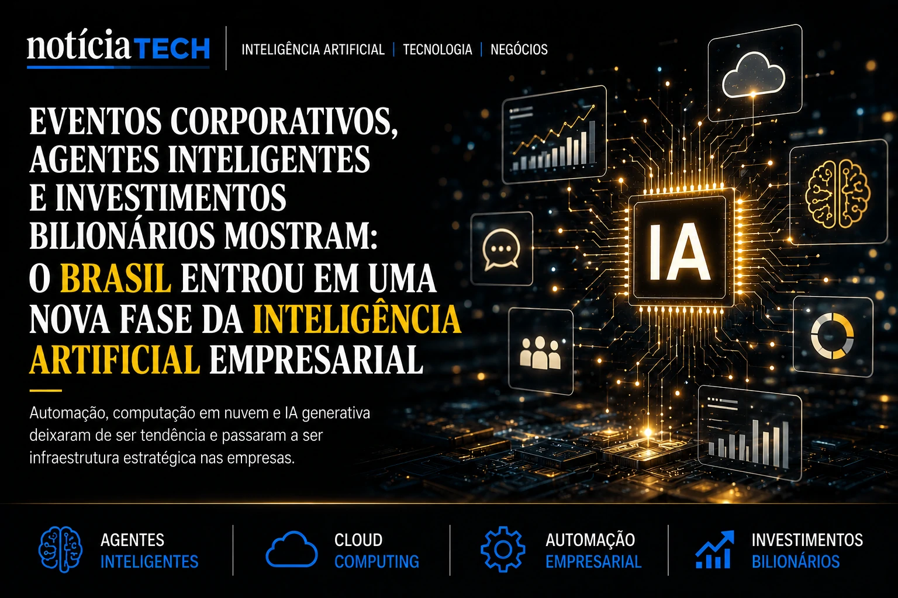
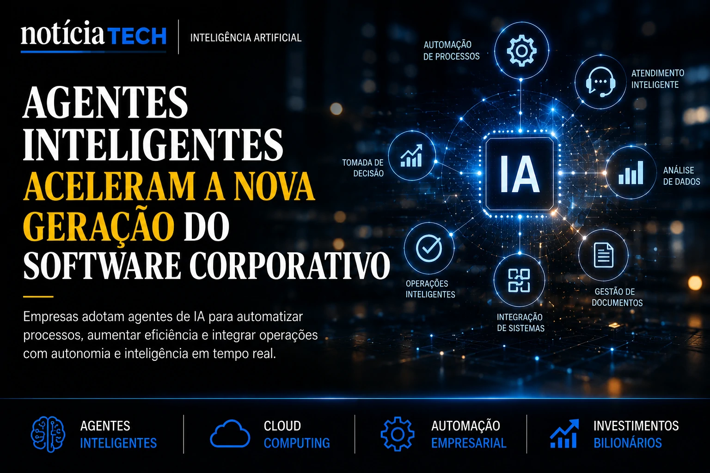

*O mercado brasileiro entrou oficialmente em uma nova fase da inteligência artificial em 2026. O avanço acelerado dos eventos corporativos, o crescimento dos investimentos em automação e a disputa entre gigantes da tecnologia mostram que a IA deixou de ser apenas tendência para se tornar infraestrutura estratégica dentro das empresas.*

## O Brasil entrou em uma nova corrida tecnológica baseada em inteligência artificial

A inteligência artificial passou a ocupar posição central nas decisões estratégicas das empresas brasileiras. O aumento dos investimentos em automação, computação em nuvem e agentes inteligentes mostra que organizações de diferentes setores começaram a acelerar projetos voltados para produtividade, eficiência operacional e transformação digital.

O movimento não acontece apenas no Brasil. Empresas globais disputam espaço em uma corrida bilionária para dominar o mercado de software corporativo baseado em IA. Plataformas empresariais começam a integrar copilotos inteligentes, agentes autônomos e sistemas capazes de interpretar contexto, analisar dados e executar tarefas operacionais de maneira cada vez mais independente.

Nos últimos meses, o crescimento do número de eventos corporativos voltados para inteligência artificial se transformou em um dos sinais mais claros dessa mudança estrutural do mercado.

Conferências empresariais, fóruns executivos e encontros sobre inovação passaram a concentrar discussões envolvendo:
- agentes inteligentes;
- IA generativa;
- automação empresarial;
- transformação digital;
- cloud computing;
- produtividade operacional;
- análise de dados;
- marketing orientado por IA;
- infraestrutura tecnológica;
- softwares corporativos inteligentes.

O cenário também reforça a percepção de que empresas que demorarem para acelerar adoção de IA podem perder competitividade nos próximos anos.

Leia também:
[Empresas adiam investimentos em IA e perdem competitividade](https://noticiatech.com.br/negocios/empresas-adiam-investimentos-ia-perdem-competitividade/)

Ao mesmo tempo, o Brasil começa a se consolidar como um dos mercados estratégicos mais relevantes da América Latina para expansão da inteligência artificial corporativa.

## Crescimento dos eventos corporativos mostra maturidade do mercado brasileiro

O aumento do interesse por eventos de inteligência artificial mostra que a discussão sobre IA deixou de ser limitada ao setor técnico e passou a atingir diretamente áreas estratégicas das empresas.

Executivos de tecnologia, marketing, vendas, operações e inovação passaram a buscar aplicações práticas capazes de gerar:
- redução de custos;
- ganho de produtividade;
- automação operacional;
- eficiência comercial;
- escalabilidade;
- otimização de processos;
- vantagem competitiva.

Eventos como AI Summit, AI Experience, conferências empresariais e fóruns organizados por grandes grupos de mídia e tecnologia começaram a reunir empresas interessadas em acelerar implementação de IA em larga escala.

O comportamento do mercado também mudou rapidamente.

Antes focadas em projetos experimentais, muitas empresas agora buscam integrar inteligência artificial diretamente em:
- atendimento;
- operações internas;
- CRM;
- vendas;
- marketing;
- gestão de documentos;
- análise de dados;
- relacionamento com clientes.

Essa aceleração acompanha um crescimento mais amplo da demanda corporativa por infraestrutura digital no país.

O Notícia Tech já mostrou anteriormente como o Brasil pode movimentar investimentos trilionários relacionados a computação em nuvem e inteligência artificial até o fim da década.

Leia também:
[Brasil pode investir R$ 2 trilhões em nuvem e inteligência artificial até 2029 e acelerar nova corrida tecnológica](https://noticiatech.com.br/inteligencia-artificial/brasil-pode-investir-r-2-trilh%C3%B5es-em-nuvem-e-intelig%C3%AAncia-artificial-at%C3%A9-2029-e-acelerar-nova-corrida-tecnol%C3%B3gica/)

Além da infraestrutura, outro movimento importante começou a ganhar força: a corrida pelos agentes inteligentes.

## Agentes de IA começam a redefinir o software corporativo

Uma das maiores mudanças do mercado corporativo envolve o avanço dos chamados agentes inteligentes.

Diferente das automações tradicionais, esses sistemas conseguem interpretar contexto, processar informações, executar tarefas operacionais e interagir com usuários de forma mais autônoma.

Na prática, empresas começam a utilizar IA para:
- automatizar atendimento;
- organizar fluxos internos;
- responder clientes;
- gerar análises;
- interpretar documentos;
- acelerar vendas;
- produzir conteúdo;
- otimizar campanhas de marketing;
- integrar operações empresariais.

Essa transformação está mudando rapidamente o próprio conceito de software corporativo.

ERPs, plataformas de vendas, CRMs e sistemas empresariais começam a incorporar IA diretamente na estrutura operacional das empresas.

O avanço desse mercado também aumenta a disputa entre gigantes globais da tecnologia.

OpenAI, Anthropic, Google, Microsoft e outras empresas aceleram investimentos no setor corporativo enquanto plataformas nacionais tentam desenvolver soluções próprias voltadas para o mercado brasileiro.

Leia também:
[OpenAI e Anthropic mudam estratégia e aceleram corrida pela implantação de IA nas empresas](https://noticiatech.com.br/negocios/openai-e-anthropic-mudam-estrat%C3%A9gia-e-aceleram-corrida-pela-implanta%C3%A7%C3%A3o-de-ia-nas-empresas/)

O avanço dos agentes inteligentes também se conecta diretamente ao conceito de B2A, onde empresas passam a adaptar estruturas digitais para serem compreendidas não apenas por pessoas, mas também por inteligências artificiais.

Leia também:
[B2A: a nova fronteira dos negócios onde empresas precisam ser entendidas por inteligências artificiais](https://noticiatech.com.br/inteligencia-artificial/b2a-a-nova-fronteira-dos-neg%C3%B3cios-onde-empresas-precisam-ser-entendidas-por-intelig%C3%AAncias-artificiais/)

## A industrialização da IA pode redefinir a competitividade das empresas brasileiras

Especialistas avaliam que o mercado brasileiro entrou em uma nova etapa da transformação digital.

A diferença agora é que a inteligência artificial deixou de funcionar apenas como ferramenta complementar e passou a ocupar posição estratégica dentro das empresas.

Em vez de simples automações isoladas, organizações começam a estruturar operações inteiras baseadas em:
- agentes inteligentes;
- análise de dados em tempo real;
- automação de processos;
- copilotos corporativos;
- integração operacional;
- softwares autônomos;
- infraestrutura baseada em IA.

Esse cenário também impulsiona a busca por profissionais qualificados.

Áreas como marketing, vendas, atendimento, operações e tecnologia passaram a incorporar inteligência artificial diretamente na rotina corporativa, criando uma nova corrida por capacitação digital dentro das empresas brasileiras.

O crescimento acelerado dos eventos corporativos de IA mostra que o Brasil entrou oficialmente em uma fase de industrialização da inteligência artificial.

Em 2026, a IA deixou de ser apenas inovação experimental. Ela passou a ocupar o centro das estratégias empresariais, da competitividade corporativa e da nova economia digital brasileira.