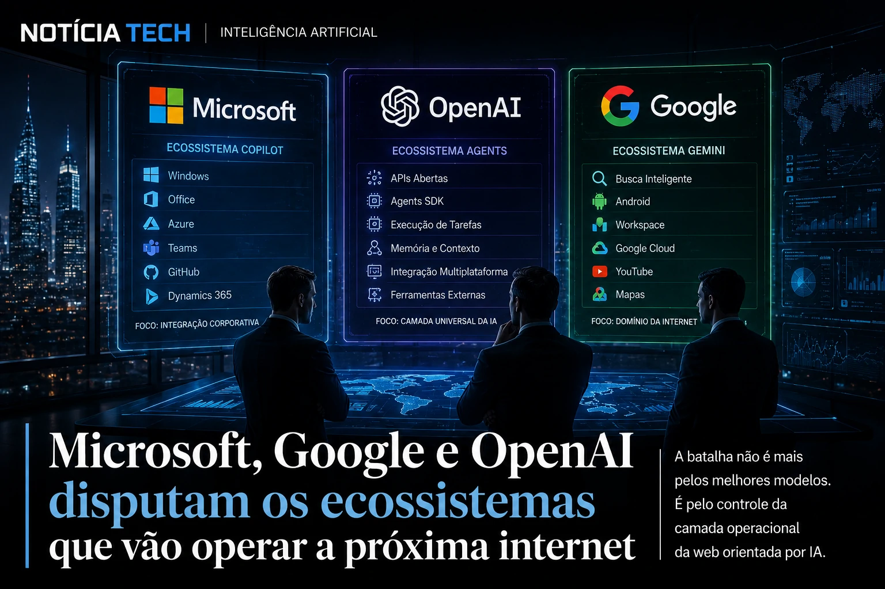
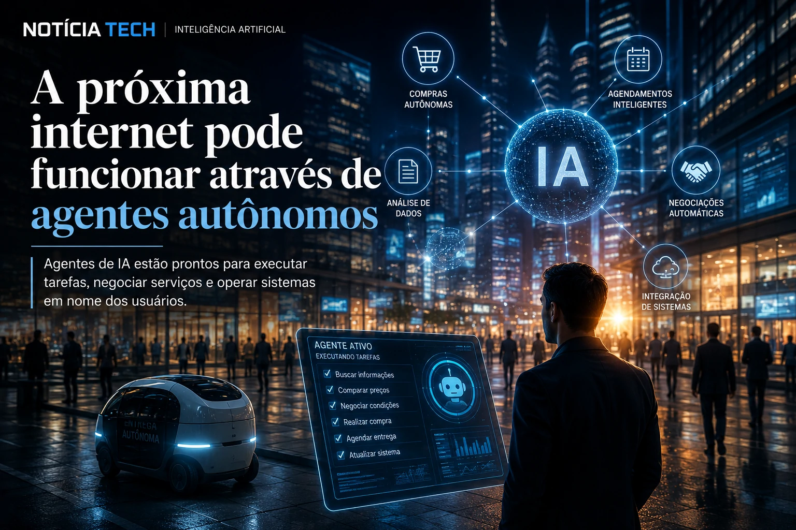

*Durante os últimos anos, a corrida da inteligência artificial parecia girar em torno de modelos de linguagem, chatbots e assistentes virtuais. Mas em 2026, a disputa mudou de nível. A verdadeira batalha estratégica agora acontece em outra camada: quem controlará os agentes autônomos, os fluxos automatizados e a infraestrutura operacional da nova internet baseada em IA. Microsoft, Google e OpenAI estão acelerando investimentos bilionários para transformar a inteligência artificial em uma camada invisível capaz de executar tarefas, operar sistemas e intermediar praticamente toda interação digital.*

## A guerra da IA deixou de ser sobre chatbots

O mercado de inteligência artificial entrou em uma nova fase estratégica.

Até recentemente, a principal disputa envolvia:
- qualidade dos modelos;
- capacidade de resposta;
- geração de conteúdo;
- precisão contextual;
- velocidade de inferência.

Mas a rápida popularização dos LLMs começou a transformar os modelos em commodities.

Agora, a nova fronteira competitiva está nos chamados sistemas agênticos.

Na prática, as empresas perceberam que o verdadeiro poder econômico da IA não está apenas em responder perguntas, mas em:
- executar tarefas;
- operar softwares;
- acessar plataformas;
- integrar serviços;
- automatizar decisões;
- agir em nome do usuário.

Essa mudança altera completamente a lógica da internet moderna.

### A IA começa a virar uma camada operacional invisível

A estratégia atual das gigantes de tecnologia aponta para um cenário onde a IA deixa de ser apenas uma interface conversacional e passa a funcionar como uma infraestrutura operacional contínua.

O objetivo não é apenas conversar com o usuário.

O objetivo é:
- executar fluxos completos;
- coordenar múltiplos sistemas;
- integrar aplicações;
- automatizar processos;
- substituir etapas operacionais.

A própria **Microsoft** vem acelerando a integração do ecossistema **Copilot** dentro do ambiente corporativo, conectando produtividade, automação e execução operacional em larga escala.

Ao mesmo tempo, a **Google** amplia o ecossistema do **Gemini** para integrar busca, produtividade, nuvem e automação contextual dentro da sua infraestrutura global.

Já a **OpenAI** avança rapidamente na criação de agentes capazes de interagir com ferramentas externas, executar ações e operar ambientes digitais de maneira persistente.

Essa disputa já começa a redesenhar o funcionamento da web.

Em vez de usuários navegando manualmente por dezenas de plataformas, agentes inteligentes passam a:
- interpretar objetivos;
- buscar informações;
- negociar serviços;
- preencher formulários;
- executar compras;
- organizar tarefas;
- operar sistemas inteiros.

Esse movimento possui relação direta com a transformação do comércio digital impulsionado por IA, como mostramos em [Comércio Agentic: como ChatGPT, Google e Shopify estão transformando a internet em uma interface de compras por IA](https://noticiatech.com.br/inteligencia-artificial/com%C3%A9rcio-agentic-como-chatgpt-google-e-shopify-est%C3%A3o-transformando-a-internet-em-uma-interface-de-compras-por-ia/).

### O novo “sistema operacional” da internet

Durante décadas:
- navegadores dominaram a experiência digital;
- aplicativos controlaram o acesso aos serviços;
- plataformas centralizaram usuários.

Agora, as Big Techs tentam construir algo muito maior:
uma camada operacional orientada por IA capaz de intermediar praticamente toda atividade online.

Isso significa que a IA pode se tornar:
- a nova interface principal da internet;
- o novo intermediador do comércio digital;
- o novo centro de produtividade corporativa;
- o novo mecanismo operacional da web.

E quem controlar essa camada poderá exercer influência massiva sobre:
- consumo;
- publicidade;
- produtividade;
- dados;
- comportamento digital;
- infraestrutura econômica.

## Microsoft, Google e OpenAI aceleram a disputa pelos ecossistemas autônomos

A disputa atual não acontece apenas no nível dos modelos de IA.

Ela acontece principalmente no controle dos ecossistemas.

Cada gigante da tecnologia está tentando criar sua própria infraestrutura operacional baseada em agentes inteligentes.

### A Microsoft aposta na integração corporativa total

A **Microsoft** talvez seja hoje a empresa mais agressiva na transformação da IA em infraestrutura operacional empresarial.

Seu diferencial não está apenas no modelo.

Está na integração.

Ao conectar:
- **Windows**;
- **Azure**;
- **Office**;
- **Teams**;
- **GitHub**;
- **Dynamics**;

a companhia cria um ambiente onde agentes conseguem operar diretamente dentro dos fluxos corporativos já existentes.

Isso posiciona o **Copilot** não apenas como assistente, mas como um sistema operacional corporativo distribuído.

A estratégia fortalece ainda mais a presença da empresa no ambiente B2B global.

Esse avanço se conecta diretamente à transformação do ambiente profissional impulsionado por IA, movimento que já analisamos em [LinkedIn deixa de ser rede de currículos e vira plataforma de distribuição B2B impulsionada por IA](https://noticiatech.com.br/negocios/linkedin-deixa-de-ser-rede-de-curr%C3%ADculos-e-vira-plataforma-de-distribui%C3%A7%C3%A3o-b2b-impulsionada-por-ia/).

### O Google tenta preservar o domínio da própria internet

A disputa da **Google** possui um peso ainda mais estratégico.

Durante décadas, a empresa controlou o principal mecanismo de descoberta da internet através da busca tradicional.

Mas a ascensão da IA conversacional ameaça justamente esse modelo.

Se usuários deixarem de navegar manualmente e passarem a delegar tarefas para agentes inteligentes:
- o tráfego tradicional pode cair;
- o modelo de busca pode mudar;
- o comportamento digital pode ser reestruturado.

Por isso, o **Gemini** se tornou uma peça central para preservar a posição da empresa no novo ecossistema da web orientada por IA.

A integração entre:
- busca;
- Android;
- Workspace;
- cloud;
- YouTube;
- automação contextual;

permite ao Google construir uma infraestrutura operacional extremamente poderosa.

### A OpenAI quer se tornar a camada universal da IA

Enquanto Microsoft e Google possuem ecossistemas próprios gigantescos, a **OpenAI** segue outro caminho:
tornar seus agentes compatíveis com toda a internet.

A estratégia envolve:
- APIs;
- execução de ferramentas;
- memória persistente;
- automação contextual;
- integração multiplataforma.

Na prática, a empresa tenta transformar seus modelos em uma camada universal capaz de operar:
- softwares;
- serviços;
- plataformas;
- marketplaces;
- sistemas empresariais.

Isso cria uma disputa extremamente sensível:
quem dominar os agentes poderá controlar o fluxo operacional da economia digital.

## A próxima internet pode funcionar através de agentes autônomos

A consequência mais profunda dessa transformação talvez seja a mudança estrutural da própria experiência online.

A internet tradicional foi construída para humanos navegarem manualmente.

A nova internet orientada por IA começa a ser construída para agentes executarem ações automaticamente.

### O comportamento digital pode mudar radicalmente

No modelo tradicional:
- usuários pesquisam;
- clicam;
- navegam;
- comparam;
- preenchem dados;
- executam tarefas manualmente.

No modelo agêntico:
- usuários definem objetivos;
- agentes executam operações;
- sistemas negociam serviços;
- fluxos acontecem automaticamente.

Isso pode alterar completamente:
- publicidade digital;
- e-commerce;
- SaaS;
- marketplaces;
- produtividade;
- consumo online.

Empresas que dependem do modelo tradicional de tráfego podem enfrentar uma das maiores transformações da história da internet.

### A economia digital começa a entrar na era agêntica

A ascensão dos agentes autônomos também inaugura uma nova dinâmica econômica.

Pesquisadores e executivos já começam a tratar esse movimento como o nascimento de uma “economia agêntica”.

Nesse cenário:
- agentes negociam APIs;
- sistemas coordenam compras;
- IA administra fluxos empresariais;
- plataformas automatizam decisões operacionais.

Isso cria novas oportunidades para:
- produtividade;
- automação;
- redução de custos;
- hiperescala empresarial.

Mas também levanta debates importantes sobre:
- concentração de poder;
- privacidade;
- dependência tecnológica;
- governança algorítmica;
- centralização operacional.

### A disputa mais importante da tecnologia pode estar apenas começando

A corrida da IA já deixou de ser apenas uma competição entre modelos mais inteligentes.

Agora, a disputa envolve:
- quem controlará os agentes;
- quem dominará os fluxos operacionais;
- quem possuirá a infraestrutura da nova internet.

E talvez esse seja o ponto mais importante de toda essa transformação:
a IA não está mais apenas mudando aplicativos.

Ela começa a redefinir a própria arquitetura operacional da economia digital global.
