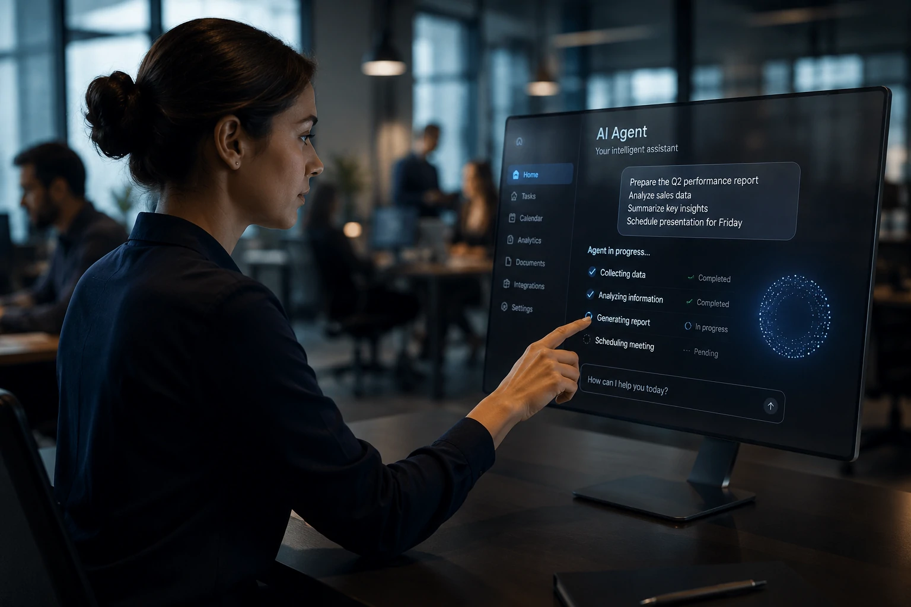
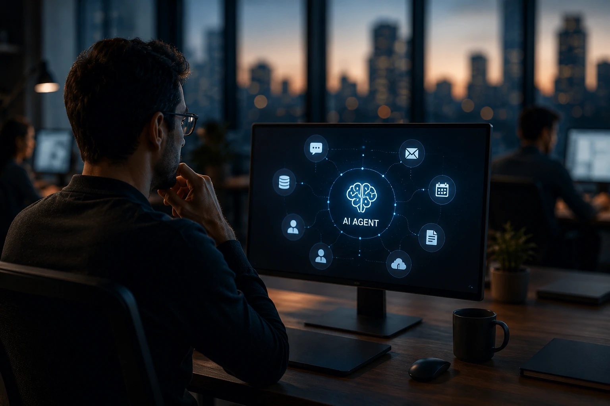
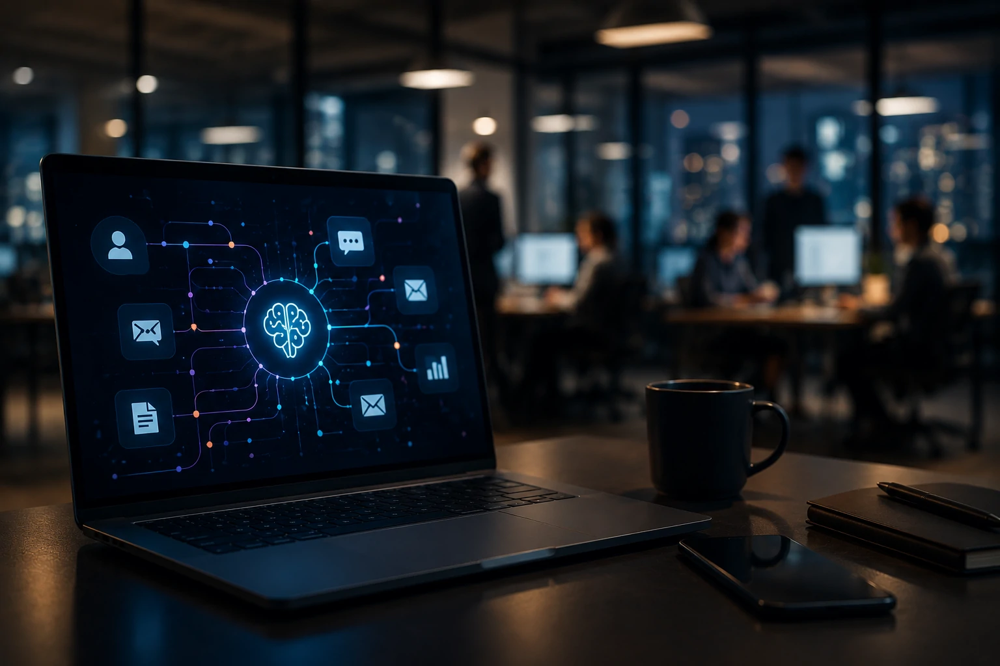

*A indústria da tecnologia está entrando em uma nova fase competitiva. Depois da era dos navegadores, dos smartphones e dos aplicativos, as maiores empresas do setor passaram a disputar uma camada ainda mais estratégica: a interface principal entre pessoas e sistemas digitais. Com o avanço dos agentes de inteligência artificial, **Apple**, **OpenAI**, **Google** e **Microsoft** estão apostando que o futuro da computação não será controlado por aplicativos individuais, mas por agentes capazes de compreender contexto, executar tarefas e coordenar múltiplos serviços em nome do usuário.*

## A próxima interface da computação será baseada em agentes de IA

Os agentes de inteligência artificial estão sendo desenvolvidos para substituir parte da navegação tradicional por aplicativos e se tornar a principal forma de interação digital.

*Os agentes de IA estão sendo posicionados como a próxima interface dominante da computação.*

Durante décadas, usuários precisaram abrir aplicativos específicos para executar tarefas. Reservar uma viagem, organizar uma agenda ou gerar um relatório exigia navegar entre diferentes sistemas.

Com os agentes, essa lógica começa a mudar. O usuário informa um objetivo e a inteligência artificial coordena automaticamente as etapas necessárias para concluí-lo.

### O que diferencia agentes de IA dos aplicativos tradicionais?

Aplicativos executam funções específicas.

Agentes coordenam diversas funções simultaneamente.

Essa mudança reduz a necessidade de conhecer ferramentas individuais e transforma a experiência digital em algo mais conversacional e contextual.

### Por que as empresas estão investindo bilhões nessa tecnologia?

A resposta é simples: controle da interface.

Historicamente, quem controla a interface principal também controla distribuição, descoberta de serviços, comportamento dos usuários e geração de receita.

Foi assim com sistemas operacionais, navegadores e smartphones. Agora, a disputa se desloca para os agentes inteligentes.

## A Apple aposta no ecossistema para transformar a Siri em um agente operacional

A estratégia da **Apple** é utilizar seu ecossistema integrado para transformar a **Siri** em uma camada operacional permanente dentro do cotidiano dos usuários.

*O diferencial competitivo da Apple está na integração entre dispositivos, aplicativos e contexto do usuário.*

A empresa possui uma vantagem única: bilhões de dispositivos ativos distribuídos globalmente.

Enquanto concorrentes precisam convencer usuários a adotar novas plataformas, a **Apple** já controla o ambiente onde grande parte das interações digitais acontece.

### O que muda com a nova geração da Siri?

A assistente deixa de atuar apenas como ferramenta de voz.

O objetivo passa a ser executar tarefas entre aplicativos, compreender contexto e antecipar necessidades dos usuários.

Essa abordagem aproxima a **Siri** do conceito de agente operacional.

### Qual é o principal diferencial da Apple?

A integração.

A combinação entre **iPhone**, **iPad**, **Mac**, aplicativos nativos e serviços cria uma base extremamente favorável para a adoção de agentes inteligentes.

Esse movimento também reforça a estratégia analisada em:

[Apple entra na corrida da IA corporativa com iPhone como agente inteligente para empresas](https://noticiatech.com.br/inteligencia-artificial/apple-ia-corporativa-iphone-agente-inteligente-empresas/)

## OpenAI, Google e Microsoft querem se tornar a camada operacional da internet

A disputa pelos agentes não acontece apenas nos dispositivos. Ela também está acontecendo dentro da própria infraestrutura digital.

*Google, Microsoft e OpenAI enxergam agentes inteligentes como uma nova camada operacional da internet.*

A **OpenAI** trabalha para expandir o papel do **ChatGPT** além das conversas.

O **Google** integra agentes à busca, ao Android e às ferramentas de produtividade.

A **Microsoft** utiliza o **Copilot** para conectar inteligência artificial ao ambiente corporativo.

### O objetivo é substituir os aplicativos?

Não necessariamente.

O cenário mais provável é que os aplicativos continuem existindo, mas passem a operar em segundo plano.

Os agentes se tornam a camada principal de interação.

### O que está em jogo nessa disputa?

Contexto, atenção e intenção.

Quem controlar essas três dimensões terá uma posição privilegiada para distribuir serviços, monetizar experiências digitais e criar novos modelos de negócios.

A estratégia da **Microsoft** também aparece em iniciativas recentes de software agent-first:

[Microsoft Project Solara aposta em software agent-first para empresas](https://noticiatech.com.br/negocios/microsoft-project-solara-dispositivos-agent-first-software-corporativo/)

## Empresas podem ser as maiores beneficiadas pela era dos agentes

A transformação provocada pelos agentes de IA não afeta apenas consumidores.

O impacto corporativo pode ser ainda mais significativo.

Processos que hoje exigem múltiplos sistemas poderão ser executados por uma única camada inteligente.

### O que muda para pequenas empresas?

Pequenas empresas passam a acessar níveis avançados de automação sem necessidade de equipes especializadas.

Entre os principais benefícios estão:

- automação operacional;
- redução de tarefas repetitivas;
- integração entre plataformas;
- aumento de produtividade;
- melhor aproveitamento de dados.

### O que muda para grandes organizações?

Grandes empresas podem utilizar agentes para conectar sistemas complexos como ERPs, CRMs e plataformas analíticas.

Isso reduz atritos operacionais e acelera fluxos de trabalho internos.

Na prática, os agentes se tornam intermediários inteligentes entre pessoas, dados e processos corporativos.

## A guerra das interfaces pode redefinir o equilíbrio de poder da indústria de tecnologia

A disputa atual possui potencial para ser tão relevante quanto a chegada dos smartphones ou da computação em nuvem.

Cada grande mudança tecnológica redefiniu quem controlava o acesso aos usuários.

Os agentes representam a próxima oportunidade de reposicionamento estratégico para as gigantes da tecnologia.

### Quem está mais bem posicionado atualmente?

Não existe uma resposta definitiva.

A **Apple** domina distribuição.

A **OpenAI** lidera inovação em modelos.

O **Google** controla uma das maiores portas de entrada da internet.

A **Microsoft** possui forte presença no ambiente corporativo.

### O que devemos observar nos próximos anos?

A principal métrica não será apenas a evolução dos modelos de linguagem.

O fator decisivo será a capacidade de transformar inteligência artificial em uma camada invisível, contextual e permanente da experiência digital.

Se essa visão se concretizar, os aplicativos continuarão existindo, mas deixarão de ocupar o centro da experiência do usuário. O protagonismo passará para agentes capazes de compreender intenções, coordenar sistemas e executar tarefas completas. A empresa que dominar essa interface terá uma das posições mais valiosas da próxima geração da computação.

---