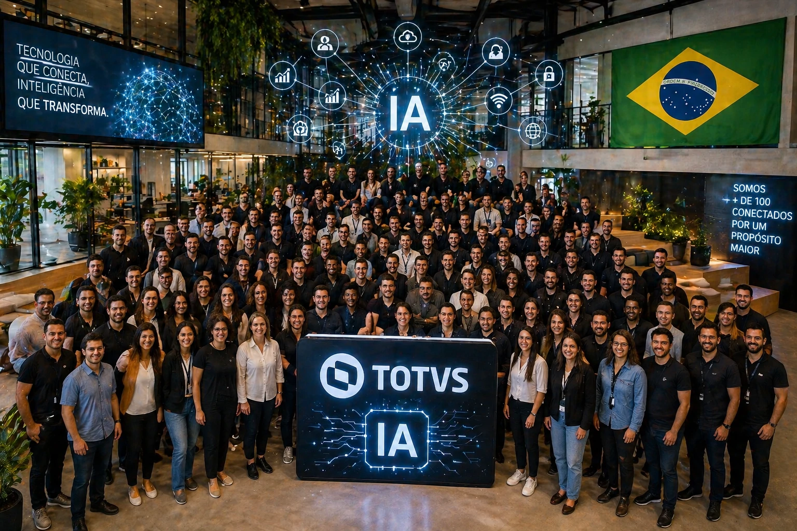

A <u>**TOTVS**</u> decidiu entrar em uma nova fase da inteligência artificial empresarial.

A empresa lançou o <u>**LYNN**</u>, seu foundation próprio de IA voltado para o mercado B2B, apostando em um modelo mais especializado e integrado aos sistemas corporativos.

O movimento chama atenção porque mostra uma mudança importante no setor.

Grandes empresas de software não querem mais apenas integrar IA de terceiros.

Agora querem construir a própria infraestrutura.

O impacto disso pode ser profundo no mercado brasileiro de software empresarial.

## Por que a TOTVS decidiu construir sua própria IA

A lógica é estratégica.

Quando uma empresa controla sua própria camada de inteligência artificial, ela ganha:

- mais controle sobre custos;
- mais previsibilidade;
- mais segurança;
- mais personalização;
- mais integração com sistemas próprios.

No caso da <u>**TOTVS**</u>, isso é ainda mais importante porque seu ecossistema já opera no centro de processos empresariais críticos.

O <u>**LYNN**</u> foi criado justamente para atuar nesse ambiente.

A proposta é desenvolver uma inteligência especializada, treinada para entender processos empresariais de forma contextual.

Isso muda a lógica de adoção da IA no mercado corporativo.

## O que muda no software corporativo com esse movimento

O software corporativo tradicional sempre funcionou como ferramenta.

Agora começa a funcionar como operador.

Isso significa que sistemas podem começar a:

- executar tarefas;
- analisar cenários;
- recomendar ações;
- operar fluxos;
- corrigir desvios.

Essa mudança transforma a lógica operacional das empresas.

O ERP deixa de ser apenas sistema de gestão.

Passa a ser ambiente ativo de inteligência.

Esse movimento pode acelerar a adoção de <u>**agentes inteligentes**</u> em processos internos.

## O impacto para empresas brasileiras

Para empresas brasileiras, esse movimento pode reduzir uma barreira importante.

A distância entre tecnologia avançada e aplicação prática.

Com IA integrada ao software de gestão, empresas ganham mais acesso a:

- automação contextual;
- decisões mais rápidas;
- redução de tarefas repetitivas;
- melhoria operacional.

O diferencial está no contexto.

Uma IA especializada entende melhor a realidade do negócio do que modelos genéricos.

Esse pode ser o ponto de virada da nova geração de software empresarial.

## O que essa decisão revela sobre o mercado

O lançamento do <u>**LYNN**</u> mostra algo importante.

A corrida da IA corporativa está mudando.

Antes, a vantagem estava em usar IA.

Agora, a vantagem começa a estar em controlar a própria IA.

Isso muda a competição.

Empresas que dominarem software + dados + inteligência própria terão mais força no mercado.

E para o Brasil, esse movimento é relevante porque fortalece um ecossistema nacional de IA voltado para negócios.

O software corporativo está entrando em uma nova fase.

E a <u>**TOTVS**</u> quer estar no centro dela.