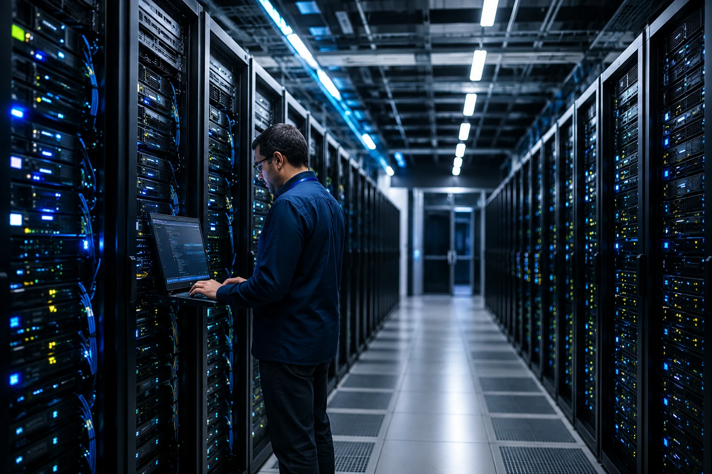
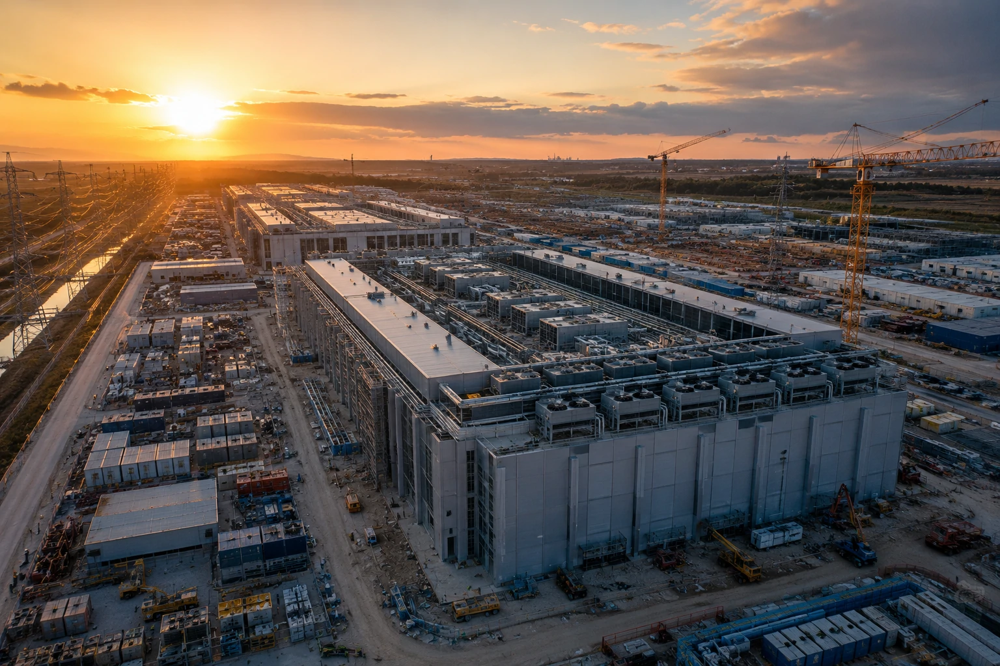
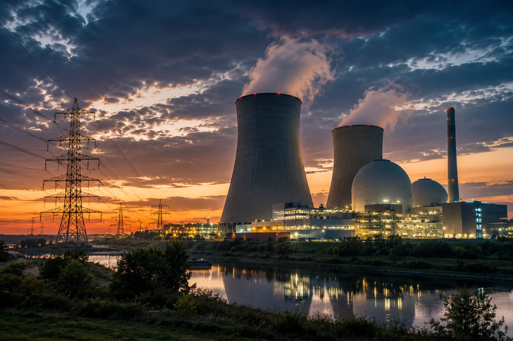

*Durante anos, o avanço da tecnologia foi associado principalmente a software, conectividade e inovação digital. Agora, a rápida expansão da **Inteligência Artificial** está trazendo uma nova variável para o centro das decisões estratégicas: a energia elétrica. O crescimento de modelos avançados, agentes autônomos e plataformas corporativas de IA está transformando infraestrutura energética em um dos recursos mais valiosos da economia digital.*

## A Inteligência Artificial está criando uma nova corrida global por energia

A expansão da **Inteligência Artificial** está aumentando rapidamente a demanda por eletricidade em escala global. Grandes modelos exigem milhares de processadores especializados trabalhando simultaneamente para treinamento e inferência.

*Grandes data centers estão se tornando consumidores estratégicos de energia em diversos países.*

O crescimento do uso de plataformas como **ChatGPT**, **Gemini**, **Claude** e agentes corporativos elevou significativamente a necessidade de capacidade computacional.

### Por que o consumo energético aumentou tanto?

Cada interação com sistemas avançados de IA exige processamento em data centers compostos por milhares de GPUs e aceleradores especializados.

Além disso, o treinamento de novos modelos pode durar semanas ou meses, consumindo recursos energéticos continuamente.

### O impacto vai além dos modelos de linguagem

A demanda não vem apenas de chatbots.

Ela também está relacionada a:

- geração de imagens;
- geração de vídeo;
- automação empresarial;
- agentes autônomos;
- análise de dados;
- desenvolvimento assistido por IA.

Esse cenário amplia a necessidade de infraestrutura energética em praticamente todos os setores da economia digital.

## Os data centers se tornaram ativos estratégicos para a economia da IA

Os data centers são a base física da revolução da **Inteligência Artificial**. Sem eles, não existe processamento suficiente para sustentar modelos avançados.

*Infraestrutura computacional tornou-se tão importante quanto o desenvolvimento dos próprios modelos de IA.*

Empresas como **Google**, **Microsoft**, **Amazon**, **Meta** e **OpenAI** estão investindo bilhões de dólares em novas instalações ao redor do mundo.

### O que existe dentro de um data center moderno?

Um data center voltado para IA concentra:

- servidores de alta performance;
- GPUs especializadas;
- sistemas de armazenamento;
- redes de alta velocidade;
- sistemas avançados de refrigeração.

A energia necessária para manter essa estrutura funcionando 24 horas por dia transformou a eletricidade em um insumo estratégico.

### O novo gargalo da Inteligência Artificial

Durante muito tempo o principal desafio da IA foi desenvolver algoritmos melhores.

Hoje, os gargalos incluem:

- chips avançados;
- capacidade computacional;
- disponibilidade energética.

Essa mudança altera completamente a dinâmica competitiva do setor.

Para entender como a infraestrutura está impactando o mercado de IA, vale conferir também a análise sobre [Investigação da OpenAI expõe governança e economia dos agentes de IA](https://noticiatech.com.br/inteligencia-artificial/investigacao-openai-governanca-economia-agentes-ia/).

## Energia nuclear voltou ao centro das discussões tecnológicas

A energia nuclear está sendo novamente considerada uma alternativa estratégica para sustentar a próxima geração da economia digital.

*Energia nuclear e pequenos reatores modulares voltam a ganhar relevância na era da IA.*

A principal vantagem está na capacidade de fornecer energia constante, previsível e em larga escala.

### Por que fontes renováveis nem sempre são suficientes?

Fontes como solar e eólica desempenham papel fundamental na transição energética.

No entanto, data centers operam continuamente e precisam de fornecimento estável independentemente das condições climáticas.

Por isso, empresas e governos estão avaliando diferentes combinações de geração energética.

### Os pequenos reatores modulares podem mudar o mercado?

Os chamados SMRs (Small Modular Reactors) estão atraindo investimentos por prometerem implantação mais flexível e custos potencialmente menores.

Caso se consolidem comercialmente, podem se tornar parte importante da infraestrutura que sustentará a expansão da IA nas próximas décadas.

## O futuro da Inteligência Artificial pode depender tanto de energia quanto de software

A evolução da IA não será definida apenas pela qualidade dos modelos.

Ela também dependerá da capacidade de alimentar fisicamente toda a infraestrutura necessária para operar esses sistemas.

### O que muda para empresas e mercados?

Organizações que utilizam IA em larga escala precisarão acompanhar não apenas avanços tecnológicos, mas também questões relacionadas a energia, custos operacionais e capacidade computacional.

A infraestrutura passa a ser uma variável competitiva relevante.

### Uma transformação que vai além da tecnologia

A próxima fase da IA conecta setores que antes pareciam distantes:

- tecnologia;
- energia;
- construção;
- mineração;
- semicondutores;
- telecomunicações.

Essa convergência pode criar uma das maiores ondas de investimento em infraestrutura das próximas décadas.

O mesmo movimento que impulsiona agentes inteligentes e automação empresarial também fortalece temas como eficiência operacional e vantagem competitiva. Nesse contexto, conteúdos como [AI Fluency: a nova vantagem competitiva na era da Inteligência Artificial](https://noticiatech.com.br/negocios/ai-fluency-vantagem-competitiva-inteligencia-artificial/) ajudam a compreender como empresas estão se preparando para um mercado cada vez mais orientado por IA.

A discussão sobre o futuro da Inteligência Artificial costuma focar em modelos mais inteligentes e agentes mais autônomos. No entanto, a próxima grande disputa pode acontecer longe das interfaces e dos algoritmos. Ela pode ocorrer nas redes elétricas, nos data centers e nas usinas que fornecerão a energia necessária para sustentar uma economia cada vez mais dependente da IA.

---